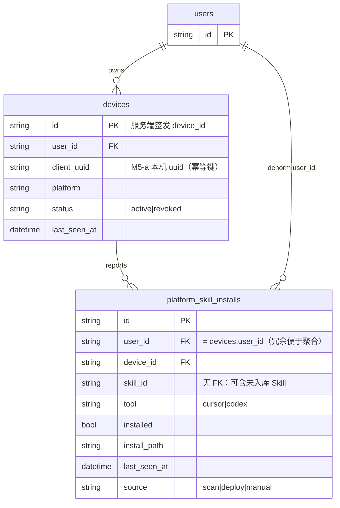
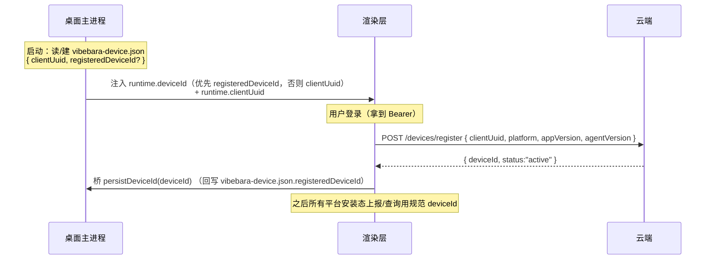
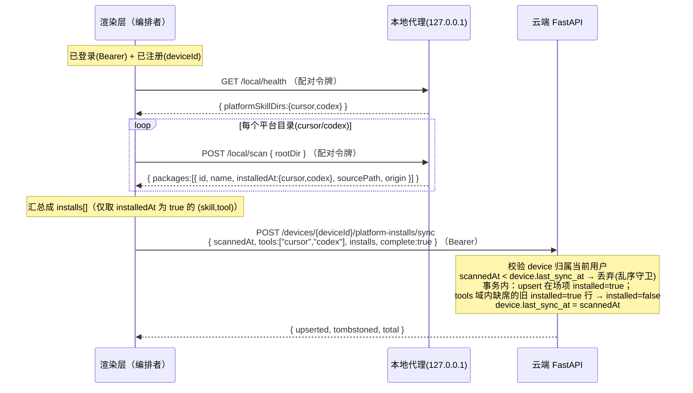

# 方案 B · M5-b 平台安装状态 多用户多机持久化设计

> 本文是 **M5-b**「平台安装态多机持久化」的可落地设计交付物。**纯设计，不改任何业务代码**——只新建本文件、并在 `M5-实施计划.md` 的 M5-b 处交叉引用；实施并入 M5-b。
>
> 上游依据：
> - 同目录 `方案B-桌面客户端迁移技术路径.md`（§2 三层架构、§3.4 鉴权与多租户、§5 接口边界）。
> - `M0-解耦设计与接口契约.md`（§1 拓扑事实「云端不直连本地代理」、§5 安全/配对模型、§9 / `contracts/local-agent-api.md` §9 云端协作端点 DTO 风格）。
> - `M2-鉴权强化实施记录.md` + `backend/app/core/security.py`（双令牌分离、配对令牌「桌面注入、云端不签发」决议④）。
> - `M4-收尾与联调记录.md`（决定①：`deployed_*` 降级为本地代理 `scan.installedAt` 实时探测、不持久化；§8(2) 已把「云端持久化 用户×Skill×工具 安装态」列为待拍板）。
> - `M5-实施计划.md`（§1 决策、§2 M5-b 范围、§6 与本设计的对齐点）、`M5-a-桌面壳骨架实施记录.md`（§2.7/§5 临时 `deviceId` 占位）。
>
> 协调者已定主轴：**平台级安装能力长久保留**，只把「状态记录」从全局单布尔升级为**支持多用户多机的持久化模型**；设备身份是地基；上报必经前端中转；新表与项目维度严格隔离；`deployed_*` 退役为派生/展示。

---

## 0. 文档元信息

| 项 | 值 |
| --- | --- |
| 里程碑 | M5-b 平台安装态多机持久化 |
| 状态 | **设计稿（待评审 / 部分待拍板，见 §10）** |
| 新增云端表 | `devices`、`platform_skill_installs` |
| 新增云端 API | `/api/v1/devices*`、`/api/v1/users/me/platform-installs`、`/api/v1/teams/{tid}/platform-installs/summary` |
| 本地代理改动 | **无**（复用 M3 冻结的 7 端点，`scan.installedAt` 已足够） |
| 桌面壳改动 | `vibebara-device.json` 升级（`clientUuid` + 注册回写的 `deviceId`）+ 一个回写 IPC |
| 前端改动 | 设备注册 + 上报编排 + 展示从「实时 scan」过渡到「持久态 + 实时校正」 |
| 约束 | 本阶段不改任何 `.py / .ts / .vue` 业务代码、不动 `desktop/`、`local-agent/`、后端实现 |

---

## 1. 目标与非目标 · 术语

### 1.1 目标

1. 把「平台级安装态」从全局单布尔 `SkillPackage.deployed_cursor/deployed_codex` 升级为 **`user × device × skill × tool` 维度的持久化模型**，cloud 形态下可表达「**哪个用户、在哪台机器、把哪个 Skill 装到了 cursor 还是 codex**」。
2. 引出 **设备身份（device_id）** 作为地基：一台桌面客户端 = 一个设备身份、归属某 user；给出签发 / 持久 / 注册 / 撤销机制，并与 M5-a 临时 `deviceId` 占位平滑过渡。
3. 设计 **经前端中转** 的上报链路（本地代理只监听 127.0.0.1，云端够不着它），含触发时机、幂等、并发、失败兜底。
4. 提供 **个人安装态查询** 与 **团队看板聚合**（覆盖率 / 谁装了）的查询 API，含鉴权与多租户。
5. 给出 **`deployed_*` 退役** 的派生 / 兼容处置，与 **`UserSkillDeployment`（项目维度）严格隔离**。
6. 不破坏 M4 已落地的 `scan.installedAt` 实时展示能力（持久态 + 实时校正并存）。

### 1.2 非目标

- **不接管项目级部署**：项目目录 `{deployPath}/.{tool}/skills/{id}` 的部署 / push / pull / dirty 仍归 `UserSkillDeployment`（M0 §3、M4 编排链），本设计**不复用、不污染**它。
- **不引入新的本地代理端点**：维持 M3 七端点冻结；不为平台目录新增 `watch`（评估见 §10）。
- **不让云端签发配对令牌**：维持 M2 决议④——配对令牌仍由桌面主进程注入；`device_id` 与配对令牌职责切分（§3.4）。
- **不在本阶段物理删除 `deployed_*` 列**：退役 = 不再作真值源，列保留兼容、未来主版本再清（§7.1）。
- 不做桌面自动更新 / 签名（M5-c）；不做对象存储资源传输（D1，沿用 inline）。

### 1.3 术语：平台级安装 vs 项目级部署（清晰边界）

| 维度 | **平台级安装（本设计）** | **项目级部署（既有 `UserSkillDeployment`）** |
| --- | --- | --- |
| 落点 | 本机全局目录 `~/.cursor/skills/{id}`、`$CODEX_HOME｜~/.codex/skills/{id}`（`local-agent/src/platform.ts`） | 项目目录 `{deployPath}/.{tool}/skills/{id}`（`project_service._install_root`） |
| 语义 | 「个人全局可用」，不绑项目；多机各自独立 | 「项目内可用」，绑 project + team，承载协作同步 |
| 编排入口 | `deployNativeSkillOrchestrated(scope=platform)`、`migrateSkillOrchestrated`（落 `~/.{tool}/skills`） | `deployProjectSkillOrchestrated`、`pull/pushOrchestrated`（落项目目录） |
| 状态来源 | 本地代理 `scan.installedAt`（存在性布尔），经前端中转上报 | 本地代理 `hash`（位级 dirty 检测）+ 云端登记 |
| 是否需要同步 / 版本 / diff | **否**——只记录「装没装」（present/absent），无 repo_version / installed_hash / abstract_snapshot | **是**——repo_version、installed_hash、abstract_snapshot、status、local_dirty |
| 维度 | `user × device × skill × tool` | `user × project × team_skill × tool`（含 install_path、各类 hash） |
| 表 | `platform_skill_installs`（新） | `user_skill_deployments`（不动） |

> 一句话：**平台安装态只回答「present/absent」，项目部署态回答「present + 内容是否漂移」。** 二者维度、真值源、生命周期都不同，故用**独立新表**，不共享任何列。

---

## 2. 数据模型

### 2.1 总览（ER 关系）



两张新表与既有表的关系：`devices.user_id → users.id`；`platform_skill_installs.device_id → devices.id`、`.user_id → users.id`。**不与 `skill_packages` / `project_skills` / `user_skill_deployments` 建立任何外键**，从物理 schema 层保证「项目维度严格隔离」。

### 2.2 设备表 `devices`

SQLAlchemy 模型（建议落点 `backend/app/models/device.py`，与既有 `models/*.py` 风格一致）：

```python
class Device(Base):
    __tablename__ = "devices"
    __table_args__ = (
        UniqueConstraint("user_id", "client_uuid", name="uq_device_user_client"),
    )

    # 服务端签发的规范设备标识（uuid4）；前端正式形态用它做上报维度键。
    id: Mapped[str] = mapped_column(
        String(36), primary_key=True, default=lambda: str(uuid.uuid4())
    )
    user_id: Mapped[str] = mapped_column(
        String(36), ForeignKey("users.id", ondelete="CASCADE"), index=True
    )
    # 本机持久 uuid（= M5-a vibebara-device.json 的 deviceId）；幂等再注册键，非身份凭证。
    client_uuid: Mapped[str] = mapped_column(String(64), index=True)
    platform: Mapped[str] = mapped_column(String(16), default="")     # win32|darwin|linux
    hostname: Mapped[str | None] = mapped_column(String(128), nullable=True)
    app_version: Mapped[str | None] = mapped_column(String(32), nullable=True)   # 桌面壳版本
    agent_version: Mapped[str | None] = mapped_column(String(32), nullable=True) # 本地代理版本
    status: Mapped[str] = mapped_column(String(16), default="active")  # active|revoked
    last_seen_at: Mapped[datetime | None] = mapped_column(DateTime, nullable=True)
    last_sync_at: Mapped[datetime | None] = mapped_column(DateTime, nullable=True)  # 上次平台安装态对账
    revoked_at: Mapped[datetime | None] = mapped_column(DateTime, nullable=True)
    created_at: Mapped[datetime] = mapped_column(DateTime, server_default=func.now())
    updated_at: Mapped[datetime] = mapped_column(
        DateTime, server_default=func.now(), onupdate=func.now()
    )
```

字段 / 约束要点：

| 字段 | 类型 | 约束 / 说明 |
| --- | --- | --- |
| `id` | `VARCHAR(36)` PK | **服务端签发** uuid4 的 device_id（正式身份）。 |
| `user_id` | `VARCHAR(36)` FK→users(CASCADE) idx | 归属用户；用户删 → 设备级联删。 |
| `client_uuid` | `VARCHAR(64)` idx | M5-a 本机 uuid。与 `user_id` 组成 **唯一键 `uq_device_user_client`**，保证「同一用户 + 同一台机器」再注册幂等命中同一行。 |
| `platform` / `hostname` / `app_version` / `agent_version` | — | 展示 / 诊断元数据，非鉴权依赖。 |
| `status` | `VARCHAR(16)` | `active` / `revoked`；撤销不删行（保留历史 + 防 device_id 复用混淆）。 |
| `last_seen_at` | `DateTime` | 任意带 Bearer 的设备调用（注册 / 上报 / 心跳）刷新。 |
| `last_sync_at` | `DateTime` | 上次成功「平台安装态对账」时间，作为 §4.4 乱序守卫。 |

> **唯一约束选型**：`(user_id, client_uuid)` 而非 `client_uuid` 单列——因为**同一台机器可被多个 Vibebara 账号登录使用**（共享桌面），应产生各自独立的设备身份。

### 2.3 平台安装态表 `platform_skill_installs`

```python
class PlatformSkillInstall(Base):
    __tablename__ = "platform_skill_installs"
    __table_args__ = (
        UniqueConstraint("device_id", "skill_id", "tool", name="uq_platform_install"),
        Index("ix_platform_install_user_tool", "user_id", "tool"),
        Index("ix_platform_install_skill", "skill_id"),
    )

    id: Mapped[str] = mapped_column(
        String(36), primary_key=True, default=lambda: str(uuid.uuid4())
    )
    user_id: Mapped[str] = mapped_column(
        String(36), ForeignKey("users.id", ondelete="CASCADE"), index=True
    )
    device_id: Mapped[str] = mapped_column(
        String(36), ForeignKey("devices.id", ondelete="CASCADE"), index=True
    )
    # 平台目录下的 skill 文件夹名（= scan 的 UnifiedSkillPackage.id）。
    # 故意**不**对 skill_packages 建 FK：平台目录可能含「未入库 / 外部来源」的 Skill。
    skill_id: Mapped[str] = mapped_column(String(64))
    tool: Mapped[str] = mapped_column(String(16))            # cursor|codex
    installed: Mapped[bool] = mapped_column(Boolean, default=True)  # 当前是否在位（false=已卸载墓碑）
    install_path: Mapped[str | None] = mapped_column(String(512), nullable=True)
    skill_name: Mapped[str | None] = mapped_column(String(128), nullable=True)  # 展示用（去 join）
    origin: Mapped[str | None] = mapped_column(String(16), nullable=True)       # cursor|codex|unknown
    source: Mapped[str] = mapped_column(String(16), default="scan")  # scan|deploy|manual
    first_seen_at: Mapped[datetime] = mapped_column(DateTime, server_default=func.now())
    last_seen_at: Mapped[datetime] = mapped_column(
        DateTime, server_default=func.now(), onupdate=func.now()
    )
    created_at: Mapped[datetime] = mapped_column(DateTime, server_default=func.now())
    updated_at: Mapped[datetime] = mapped_column(
        DateTime, server_default=func.now(), onupdate=func.now()
    )
```

维度键与约束：

| 维度键 | 说明 |
| --- | --- |
| `user_id` | 冗余存储（= `devices.user_id`），便于「个人 / 团队聚合」免 join 设备表；服务端写入时强制 `= device.user_id`。 |
| `device_id` | 哪台机器。 |
| `skill_id` | 哪个 Skill（平台目录文件夹名）。 |
| `tool` | cursor / codex。 |
| `installed` | present/absent；**对账时翻转**而非删行（保留卸载历史 + 幂等稳定）。 |
| `install_path?` | 该设备上的绝对安装路径（如 `C:\Users\me\.cursor\skills\my-skill`），可空。 |
| `last_seen_at` | 最近一次被 scan 上报确认的时间（展示「最后同步于…」+ 判定陈旧）。 |
| `source` | 状态来源：`scan`（全量对账）/`deploy`（平台部署 / 迁移后定点 upsert）/`manual`。 |

**唯一约束**：`uq_platform_install (device_id, skill_id, tool)`——上报对账以此 upsert。`device_id` 已蕴含 `user_id`（设备归属唯一），故唯一键无需含 `user_id`；`user_id` 仅作冗余聚合列 + 复合索引 `ix_platform_install_user_tool(user_id, tool)`（个人 / 团队看板按用户聚合）与 `ix_platform_install_skill(skill_id)`（按 Skill 看覆盖）。

### 2.4 Alembic 迁移思路（兼容现状、不破坏 local）

现状：仓库已有 Alembic（baseline `428c03c90199`，`backend/alembic/versions/...baseline_schema.py`）；开发兜底走 `core/database.py:init_db` 的 `Base.metadata.create_all` + `_migrate_add_columns`（受 `DB_AUTO_CREATE` 控制，cloud 用 `alembic upgrade head`）。

迁移设计（**纯增量，零破坏**）：

1. **新增一条 revision**（`down_revision='428c03c90199'`），仅 `op.create_table('devices', ...)` 与 `op.create_table('platform_skill_installs', ...)` + 对应 `create_index` / `UniqueConstraint`。
2. **不 ALTER 任何既有表**：不动 `skill_packages.deployed_*`、不动 `user_skill_deployments`。故 local 形态行为 100% 不变（`deployed_*` 仍按 §7.1 由后端探测本机 home）。
3. **开发兜底自然覆盖**：新增两个 SQLAlchemy 模型后，dev（`DB_AUTO_CREATE=true`）下 `create_all` 会自动建表，**无需** 往 `_migrate_add_columns` 加列（那是「给已有表补列」，整表新增不属于它）。
4. 外键仅指向 `users` / `devices`（皆 `ondelete=CASCADE`），不引入对既有协作表的耦合，回滚（`downgrade` drop 两表）安全。
5. **存量数据零迁移**：平台安装态属「运行期可重建」状态——上线后由设备登录 + 首次 scan 上报自然填充，无需从 `deployed_*` 回填（且 `deployed_*` 是「全局无设备维度」，无法可靠回填到具体设备）。

> 命名建议：`backend/alembic/versions/<ts>_add_devices_and_platform_installs.py`，revision 风格沿用 baseline。

---

## 3. 设备身份方案

### 3.1 device_id 的产生 / 持久 / 注册 / 撤销

| 阶段 | 机制 |
| --- | --- |
| **产生（本机侧）** | 桌面主进程沿用 M5-a：`crypto.randomUUID()` 写 `<userData>/vibebara-device.json`，作为 **`clientUuid`**（本机持久、与登录用户无关）。 |
| **签发（云端侧）** | 登录后前端持 Bearer 调 `POST /api/v1/devices/register {clientUuid, platform, hostname?, appVersion?, agentVersion?}`；云端按 `(user_id, clientUuid)` **upsert** `devices` 行，**服务端签发** `id`（规范 `device_id`，uuid4）并返回。**幂等**：同机同用户重复注册命中同一行、返回同一 `device_id`。 |
| **持久（回写本机）** | 前端把返回的 `device_id` 经桌面桥写回 `vibebara-device.json`（新增 `registeredDeviceId` 字段）；后续会话用规范 `device_id` 做上报维度键。 |
| **撤销** | `DELETE /api/v1/devices/{deviceId}`（或 `POST .../revoke`）→ `status='revoked'`、`revoked_at=now()`，**不删行**；该设备后续上报一律 403。聚合查询默认排除 `revoked`。用于「换机 / 丢失 / 注销某台」。 |

> **为何服务端签发 `device_id` 而非直接用 `clientUuid`**：① 防伪冒——客户端不能凭空声明任意 `device_id`（服务端按 Bearer 用户铸造并绑定，§8）；② 多用户同机——同一 `clientUuid` 被两个账号登录 → 两个独立设备行、两个 `device_id`，互不串扰。`clientUuid` 仅作幂等键，**不是鉴权凭证**。

### 3.2 一个用户多设备

`devices` 以 `user_id` 索引、`(user_id, client_uuid)` 唯一——同一用户在台式机、笔记本、公司机各装一份桌面客户端 = 三行 `devices`（三个 `device_id`）。`platform_skill_installs` 按 `device_id` 分别记录，聚合时按 `user_id` 汇总即得「我的所有设备安装态」（§5.2）。

### 3.3 与 M5-a 临时占位的过渡（衔接 / 收敛）

M5-a 现状（见 `M5-a-桌面壳骨架实施记录.md` §2.7/§5）：`deviceId.ts` 生成本机 uuid 存 `vibebara-device.json`，注入 `runtimeConfig.deviceId` 与桥 `deviceId`；前端 `VibebaraRuntimeConfig.deviceId?` 仅透传不做业务判断。

过渡方案（**占位 uuid 升格为 `clientUuid`，再换正式 `device_id`**）：



兼容与收敛细节：

- **字段语义平移**：`vibebara-device.json` 原 `deviceId` 字段（M5-a）→ 视为 `clientUuid`（迁移时读旧 `deviceId` 当 `clientUuid` 用，零数据丢失）。
- **回写 IPC**：M5-b 在桌面壳新增一个 `device:persist-id` IPC（主进程把 `registeredDeviceId` 落 `vibebara-device.json`），桥暴露 `persistDeviceId(id)`。这是桌面侧唯一新增点，属 M5-b 实施（本设计不改 `desktop/`）。
- **运行时字段**：`VibebaraRuntimeConfig` 可在 M5-b 增可选 `clientUuid?`；`deviceId` 注入优先级 = `registeredDeviceId ?? clientUuid`，保证「未注册前也有占位、注册后即用正式 id」。前端编排在调用上报前确保 `deviceId` 已是注册后的规范值（未注册先注册）。
- **是否需要云端「设备注册」端点**：**需要**——即 `POST /devices/register`。它**只铸造云端设备身份**（绑定 Bearer 用户），**不签发配对令牌**，与 M2 决议④边界并存（§3.4）。

### 3.4 device_id 与配对令牌、Bearer 的职责切分

| 凭证 / 标识 | 签发方 | 持有 / 注入 | 校验方 | 回答的问题 | 是否进云端 | 是否进本地代理 |
| --- | --- | --- | --- | --- | --- | --- |
| **Bearer Token** | 云端 `auth_service` | 渲染层（`safeStorage`） | 云端 | 「**我是谁**（哪个 user）」 | 是 | 否 |
| **Pairing Token** | 桌面主进程（M2 决议④） | 渲染层 + 本地代理（env 注入） | 本地代理 | 「我是否本机已配对的合法渲染层（**可否写本机盘**）」 | **否** | 是 |
| **device_id** | 云端 `devices`（注册时铸造） | 渲染层（桥 / 运行时配置） | 云端（归属校验） | 「这条安装态是**哪台机器**的」 | 是（随 Bearer 上报） | **否** |

要点：

- `device_id` **不是鉴权凭证**——它只标识「哪台机器」。任何带 `device_id` 的云端调用仍以 **Bearer 为身份**，并由云端校验 `device.user_id == current_user_id`（归属），防止上报 / 查询他人设备（§8）。
- 配对令牌仍是**会话级、本机级**的写盘授权，与持久的 `device_id` 正交：配对令牌不持久为身份、不进云端；`device_id` 不进本地代理。三者互不替代。
- 上报链路里：前端**用配对令牌**调本地代理 `scan` 拿 `installedAt`，再**用 Bearer + device_id** 上报云端——双令牌在前端这一编排者处天然分离（M0 §1.1）。

---

## 4. 上报链路（经前端中转）

### 4.1 为什么必须经前端中转

M0 §1.1 拓扑事实：云端在公网、本地代理只监听 `127.0.0.1`，**云端无法主动连本地代理**。故平台安装态的真值（本机 `~/.cursor|.codex/skills` 装了什么）只能由**前端（持 Bearer + 配对令牌）**采集后上报：前端 → 本地代理 `scan`（配对令牌）拿 `installedAt` → 前端 → 云端 `upsert`（Bearer + device_id）。这与 M4 已落地的 `getPlatformInstalledStatus()`（`frontend/src/api/orchestration.ts`）采集逻辑同源，只是末端从「仅展示」改为「上报持久化 + 展示」。

### 4.2 端点设计（DTO 风格对齐 M0 §9 / 现有 client，camelCase）

> Base `/api/v1`，鉴权 `Authorization: Bearer`。响应沿用现有云端风格（`{ success, ... }` / 资源对象）。

#### 4.2.1 设备注册 / 列举 / 撤销

```ts
/** POST /api/v1/devices/register —— 注册/刷新设备（幂等：(user, clientUuid)）。 */
export interface DeviceRegisterRequest {
  clientUuid: string;
  platform?: string;       // win32|darwin|linux
  hostname?: string;
  appVersion?: string;     // 桌面壳版本
  agentVersion?: string;   // 本地代理版本
}
export interface DeviceInfo {
  deviceId: string;
  clientUuid: string;
  platform: string;
  hostname?: string;
  appVersion?: string;
  agentVersion?: string;
  status: 'active' | 'revoked';
  lastSeenAt: string | null;   // ISO-8601
  lastSyncAt: string | null;
  createdAt: string;
}
export interface DeviceRegisterResponse { success: boolean; device: DeviceInfo; }

/** GET /api/v1/devices —— 列举「我的」设备。 */
export interface DeviceListResponse { success: boolean; devices: DeviceInfo[]; }

/** DELETE /api/v1/devices/{deviceId} —— 撤销设备（status=revoked，不删行）。 */
export interface DeviceRevokeResponse { success: boolean; deviceId: string; status: 'revoked'; }
```

#### 4.2.2 平台安装态上报（全量对账 / 定点 upsert）

```ts
/** 一条平台安装项（前端从 scan.installedAt 拆解：每个已装 (skill,tool) 一项）。 */
export interface PlatformInstallItem {
  skillId: string;
  tool: 'cursor' | 'codex';
  installPath?: string;     // 该设备绝对路径（可由 scan.sourcePath / platformSkillDirs 推导）
  skillName?: string;       // scan 的 displayName/name
  origin?: 'cursor' | 'codex' | 'unknown';
}

/** POST /api/v1/devices/{deviceId}/platform-installs/sync —— 上报。
 *  complete=true：对 `tools` 列出的工具域做「全量对账」（缺席项→ installed=false 墓碑）；
 *  complete=false：仅 upsert `installs` 中的项（不墓碑），用于「部署/迁移后」定点更新。 */
export interface PlatformInstallSyncRequest {
  scannedAt: string;                 // 本次 scan 的客户端时间（乱序守卫，ISO-8601）
  tools: ('cursor' | 'codex')[];     // 本次覆盖到的工具域（决定对账范围）
  installs: PlatformInstallItem[];
  complete: boolean;
  source?: 'scan' | 'deploy' | 'manual';  // 默认 scan
}
export interface PlatformInstallSyncResponse {
  success: boolean;
  deviceId: string;
  upserted: number;     // 本次置 installed=true 的行数
  tombstoned: number;   // 本次置 installed=false 的行数（仅 complete=true）
  total: number;        // 该设备当前 installed=true 行数
}
```

> 路由 `POST /api/v1/devices/{deviceId}/platform-installs/sync` 用动作子资源风格（与 M0 §9 `register-deployment` / `commit-pull` 一致）。`deviceId` 必须归属当前 Bearer 用户，否则 403（§8）。

### 4.3 上报时序（采集 → 中转 → 对账）



> 采集步骤与 `getPlatformInstalledStatus()` 完全一致（health → scan(cursor) → scan(codex)）；区别仅在末端多一次云端 `sync`。`installedAt` 对每个包已分别给出 cursor/codex 布尔，前端把 `true` 的拆成 `installs[]` 项即可。

### 4.4 触发时机

| 时机 | 行为 | `complete` | `source` |
| --- | --- | --- | --- |
| **登录后** | 先 `register`（确保 deviceId）→ 一次全量 scan + `sync` | true | scan |
| **定时** | 应用前台时按节流（建议 5–10 min 或窗口 focus 时）做全量 scan + `sync` | true | scan |
| **手动** | 用户点「刷新安装状态」→ 立即全量 scan + `sync` | true | scan |
| **平台部署 / 迁移后** | `deployNativeSkillOrchestrated(scope=platform)` / `migrateSkillOrchestrated` 成功后，定点上报受影响 `(skillId,tool)` | **false** | deploy |

> 「部署后」走 `complete=false` 定点 upsert（无需重扫整个平台目录、即时点亮 UI）；全量对账留给登录 / 定时 / 手动。

### 4.5 幂等与并发

- **幂等**：`upsert by uq_platform_install(device_id, skill_id, tool)`；全量对账（`complete=true`）是「期望态 apply」，重复执行结果一致。
- **乱序守卫**：以 `device.last_sync_at` 与请求 `scannedAt` 比较——**仅当 `scannedAt >= last_sync_at` 才接受全量对账**，丢弃迟到快照，避免「旧扫描覆盖新状态」。`complete=false` 定点 upsert 不受此限（只增不删，安全）。
- **并发**：同设备并发 `sync` → 取 `SELECT ... FOR UPDATE` 锁 `devices` 行（或对账在单事务内 + 唯一约束兜底）串行化；跨设备天然无冲突（不同 `device_id`）。
- **对账范围**：墓碑仅作用于 `tools` 列出的工具域——若某次只扫到了 cursor（codex 目录不存在），`tools:["cursor"]`，则 codex 的旧行不被误墓碑。

### 4.6 与本地代理 scan 衔接 & 失败兜底

- **scan 衔接**：复用 M3 `POST /local/scan`（契约 §4）已返回的 `installedAt:{cursor,codex}` / `sourcePath` / `origin` / `name`，**本地代理零改动**。`install_path` 由 `platformSkillDirs.{tool}` + `skillId` 拼出或取 `sourcePath`。
- **本地代理不可达**：前端拿不到 scan 结果 → **不发 `sync`**（绝不在无数据时发 `complete=true` 空快照，否则会误墓碑清空云端态）。云端状态保持上次值，`last_seen_at` 变旧；查询 API 回传 `lastSyncAt` 供 UI 标注「最后同步于…」。
- **云端不可达**：scan 成功但 `sync` 失败 → 前端用本次 scan 结果**本地展示**（实时校正，§6），并按退避重试 `sync`（与 M5-a 代理重启退避同思路）。
- **部分失败**：单工具扫描失败 → 该工具不纳入 `tools`，只对账成功的工具域（避免误墓碑）。

---

## 5. 查询 / 聚合 API

### 5.1 端点一览

```ts
/** GET /api/v1/devices/{deviceId}/platform-installs —— 某设备的安装态（含/不含墓碑）。 */
// query: ?tool=cursor|codex & includeUninstalled=false
export interface DevicePlatformInstallsResponse {
  success: boolean;
  deviceId: string;
  lastSyncAt: string | null;
  installs: Array<{ skillId: string; tool: string; installed: boolean;
                    installPath?: string; skillName?: string; lastSeenAt: string }>;
}

/** GET /api/v1/users/me/platform-installs —— 个人跨设备聚合。 */
export interface MyPlatformInstallsResponse {
  success: boolean;
  // 按 skillId 聚合：在我哪些设备的 cursor/codex 装了
  skills: Array<{
    skillId: string;
    cursor: { installed: boolean; deviceIds: string[] };   // 任一设备装了即 installed=true
    codex:  { installed: boolean; deviceIds: string[] };
    lastSeenAt: string;
  }>;
  devices: DeviceInfo[];   // 便于前端把 deviceId 映射成机器名
}

/** GET /api/v1/teams/{teamId}/platform-installs/summary —— 团队看板聚合。
 *  仅统计「该团队 skill_packages（scope=team, team_id=该团队）」的覆盖情况。 */
export interface TeamPlatformInstallSummaryResponse {
  success: boolean;
  teamId: string;
  memberCount: number;
  skills: Array<{
    skillId: string;
    displayName: string;
    cursor: { installedUserCount: number; coverage: number };  // coverage = installedUserCount/memberCount
    codex:  { installedUserCount: number; coverage: number };
    installers?: Array<{ userId: string; displayName: string;   // 谁装了（见 §10 隐私待拍板）
                         cursor: boolean; codex: boolean }>;
  }>;
}
```

### 5.2 个人聚合语义

`GET /users/me/platform-installs`：按 `user_id` 取所有 `installed=true` 行，按 `skillId` 折叠——某 Skill 在用户**任一设备**装了 cursor → `cursor.installed=true`，并列出 `deviceIds`。这正是 `deployed_*`「单布尔」想表达却无法表达的多机视图（§7.1）。

### 5.3 团队看板聚合语义

`GET /teams/{teamId}/platform-installs/summary`：

1. 取该团队成员 `user_id` 集合（`team_members`）+ 团队 Skill 集合（`skill_packages` where `scope='team' and team_id=teamId`）。
2. 对每个团队 Skill，统计「有多少**成员**（去重到 user，非 device）至少在一台设备装了 cursor / codex」→ `installedUserCount` / `coverage`。
3. 可选 `installers[]`（谁装了）——受隐私策略约束（§8 / §10）。

> 聚合只读 `platform_skill_installs`（含冗余 `user_id`）+ `team_members` + `skill_packages`（取团队 Skill 列表与 displayName），**不 join `user_skill_deployments`**（隔离）。

### 5.4 鉴权与多租户

| 端点 | 鉴权 |
| --- | --- |
| `POST /devices/register`、`GET /devices`、`DELETE /devices/{id}` | Bearer + **设备归属**（操作对象 `device.user_id == 当前用户`） |
| `POST /devices/{id}/platform-installs/sync`、`GET /devices/{id}/platform-installs` | Bearer + 设备归属 |
| `GET /users/me/platform-installs` | Bearer（仅本人聚合） |
| `GET /teams/{tid}/platform-installs/summary` | Bearer + **团队成员**（复用 `team_service.is_team_member`，与现有项目 / WS 鉴权同源）；`installers` 细节是否仅 owner/admin 见 → §10 |

---

## 6. 前端衔接（实时 scan → 持久态 + 实时校正）

### 6.1 三段式演进（灰度安全）

| 阶段 | 展示数据源 | 说明 |
| --- | --- | --- |
| **现状（M4）** | 本地代理实时 `scan.installedAt`（`getPlatformInstalledStatus()`），不持久 | 仅当前设备、当前在线时可见 |
| **M5-b 过渡** | **云端持久态优先**（`GET /users/me/platform-installs`）+ 本地代理在线时**实时校正并触发 `sync`** | 离线 / 跨设备可见持久态；在线即被实时纠偏 |
| **稳态** | 云端持久态为主视图；本地 scan 作为「校正 + 上报」的后台动作 | 看板 / 多机视图依赖持久态 |

### 6.2 「持久态 + 实时校正」合流策略

- 进入 SkillForge / 看板：先用 `GET /users/me/platform-installs`（或团队看板）**立即渲染**持久态（含「最后同步 lastSeenAt」标注）。
- 若 `isDesktop()` 且本地代理可达：后台跑一次 scan → 若与持久态有差异，**以本次 scan 为准更新本设备的展示**，并 `sync` 上报对账（写回云端）。即「云端给历史 / 跨设备，scan 给本设备此刻真相」。
- `store.installedStatus(skill)` 的取值优先级演进为：**云端持久聚合 > 本设备实时 scan（在线校正）> `deployed_*`（web 灰度回退）**。

### 6.3 灰度开关

- `runtimeConfig.orchestration=false`（web 灰度）：**不**注册设备、不上报、不查持久态；展示沿用 `deployed_*`（与 M4 完全一致，零回归）。
- `orchestration=true`（桌面）：走 M5-b 全链路。
- 额外可加细粒度开关（如 `VITE_PLATFORM_INSTALL_PERSIST`）以便桌面内灰度先观察上报、后切持久态展示——降低上线风险。

---

## 7. 与现有关系

### 7.1 `deployed_*` 退役处置（派生 / 展示）

| 形态 | 现状（M4） | M5-b 处置 |
| --- | --- | --- |
| **真值源** | 全局单布尔 `SkillPackage.deployed_cursor/codex` | **退役**——不再作真值源；真值 = `platform_skill_installs` 聚合 |
| **cloud** | M4 决定①：`_upsert_db` 不据后端盘写 `deployed_*`（新行默认 False） | 维持「不写」；展示改读 `GET /users/me/platform-installs`；`deployed_*` 仅作**派生展示兜底**（无持久态 / web 灰度时） |
| **local** | `_upsert_db` 仍探测后端=本机 home 设 `deployed_*` | **保留不变**（单机形态有效、零回归）；如该机也跑桌面壳 + 上报，则以持久态为准、`deployed_*` 作冗余 |
| **列物理处置** | 列存在 | **保留列**（不在 M5-b 删）；标注 `@deprecated`，未来主版本单独迁移清理（避免与 local 兼容冲突） |
| **聚合换算** | — | 「团队 / 个人安装态」由 `platform_skill_installs` 聚合（§5），不再读 `deployed_*` 单布尔 |

> 退役 = **降级为派生/展示兜底**，不是立即删除。前端取值优先级（§6.2）天然把 `deployed_*` 放在最低优先级回退位。

### 7.2 与 `UserSkillDeployment` 的隔离边界

| 隔离面 | 措施 |
| --- | --- |
| **物理 schema** | `platform_skill_installs` 不对 `user_skill_deployments` / `project_skills` 建任何 FK；维度键不含 `project_id` / `team_id` / `repo_version` / `installed_hash` |
| **语义** | 平台态只记 present/absent；不记 install_hash / abstract_snapshot / dirty（那些是项目部署的同步语义） |
| **写路径** | 平台态由 `POST /devices/{id}/platform-installs/sync` 写；项目部署由 `register-deployment`/`commit-pull`/`push` 写。互不调用 |
| **聚合** | 团队看板聚合**只读** `platform_skill_installs`，绝不 join `user_skill_deployments`（防维度污染） |

### 7.3 与 `DEPLOYMENT_MODE` 的关系

- 新表与端点**在 local / cloud 均挂载**（属云端数据端点，无本地盘依赖），但：
  - **cloud / desktop（orchestration=true）**：完整启用——多用户多机持久化的目标场景。
  - **local / web（orchestration=false）**：退化——无设备注册、无上报；展示走 `deployed_*`（§6.3）。local 单机形态本就是「一台机器一个用户」，持久化语义退化但不报错。
- 与 M2 决议④（配对令牌云端不签发）并存：`POST /devices/register` 只铸造设备身份、**不签发配对令牌**，不越界。

---

## 8. 安全

| 威胁 | 防护 |
| --- | --- |
| **设备伪冒**（声明他人 device_id 上报 / 查询） | `device_id` 服务端铸造、绑定 Bearer 用户；所有 `/devices/{id}/*` 校验 `device.user_id == current_user_id`，否则 **403**。`clientUuid` 非凭证，猜中也无法用（仍需 Bearer + 归属）。 |
| **上报鉴权** | 必须 Bearer（身份）+ 设备归属校验（哪台机器是你的）。配对令牌**不参与**云端上报（仅用于前端调本地代理 scan 那一步）。 |
| **越权聚合** | `GET /users/me/...` 仅本人；`GET /teams/{tid}/...` 复用 `is_team_member`（与项目 / WS 同源，M2 §5）。非成员 403。 |
| **跨用户安装态泄露** | `platform_skill_installs` 查询一律带 `user_id`/`device` 归属过滤；团队看板仅暴露团队 Skill 的覆盖，不泄露成员的非团队 Skill / 私人 Skill。 |
| **install_path 信息泄露** | `install_path` 含本机用户名等路径——**个人查询可见、团队看板默认不返回 install_path**（只给 present/absent + 计数）。 |
| **撤销绕过** | `status='revoked'` 的设备上报 → 403；聚合默认排除 revoked。 |
| **空快照误清** | 全量对账（`complete=true`）必须来自成功 scan；前端无 scan 数据时不发空快照（§4.6）；云端可拒绝「`installs=[]` 且 `complete=true`」的可疑全清（或要求显式 `confirmEmpty=true`，见 §10）。 |

---

## 9. M5-b 实施计划

### 9.1 可执行步骤

| 步骤 | 范围 | 落点（建议） | 依赖 |
| --- | --- | --- | --- |
| **S1 数据模型 + 迁移** | `Device` / `PlatformSkillInstall` 模型 + Alembic 新 revision（§2） | `backend/app/models/device.py`、`models/platform_install.py`、`alembic/versions/...` | — |
| **S2 服务层** | 设备注册 / 撤销 / 列举；上报对账（幂等 + 乱序守卫 + 事务）；个人 / 团队聚合 | `backend/app/services/device_service.py`、`platform_install_service.py` | S1 |
| **S3 云端 API** | `/devices*`、`/devices/{id}/platform-installs/sync`、`/users/me/platform-installs`、`/teams/{tid}/platform-installs/summary`（DTO §4.2/§5.1） | `backend/app/api/devices.py`（新路由，`main.py` 挂载） | S2 |
| **S4 桌面壳过渡** | `vibebara-device.json` 升 `{clientUuid, registeredDeviceId}`；`device:persist-id` IPC + 桥 `persistDeviceId`；运行时注入 `clientUuid` | `desktop/src/main/deviceId.ts`、`ipc.ts`、`preload/index.ts`、`runtimeConfig.ts` | — |
| **S5 前端衔接** | `api/devices.ts`（注册/上报/查询 client）；登录后注册 + 上报编排；展示从 scan 过渡到持久态 + 实时校正；触发时机（登录/定时/手动/部署后） | `frontend/src/api/devices.ts`、`api/orchestration.ts`（扩 `reportPlatformInstalls`）、`stores/skillStore.ts`、`views/SkillForge.vue` | S3, S4 |
| **S6 团队看板 UI** | 覆盖率 / 谁装了视图（消费 §5.3） | 前端新增看板视图 | S3 |
| **S7 测试** | 模型/迁移；上报幂等 + 对账 + 乱序守卫；归属 / 越权 403；团队聚合；e2e（前端编排 scan→sync→query） | `backend/tests/test_platform_install*.py`、扩 `test_e2e_orchestration.py` | S1–S6 |

### 9.2 与桌面壳 / 设备身份 / 自动更新衔接

- **桌面壳（M5-a）**：S4 收敛 M5-a 占位——`clientUuid` 平移、`registeredDeviceId` 回写；运行时 `deviceId` 优先用注册后的规范值。
- **设备身份**：S1–S3 落地 `devices` 表 + 注册端点，替换 M5-a「仅占位」状态，满足 `M5-实施计划.md` §4 M5-b 退出标准「替换占位 deviceId」。
- **自动更新（M5-c）**：`devices.app_version/agent_version` 随注册上报，为 M5-c「客户端×云端版本兼容矩阵」提供「在网设备版本分布」数据底座；撤销机制亦可配合「强制下线旧版本设备」。

### 9.3 工作量粗估（单人 / 人天）

| 模块 | 人天 |
| --- | --- |
| S1 模型 + 迁移 | 0.5–1 |
| S2 服务层（对账 / 聚合 / 守卫） | 1.5–2.5 |
| S3 云端 API + 鉴权 | 1–1.5 |
| S4 桌面壳过渡 | 0.5–1 |
| S5 前端注册 + 上报 + 展示过渡 | 1.5–2.5 |
| S6 团队看板 UI | 1–2 |
| S7 测试 | 1–1.5 |
| **合计** | **≈ 7–12** |

### 9.4 退出标准

- [ ] `devices` / `platform_skill_installs` 落地（Alembic 迁移可 upgrade/downgrade；dev `create_all` 兜底；**不破坏 local**、不动 `user_skill_deployments`）。
- [ ] 设备注册幂等（同机同用户 → 同 `device_id`）；撤销生效（revoked 上报 403）。
- [ ] 同一用户多设备的平台安装态持久化、可经 `GET /users/me/platform-installs` 跨设备查询。
- [ ] 上报对账幂等 + 乱序守卫 + 空快照防误清；本地代理不可达不清云端态。
- [ ] 团队看板可出「覆盖率 / 谁装了」，鉴权 = 团队成员；不泄露非团队 Skill / install_path（默认）。
- [ ] 前端展示从「实时 scan」过渡到「持久态 + 实时校正」，**不破坏** M4 `scan.installedAt` 实时探测；web 灰度回退 `deployed_*` 零回归。
- [ ] M5-a 临时 `deviceId` 占位被规范 `device_id` 替换（衔接 `M5-实施计划.md` §4 M5-b 退出标准）。

### 9.5 风险

| 风险 | 缓解 |
| --- | --- |
| 全量对账误墓碑清空（scan 失败 / 空目录） | 无 scan 不发空快照；`complete=true` 且 `installs=[]` 可疑全清需显式确认（§10） |
| 乱序 / 并发覆盖 | `scannedAt` 守卫 + 设备行锁（§4.5） |
| 平台目录大、scan 频繁开销 | 节流定时（5–10 min / focus）+ 部署后定点 `complete=false` 上报，避免高频全扫 |
| 团队看板隐私争议 | `installers` 细节默认仅 owner/admin / 或仅计数（§10 待拍板） |
| 未入库 Skill 进表 | `skill_id` 无 FK，记录物理真相；看板按团队 Skill 过滤展示 |
| 多用户同机语义混淆 | `(user_id, clientUuid)` 唯一 → 同机不同账号 = 不同 device，互不串扰（§3.2） |

---

## 10. 未决 / 需协调者拍板项

| 编号 | 议题 | 选项 | 设计倾向 |
| --- | --- | --- | --- |
| **U1** | `device_id` 签发方式 | A. 服务端铸造 + `clientUuid` 幂等键（本设计）；B. 直接用 `clientUuid` 作 PK | **A**（防伪冒 + 多用户同机；见 §3.1） |
| **U2** | 团队看板粒度 / 隐私 | A. 仅覆盖率计数；B. owner/admin 可见「谁装了」`installers`；C. 全员可见 installers | 默认 **B**（计数全员、明细限 owner/admin），最终由协调者定 |
| **U3** | 卸载墓碑保留策略 | A. 保留 `installed=false` 行（本设计，留卸载历史 + 幂等）；B. 直接删行 | **A**；是否定期清理超期墓碑待定 |
| **U4** | `skill_id` 是否对 `skill_packages` 建 FK | A. 不建（记录物理真相，含未入库）；B. 建 FK（强一致但丢失非 Store 安装） | **A**（§2.3） |
| **U5** | `deployed_*` 列何时物理删除 | A. M5-b 仅退役保留列；B. 本阶段即删 | **A**（保留兼容 local，未来主版本删；§7.1） |
| **U6** | 是否为平台目录引入 `WS /local/watch` 实时上报 | A. 否（poll + 触发，本设计）；B. 是（突破 7 端点冻结 / 扩 watch 订阅） | **A**（维持冻结，定时 + 触发足够；如需实时再评估） |
| **U7** | 空全量快照防误清强度 | A. 前端不发空快照（本设计）；B. 云端额外要求 `confirmEmpty=true` 才允许全清 | A 为底线，是否加 B 由协调者定 |
| **U8** | 定时上报节流口径 | 5 min / 10 min / 仅窗口 focus / 仅手动 | 建议「focus + 10 min 节流」，可配置 |
| **U9** | 设备数量上限 / 配额 | 是否限制单用户设备数（防滥用） | 暂不限，留观察；如需在 `register` 加配额 |

---

## 附：核心决策速览（汇报锚点）

- **数据模型**：两张新表 `devices`（服务端签发 `device_id` + `(user_id, client_uuid)` 唯一）、`platform_skill_installs`（维度 `user×device×skill×tool`，唯一键 `(device_id, skill_id, tool)`，`installed` 墓碑、`source`、`last_seen_at`）；纯增量 Alembic，不动 `deployed_*` / `user_skill_deployments`，不破坏 local。
- **设备身份**：本机 `clientUuid`（M5-a uuid 平移）→ 登录后 `POST /devices/register` 服务端铸造规范 `device_id` → 回写本机；与配对令牌（桌面注入、本机写盘授权、不进云端）、Bearer（身份）三者职责切分，`device_id` 非鉴权凭证、靠归属校验防伪冒。
- **上报链路**：经前端中转——前端持配对令牌调本地代理 `scan` 拿 `installedAt`，再持 Bearer + `device_id` 调 `POST /devices/{id}/platform-installs/sync` 全量对账（幂等 + `scannedAt` 乱序守卫 + 空快照防误清）；触发于登录后 / 定时 / 手动 / 部署后（部署后定点 `complete=false`）。
- **聚合 API**：`GET /users/me/platform-installs`（个人跨设备）、`GET /teams/{tid}/platform-installs/summary`（团队覆盖率 / 谁装了），鉴权 = 本人 / 团队成员，只读新表不污染项目维度。
- **deployed_* 退役**：降级为派生/展示兜底，cloud 不写、local 保留、列暂不删；真值改由新表聚合。
- **与 M5-a 过渡**：占位 uuid 升 `clientUuid`，注册换正式 `device_id` 回写；需新增 `POST /devices/register` 端点，但不签发配对令牌（守 M2 决议④）。
