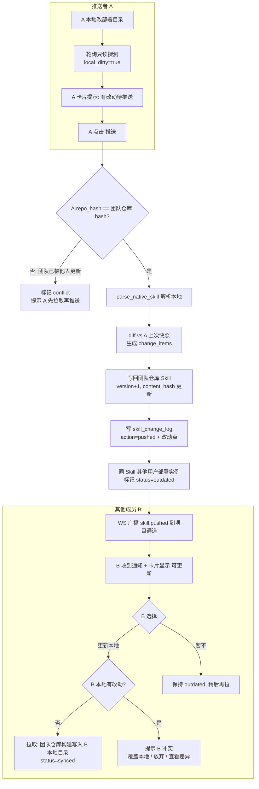

# 推送用户隔离 + 同步到平台 + 其他用户拉取更新 设计方案

> **本文档已归档** — 所述功能均已落地，当前实现以 [`../design/skill-collaboration-sync.md`](../design/skill-collaboration-sync.md) 为准；本文仅作决策溯源。

> 状态：待确认（先评审本文档，确认无误后再改代码）
> 关联文档：`skill-push-and-abstract-diff-plan.md`、`team-project-skill-sync-plan.md`（同目录）、`../architecture.md`
> 目标：在已实现的"手动推送 + 抽象层改动点"基础上，明确**用户隔离边界**，并补齐两条链路：
> 1. 用户点击「推送」时，本地改动**直接同步到平台**（更新项目 Skill / 团队仓库）。
> 2. 同项目下其他已部署该 Skill 的用户**收到通知**，可选择把更新**拉取到自己本地**。

---

## 一、需求拆解

用户描述的目标流程：

1. 用户本地部署完 Skill 后，平台实时跟踪这个本地 Skill 实例。
2. 本地有改动时，平台提示该用户"是否推送到项目 Skill"。
3. 用户点击推送，本地改动同步到平台。
4. 该项目下其他用户收到通知"是否更新本地 Skill"。
5. 其他用户确认后，把平台最新内容拉取到自己的本地部署目录。

贯穿其中的关键词是**用户隔离**：每个成员的本地部署、跟踪、改动、推送都是独立的，互不干扰；只有"推送"这一显式动作才会把某个成员的改动同步到平台，进而影响其他成员。

---

## 二、现状梳理

### 2.1 已经满足的隔离

- `user_skill_deployments` 表本身是 per-user 的（`user_id + project_id + team_skill_id + tool_type + deploy_path`）。
- `list_project_skills(project_id, user_id)` 已按 `user_id` 过滤，**每个用户只看到自己的部署状态卡片**（`backend/app/services/project_service.py`）。
- `push_deployment` / `get_deployment_local_status` / `stop_tracking` / `promote` 均校验 `deployment.user_id == user_id`，**不能操作他人部署实例**。
- 本地改动探测 `refresh_deployment_dirty` 按部署实例独立维护 `local_dirty`。

结论：**部署、跟踪、改动检测、推送权限**这几层用户隔离已经具备。

### 2.2 尚缺的能力

| 缺口 | 当前行为 | 目标行为 |
|------|----------|----------|
| 推送语义 | `push_deployment` 只把改动写入 `skill_change_log`（`action=pushed`）并更新自己的快照基线，**不写团队仓库**；写回仓库要再点「提升」`promote_deployment` | 推送即"同步到平台"——直接更新团队仓库 Skill 并推进版本 |
| 其他用户通知 | 无。推送后其他成员的部署实例状态不变 | 推送后，同 Skill 的其他用户部署实例标记为"可更新"，并收到通知 |
| 拉取更新 | `sync_pull` 只把内容返回给前端编辑器，**不写用户本地部署目录** | 新增"拉取更新"：把团队仓库最新构建并写回该用户本地部署目录 |
| 落后状态 | `status` 只有 `synced/changed/conflict/missing/untracked` | 新增 `outdated`（团队仓库比我本地新） |
| 动态视角 | 项目动态平铺所有用户记录（含历史遗留英文 `deployment files changed`） | 动态保留为审计流；"需要我行动"的提示改由我自己的部署卡片状态驱动 |

> 截图中的 `DAIL 操作了 ... deployment files changed` 是上一版自动轮询遗留的旧日志，新逻辑不再产生；可选择清理或忽略（见决策点 E）。

---

## 三、目标流程

### 3.1 角色

- **推送者 A**：本地改了 Skill，点击推送，把改动同步到平台。
- **其他成员 B/C**：同项目下也部署了同一个 Skill，收到"可更新"通知，决定是否拉取。

### 3.2 流程图

---

## 四、用户隔离边界（明确矩阵）

| 资产 / 行为 | 归属 | 隔离说明 |
|-------------|------|----------|
| 本地部署目录 `install_path` | per-user | 各成员路径/工具不同，互不可见 |
| 跟踪与改动探测 `local_dirty` | per-user | 各自部署实例独立 |
| 部署快照基线 `abstract_snapshot` | per-user | A 的基线只用于算 A 的增量 |
| 推送权限 | per-user | 只能推自己的部署实例 |
| 团队仓库 Skill（`skill_packages` scope=team） | team 共享 | 推送/拉取的唯一事实源 |
| 项目 Skill 列表 `project_skills` | project 共享 | 版本与 content_hash 团队可见 |
| 项目动态 `skill_change_log` | project 共享（审计流） | 记录谁推送/拉取了什么改动点 |
| "需要我行动"提示（推送/拉取） | per-user | 由我自己的 `deployment.status` 驱动 |

---

## 五、推送语义变更（决策点 A，核心）

用户描述"点击推送 = 同步到平台"，因此推荐把**推送重定义为"解析本地 → 写回团队仓库 → 推进版本 → 记录动态 → 通知其他用户"**。

- **方案 A1（推荐，合并推送+提升）**：`push_deployment` 内部完成写回团队仓库（即吸收当前 `promote_deployment` 的写仓库逻辑）。前端去掉单独的「提升」按钮，只保留「推送」。冲突时推送被拦截，提示先拉取。
  - 优点：符合用户"推送即同步到平台"的直觉，操作链路最短。
  - 影响：`promote_deployment` 可保留为内部函数（被推送复用 / 团队自动热更新复用），不再单独暴露按钮。
- **方案 A2（保留两步）**：推送只记录改动（现状），仍需「提升」才写仓库。
  - 与用户描述不符，不推荐。

> 默认按 **A1** 设计。下面的"写回团队仓库 + 通知其他用户"都建立在推送即同步的前提上。

---

## 六、其他用户通知与拉取

### 6.1 推送后标记其他实例为 outdated

`push_deployment` 写回团队仓库成功后：

1. 查询同 `project_id + team_skill_id` 且 `user_id != 推送者` 且 `tracking_enabled` 的所有部署实例。
2. 对每个实例：
   - 若该实例 `local_dirty`（本地也有改动）→ 标记 `conflict`（拉取会冲突）。
   - 否则 → 标记 `outdated`（团队仓库比本地新，可直接拉取）。
3. WS 广播 `skill.pushed` 事件到项目通道（已有），其他成员前端收到后刷新自己的部署卡片即可看到新状态。

### 6.2 新增"拉取更新到本地"接口

`POST /api/v1/skill-deployments/{deployment_id}/pull-update`

服务层 `pull_update_deployment(deployment_id, user_id, overwrite=False)`：

1. 校验归属、tracking。
2. 计算本地实时 hash：
   - 若 `local_dirty`（本地有未推送改动）且 `overwrite=False` → 返回冲突，前端提示"本地有改动，拉取将覆盖，是否继续 / 查看差异"。
3. 用团队仓库当前内容构建目标平台产物并写入该用户 `install_path`（复用 `NativeSkillStore.deploy(dest_path=deploy_path)`）。
4. 重新解析本地为抽象包，更新该实例：`repo_hash=installed_hash=团队 hash`、`repo_version=团队版本`、`abstract_snapshot=最新`、`status=synced`、`local_dirty=False`。
5. 写 `skill_change_log`（`action=pulled`，`source=team_repo`，可带与拉取前的 change_items）。
6. WS 广播（可选）。

### 6.3 通知载体

第一版**不新增通知表**，复用现有机制：

- 其他成员的"可更新"状态 = `deployment.status = outdated`，在项目页部署卡片展示。
- 实时提示 = WS `skill.pushed` 事件触发前端 toast（"{推送者} 更新了 {Skill}，可拉取到本地"）。
- 历史 = `skill_change_log`（action=pushed/pulled）。

---

## 七、冲突处理

| 场景 | 判断 | 处理 |
|------|------|------|
| A 推送，但团队仓库已被他人推送过 | `A.repo_hash != team.content_hash` | 拦截推送，A.status=conflict，提示"先拉取最新再推送" |
| B 拉取，但 B 本地有未推送改动 | `B.local_dirty == true` | 拦截拉取（除非 `overwrite=true`），提示"覆盖本地 / 放弃 / 查看差异" |
| B 同时 outdated + 本地改动 | 上面两者叠加 | 标记 conflict；B 需选择：先推自己的改动（若不冲突）或放弃本地拉取最新 |

第一版不做自动三方合并，只提供"覆盖 / 放弃 / 查看差异"（差异复用已实现的 `diff_abstract_packages`）。

---

## 八、数据模型调整

### 8.1 `user_skill_deployments.status` 取值扩展

新增 `outdated`：团队仓库版本/hash 新于本地部署。完整取值：
`synced` / `changed` / `conflict` / `missing` / `untracked` / `outdated`。

无需新增列（status 已是 String(32)）。

### 8.2 `skill_change_log.action` 取值

沿用并明确：`pushed`（推送写回仓库）、`pulled`（拉取更新到本地）、`conflict`、`missing`。`promoted/auto_promoted` 若按 A1 合并则逐步弃用（保留兼容旧数据）。

> 本方案预计**不需要新增表/新增列**，主要是行为与状态机调整。若评审决定加独立通知表（决策点 D），再追加。

---

## 九、接口调整

| 方法 | 路径 | 说明 | 变化 |
|------|------|------|------|
| POST | `/skill-deployments/{id}/push` | 推送即同步到平台（解析→写团队仓库→标记他人 outdated→通知） | 语义增强 |
| POST | `/skill-deployments/{id}/pull-update` | 拉取团队最新到本地部署目录 | 新增 |
| GET | `/skill-deployments/{id}/local-status` | 只读检测本地改动 | 不变 |
| GET | `/projects/{id}/skills` | 返回 deployment.status 含 outdated | 字段值扩展 |
| POST | `/skill-deployments/{id}/promote` | 按 A1 可下线为内部逻辑 | 待定（决策点 A） |

---

## 十、前端调整

### 10.1 推送者视角（`ProjectSkills.vue`）

- 本地有改动 → 卡片显示"有改动待推送" + 推送按钮（已有）。
- 点击推送时弹出确认（"将把本地改动同步到项目 Skill，团队其他成员可拉取，是否继续？"）——对应用户描述的"平台提示是否推送"。
- 推送冲突 → 提示"团队仓库已更新，请先拉取最新再推送"。

### 10.2 其他成员视角

- 部署卡片新增 `outdated` 状态展示"可更新" + 「更新本地」按钮。
- 收到 WS `skill.pushed` 且该 Skill 是自己已部署的（非自己推送）→ toast 提示 + 刷新卡片。
- 点「更新本地」→ 调 pull-update；若本地有改动则弹冲突确认（覆盖 / 取消 / 查看差异）。

### 10.3 动态展示

- 保留项目动态为审计流，文案区分 `pushed`（推送了）/ `pulled`（更新了本地）。
- 旧英文遗留记录按决策点 E 处理。

### 10.4 API / Store

- `api/projects.ts` 新增 `pullUpdateDeployment`；`UserSkillDeploymentInfo.status` 增加 `outdated` 语义（类型本就是 string）。
- `projectSyncStore` 新增 `pullUpdate` action；`useSkillSync` 对 `skill.pushed` 区分"是否我已部署该 Skill"决定是否提示可更新。

---

## 十一、待确认决策点

- **A. 推送语义**：A1 推送即写回团队仓库并下线单独「提升」按钮（推荐，符合"推送=同步到平台"）/ A2 保留 push+promote 两步。
- **B. 拉取冲突默认**：B 本地有改动时拉取，默认拦截要求显式 `overwrite`（推荐），还是默认覆盖本地？
- **C. 通知范围**：是否只通知"已部署该 Skill"的成员（推荐）？还是项目所有成员都收到？
- **D. 通知存储**：第一版复用 status + change_log + WS（推荐），还是新增独立通知/未读表？
- **E. 历史脏数据**：是否清理旧的英文 `deployment files changed` 等遗留日志？
- **F. 管理员/权限**：推送写回团队仓库是否限制角色（如仅 owner/admin 可推送）？还是任意成员可推送（推荐，团队协作）？

---

## 十二、暂不处理（第一版不做）

- 自动三方合并 Markdown / 资源。
- 拉取/推送的细粒度行级合并 UI（只给覆盖/放弃/查看差异）。
- 跨项目、跨团队的 Skill 实例联动。
- 离线通知聚合与未读计数中心。

---

## 十三、预计改动文件（确认后执行）

后端：
- `app/services/project_service.py`：`push_deployment` 合并写回仓库 + 标记他人 outdated + 通知；新增 `pull_update_deployment`；`promote` 视决策点处理；状态机加 `outdated`。
- `app/api/projects.py`：新增 pull-update 路由；推送响应补充冲突语义。
- `app/schemas/project.py`：新增 `PullUpdateResponse` 等。

前端：
- `api/projects.ts`、`stores/projectSyncStore.ts`、`composables/useSkillSync.ts`、`stores/notificationStore.ts`、`views/ProjectSkills.vue`：推送确认、outdated 展示、拉取更新、通知文案。
