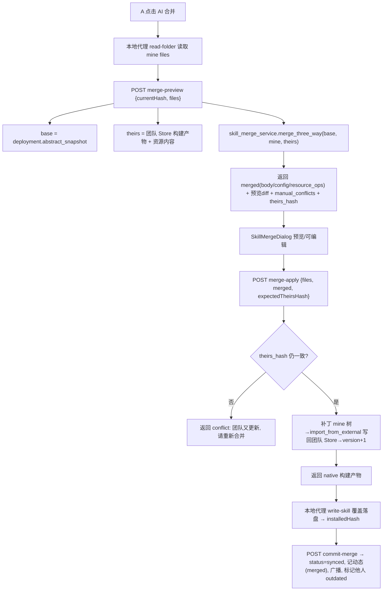

# AI 辅助合并（Skill 冲突一键合并）— 设计

> 状态：**已实现**
> 一句话：推送冲突时，对 base / mine / theirs 三方版本做 AI 三方合并（SKILL.md 正文 + 配置字段 + 文本资源文件），先弹窗预览可编辑，再「一键提交」写回团队仓库、覆盖本地、回到 `synced`。

本文是「AI 辅助合并」子系统的单一事实来源。冲突的判定与拦截见 [skill-collaboration-sync.md](skill-collaboration-sync.md) §6，本文只覆盖冲突**发生后**的 AI 合并链路。

---

## 1. 背景与目标

现状（见 [skill-collaboration-sync.md](skill-collaboration-sync.md) §4.5 / §6）：

- A 本地有未推送改动（`local_dirty`），B 先推送一版 → A 的部署被标记 `status="conflict"`（团队仓库已前进 + A 本地有改动两者叠加）。
- A 再推送被拦截（`push_deployment` / `push_deployment_content` 双重闸：`status ∈ {outdated, conflict}` 与 `repo_hash != team.content_hash`）。
- 此前 A 只能「覆盖 / 放弃」，本地改动会被白白丢弃。

本功能新增第三条出路：**AI 三方合并**。在不丢弃任一方改动的前提下，把 A 与 B 的改动合并成新版本，一键提交。

---

## 2. 三方合并的数据来源

合并基于**平台抽象包**（与 [skill-forge.md](skill-forge.md) 对齐），抽象包结构见 [`skill_diff_service.parse_native_skill`](../../backend/app/services/skill_diff_service.py)：

```
{ "config": {...}, "vibeh_body": "SKILL.md 正文", "resources": { "scripts/foo.py": "<sha256>", ... } }
```

三方版本的取得：

| 角色 | 含义 | 来源 | 内容完整性 |
|------|------|------|------------|
| **base** | 共同祖先（A 上次同步态） | `user_skill_deployments.abstract_snapshot`（DB） | 正文/配置全文；资源**仅 sha256**（快照不存内容） |
| **mine** | A 的本地工作副本 | 前端经本地代理 `read-folder` 上传的 `files[]` | 全量（正文/配置/资源内容齐全） |
| **theirs** | 团队仓库最新（含 B 的改动） | `_build_artifact_payload(skill_id, tool)` + `collect_store_resources(prefix)` | 全量（从对象存储 Store 取） |

> **关键限制**：base 的资源**内容**未存快照（只有 hash）。因此正文与配置可做「真三方合并」，而资源文件双边都改时只能退化为「mine ↔ theirs 二方合并」。

---

## 3. 合并范围与策略

### 3.1 SKILL.md 正文（`vibeh_body`）— 真三方合并
- mine == base → 取 theirs；theirs == base → 取 mine；mine == theirs → 任一。
- 三方互不相同 → 调 LLM 做三方合并（给定 base/mine/theirs 全文，要求产出合并稿，保留双方语义、不臆造）。

### 3.2 配置字段（`config`）— 字段级三方合并
纳入白名单字段（与 `skill_diff_service._FIELD_LABELS` 一致）：`description` / `ui.*` / `policy.auto_invoke` / `metadata.*` / `dependencies.*`。
- 逐字段比对 base/mine/theirs：单边改动直接采纳；双边一致采纳；**双边冲突**字段交 LLM 批量裁决（一次 JSON 调用）。
- `name` 不参与合并（团队仓库 id 不可变，写回时恒为 `skill_id`）。

### 3.3 文本资源文件（scripts / references / assets）
用三方 hash 判定各边「增 / 删 / 改」：

| 情况 | 处理 |
|------|------|
| 仅单边改/增/删 | 直接采纳该边 |
| 双边同改且 hash 相同 | 采纳（无冲突） |
| 双边都改且为**文本** | LLM 二方合并（mine ↔ theirs；base 内容不可得） |
| 双边都改且为**二进制** | 列入「需手动处理」，默认保留 theirs |
| 双边均未改 | 保留 theirs（== mine == base） |

文本/二进制判定口径与 [`content_transfer._encode_bytes`](../../backend/app/services/content_transfer.py) 一致（可 UTF-8 解码即文本）。

### 3.4 容错降级
LLM 未配置（`LLM_API_KEY` 空）或调用/解析失败时：
- 能用规则解决的（单边改动）照常合并；
- 需 AI 裁决处（正文三方冲突、配置冲突字段、文本资源双改）**降级**：正文/资源默认保留 mine 并记入 `notes` 提示人工处理，配置冲突字段保留 mine。
- 前端据 `merge_available=false` 弱化「AI 合并」入口并提示「未配置 AI，建议覆盖/放弃」。

---

## 4. 端到端流程



三段式（与 pull 的 `build-artifact → write-skill → commit-pull` 同模式），云端**不读用户本地盘**：

1. **merge-preview**：只算不写。重建 mine（临时目录）→ 取 base/theirs → 三方合并 → 返回合并稿 + 预览 diff（合并稿相对 theirs 的改动点）+ 手动冲突清单 + `theirs_hash`（乐观锁令牌）。
2. **merge-apply**：乐观锁校验 `theirs_hash` 未再变（团队在预览期间未被第三次推送）→ 以 mine 临时树为基底打补丁（替换 SKILL.md 正文、按合并稿改配置写回 frontmatter / `agents/openai.yaml`、按 `resource_ops` 覆盖/新增/删除资源、补 theirs-only 文件）→ `NativeSkillStore.import_from_external(..., allow_team_update=True, target_skill_id=skill_id)` 写回 Store → `version+1`、`content_hash` 更新 → 返回 native 构建产物。
3. 前端 `write-skill`（overwrite）把产物覆盖落盘 → 本地代理实算 `installedHash`。
4. **commit-merge**：置本部署 `synced`、`local_dirty=false`、`installed_hash/repo_hash/repo_version/abstract_snapshot` 更新 → 写 `skill_change_log(action='merged')` → `_mark_other_deployments_outdated` 标记其他成员落后 → 广播 `skill.pushed`。

---

## 5. 关键 API

| 方法 | 路径 | 说明 |
|------|------|------|
| POST | `/api/v1/skill-deployments/{id}/merge-preview` | 入参 `{currentHash, files}`；返回 `{merged, preview_change_items, manual_conflicts, notes, theirs_hash, merge_available}`。只算不写。 |
| POST | `/api/v1/skill-deployments/{id}/merge-apply` | 入参 `{files, merged, expectedTheirsHash}`；乐观锁校验通过则写回团队 Store（version+1）并返回 native 构建产物（同 build-artifact 形状）。 |
| POST | `/api/v1/skill-deployments/{id}/commit-merge` | 入参 `{installedHash, repoHash, repoVersion, abstractSnapshot}`；登记 `synced` + 写动态(`merged`) + 标记他人 outdated + 广播。 |

`merged` 结构（preview 产出、apply 回送，预览框可编辑后回送）：

```json
{
  "body": "合并后的 SKILL.md 正文",
  "config": { "description": "...", "ui": {...}, "policy": {...}, "metadata": {...}, "dependencies": {...} },
  "resource_ops": [
    { "path": "scripts/foo.py", "action": "write_text", "encoding": "utf8", "content": "..." },
    { "path": "assets/logo.png", "action": "use_theirs" },
    { "path": "references/old.md", "action": "delete" }
  ]
}
```

`resource_ops.action ∈ {use_mine, use_theirs, write_text, delete}`：apply 以 mine 树为基底应用——`use_mine` 保留、`use_theirs` 从 Store 取内容覆盖/新增、`write_text` 写入（合并/编辑后的）文本、`delete` 删除。

---

## 6. 前端入口与组件

| 位置 | 角色 |
|------|------|
| [ProjectSkills.vue](../../frontend/src/views/ProjectSkills.vue) | `status==='conflict'` 时在「更新本地」旁显示「AI 合并」按钮（纯色按钮规范 `.cursor/rules/solid-color-buttons.mdc`）；串联预览→提交。 |
| `SkillMergeDialog.vue` | 预览合并稿：SKILL.md 正文（可编辑）、配置字段差异、文本资源合并结果（可编辑）、「需手动处理」清单；底部「确认提交」一键提交。 |
| [orchestration.ts](../../frontend/src/api/orchestration.ts) | `mergePreviewOrchestrated`（read-folder→merge-preview）/ `mergeCommitOrchestrated`（merge-apply→write-skill→commit-merge）。 |
| [projects.ts](../../frontend/src/api/projects.ts) | merge 三端点封装与 DTO，按 `isOrchestrationEnabled()` 分流。 |
| [projectSyncStore.ts](../../frontend/src/stores/projectSyncStore.ts) | `mergePreview` / `mergeCommit` action，提交成功后 `selectProject` 刷新。 |

---

## 7. 冲突 / 边界处理

| 场景 | 处理 |
|------|------|
| 预览期间团队又被第三人推送 | merge-apply 乐观锁 `expectedTheirsHash != 当前 theirs_hash` → 返回 `conflict`，提示「团队又更新，请重新合并」。 |
| 本地在预览后又改动 | apply 仍以重新上传的 `files` 为准（前端在 apply 前再次 read-folder）；不一致以提交内容为准。 |
| LLM 未配置 / 失败 | 见 §3.4 降级；保留覆盖/放弃兜底。 |
| 二进制资源双改 | 列「需手动处理」，默认保留 theirs；用户提交后可在本地手动改完再普通推送。 |
| 大 Skill 超 token | 正文/资源按文件分块送 LLM；单文件超限 → 转「需手动处理」。 |

---

## 8. 已知限制 / 后续增强

- 资源文件双边都改为二方合并（base 资源内容未入快照）；后续可在快照内存全量资源内容以实现资源真三方合并。
- 仅正文 / 文本资源行级由 LLM 处理，无确定性三方算法兜底（如 diff3）；可叠加 diff3 作为 LLM 前置。
- 配置 `name` 与团队 id 绑定，重命名意图仍走 `ui.display_name`（见 [skill-collaboration-sync.md](skill-collaboration-sync.md) §9）。

---

## 9. 配置

复用现有 LLM 抽象层（[backend/app/services/llm/](../../backend/app/services/llm/)，默认百炼 `qwen-plus`），无需新增配置项：

- `LLM_PROVIDER` / `LLM_BASE_URL` / `LLM_API_KEY` / `LLM_MODEL`（见 [backend/app/core/config.py](../../backend/app/core/config.py)）。
- 未配置 `LLM_API_KEY` 时 AI 合并降级（§3.4），不阻断「覆盖 / 放弃」原路径。
