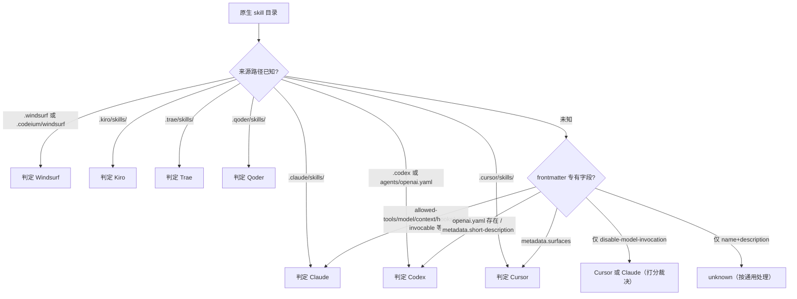

# Skill Forge — 抽象 Skill 包 & 多平台构建设计

> 版本：v0.6 (Confirmed)  
> 目标平台：Cursor、Codex CLI、Claude Code、Windsurf Cascade、Kiro、Trae、Qoder

---

## 一、设计目标

1. 定义一个**平台无关的抽象 Skill 包**格式（`skill.config.yaml` + `SKILL.md`），作为所有平台信息的**超集**
2. 针对每个目标平台，定义**严格的构建规则**——生成的产物必须 100% 符合该平台规范，不含任何其他平台的文件或字段
3. 构建过程是**有损转换**——目标平台不支持的字段和文件会被精确丢弃
4. 支持**反向导入**——从任意已支持平台（Cursor / Codex / Claude / Windsurf / Kiro）的原生 skill 解析为抽象包，这是平台核心能力
5. 明确区分**仓库快照**、**项目 Skill 列表**与**用户部署实例**——导入仓库后不再监听原始来源目录；用户部署后才监听其本地部署目录
6. **CC（Claude Code）与 Windsurf 必须按各自平台真实的 skill 结构构建/导入**，不再退化为 Cursor 的「最小公分母」克隆——Claude 完整 round-trip 其专有 frontmatter，Windsurf 忠于其官方 `name`+`description` 规范
7. **Kiro 按 Agent Skills 标准核心字段构建/导入**——支持 `name`/`description` + 标准可选字段 `license`/`compatibility`/`metadata`(author/version)，不写 Codex 的 `ui.*`、Cursor 的 `disable-model-invocation`/`metadata.surfaces` 与 Claude 的运行时扩展字段
8. **Trae 按与 Windsurf 同源的最小 Agent Skills 规范构建/导入**——官方仅文档化 `name`+`description`，构建产物严格只输出这两个字段；全局目录在 `~/.trae/skills`（国际版 trae.ai）与 `~/.trae-cn/skills`（国内版 trae.cn）间自动探测，项目级统一落 `.trae/skills/`
9. **Qoder 按与 Windsurf/Trae 同源的最小 Agent Skills 规范构建/导入**——官方（IDE 与 CLI 一致）仅文档化 `name`+`description`，构建产物严格只输出这两个字段；全局目录统一为 `~/.qoder/skills`（无国内/国际分叉），项目级落 `.qoder/skills/`，同名时项目级优先

### 七平台概览

| 平台 | 全局 skill 目录 | 项目 skill 目录 | frontmatter 复杂度 | 平台特有产物 |
|------|----------------|----------------|--------------------|--------------|
| Cursor | `~/.cursor/skills/` | `{ws}/.cursor/skills/` | 低（name/description/`disable-model-invocation`） | — |
| Codex CLI | `~/.codex/skills/`（或 `$CODEX_HOME/skills/`） | `{ws}/.codex/skills/` | 低（SKILL.md 仅 name/description） | `agents/openai.yaml`、`LICENSE.txt` |
| Claude Code | `~/.claude/skills/` | `{ws}/.claude/skills/` | **高**（标准超集 + 运行时扩展 15+ 字段） | 无独立文件，全部写入 frontmatter |
| Windsurf | `~/.codeium/windsurf/skills/` | `{ws}/.windsurf/skills/` | 低（官方仅 name/description） | — |
| Kiro | `~/.kiro/skills/` | `{ws}/.kiro/skills/` | 中（name/description + 标准可选 license/compatibility/metadata） | — |
| Trae | `~/.trae/skills/`（自动探测 `~/.trae-cn/skills/`） | `{ws}/.trae/skills/` | 低（官方仅 name/description） | — |
| Qoder | `~/.qoder/skills/` | `{ws}/.qoder/skills/` | 低（官方仅 name/description） | — |

---

## 二、抽象 Skill 包结构

### 2.1 目录布局

抽象包是所有平台信息的**超集**——包含每个平台可能用到的全部文件和字段，无论某个平台是否支持。

```
my-skill/
├── skill.config.yaml           # 必需 — 统一配置（该抽象包副本的 source of truth）
├── SKILL.md                    # 必需 — 技能正文（纯 Markdown，不含 frontmatter）
├── scripts/                    # 可选
│   ├── validate.py
│   └── requirements.txt        # Python 依赖声明
├── references/                 # 可选
│   └── api-spec.md
├── assets/                     # 可选
│   ├── icon-small.svg          # 小图标（Codex 用，Cursor/Claude/Windsurf 构建时丢弃）
│   ├── icon-large.svg          # 大图标（Codex 用，Cursor/Claude/Windsurf 构建时丢弃）
│   └── template.png            # 通用资源（所有平台保留）
└── LICENSE                     # 可选（仅 Codex 构建时输出为 LICENSE.txt）
```

### 2.2 `skill.config.yaml` Schema

```yaml
# ============================================================
# 核心字段（所有平台共用）
# ============================================================
name: "my-skill"                      # 必需 | 小写+连字符，最长 64 字符
description: >-                       # 必需 | 最长 1024 字符
  做什么 + 何时使用的完整描述。
  Agent 据此判断是否激活该技能。

# ============================================================
# UI / 展示元数据（Codex 专有，构建到其他平台时丢弃）
# ============================================================
ui:
  display_name: "My Skill"            # 可选 | UI 显示名（人类可读）
  short_description: "简短描述"        # 可选 | 25-64 字符，面板摘要
  brand_color: "#3B82F6"              # 可选 | 品牌强调色
  icon_small: "./assets/icon-small.svg"  # 可选 | 小图标路径（相对 skill 根目录）
  icon_large: "./assets/icon-large.svg"  # 可选 | 大图标路径
  default_prompt: >-                  # 可选 | 用户选择该技能时自动填入的 prompt
    Use $my-skill to do something.

# ============================================================
# 策略 / 行为控制
# ============================================================
policy:
  auto_invoke: true                   # 可选 | 是否允许 Agent 自动激活（默认 true）
                                      # false = 仅显式调用时加载
                                      # 映射：Cursor / Claude → disable-model-invocation
                                      #       Codex          → policy.allow_implicit_invocation

# ============================================================
# Claude Code 专有运行时字段（构建到其他平台时丢弃）
# 与 Codex 专有的 `ui:` 块平行，承载 Claude SKILL.md 的扩展 frontmatter
# ============================================================
claude:
  allowed_tools: "Read, Grep, Glob"   # 可选 | 技能激活时免确认的工具（空格/逗号分隔或 YAML 列表）
                                      #        支持 Bash(git *) 等模式；属 Agent Skills 标准但实验性，
                                      #        当前仅 Claude 输出
  disallowed_tools: "AskUserQuestion" # 可选 | 技能激活时从工具池移除（Claude 专有）
  user_invocable: true                # 可选 | false 则隐藏于 / 菜单（背景知识，默认 true）
  argument_hint: "<environment>"      # 可选 | 调用时的参数自动补全提示
  model: "sonnet"                     # 可选 | 模型覆盖（haiku/sonnet/opus 或完整模型 ID）
  effort: "high"                      # 可选 | 推理努力级别（low/medium/high/max）
  context: "fork"                     # 可选 | inline（默认）| fork（在隔离子代理中运行）
  agent: "Explore"                    # 可选 | context: fork 时的子代理类型（Explore/Plan/general-purpose）
  when_to_use: "Use when user asks to deploy."  # 可选 | 自然语言触发提示（与 description 合并计入列表预算）
  hooks:                              # 可选 | 技能范围内的 Hooks（与 settings.json hooks 同 schema）
    PreToolUse:
      - matcher: "Bash(git commit)"
        hooks:
          - type: command
            command: "./scripts/validate.sh"

# ============================================================
# 依赖声明
# ============================================================
dependencies:
  skills:                             # 可选 | 依赖的其他技能
    - "$imagegen"
  tools:                              # 可选 | 依赖的外部工具（Codex openai.yaml 用）
    - type: "mcp"
      name: "github"
      transport: "streamable_http"
      url: "https://..."

# ============================================================
# 资源声明（显式列出，避免歧义）
# ============================================================
resources:
  scripts:                            # 可选
    - path: "scripts/validate.py"
      description: "校验输出格式"
    - path: "scripts/requirements.txt"
      description: "Python 依赖"
  references:                         # 可选
    - path: "references/api-spec.md"
      description: "API 参考文档"
  assets:                             # 可选
    - path: "assets/template.png"
      description: "模板图片"

# ============================================================
# 元数据
# ============================================================
metadata:
  license: "MIT"                      # 可选 | Codex → LICENSE.txt；Claude → frontmatter license
  compatibility: "Requires Node 20+"  # 可选 | Agent Skills 标准；Claude → frontmatter compatibility
  author: "your-name"                 # 可选 | Claude → frontmatter metadata.author
  version: "1.0.0"                    # 可选 | Claude → frontmatter metadata.version
  tags: ["coding", "review"]          # 可选
  surfaces: ["ide"]                   # 可选 | Cursor 特有：限定适用界面
```

> **Schema 字段归属约定**
>
> - **共用字段**：`name`、`description`、`policy.auto_invoke`、`dependencies`、`resources`、`metadata`。
> - **`ui:` 块**：Codex 专有（品牌、图标、默认提示词），构建到 Cursor/Claude/Windsurf 时整体丢弃。
> - **`claude:` 块**：Claude Code 专有运行时字段，构建到 Cursor/Codex/Windsurf 时整体丢弃。
> - **`policy.auto_invoke` 跨平台复用**：Cursor 与 Claude 共用同一语义（`auto_invoke: false` → `disable-model-invocation: true`）；Codex 映射为 `policy.allow_implicit_invocation`；Windsurf 无对应字段（忽略）。
> - `allowed_tools` / `disallowed_tools` 虽属 Agent Skills 标准（experimental），但当前仅 Claude 实际消费，故归入 `claude:` 块，避免暗示 Cursor/Codex/Windsurf 也会输出。
>
> **与代码 schema（`unified.ts`）的对应**：现有 `unified.ts` 用 `triggers.disableModelInvocation`（对应本文 `policy.auto_invoke` 取反）与 `triggers.allowImplicitInvocation`，并已有 `ui`、`dependencies`、`resources`、`targets` 块。本设计新增 `claude` 块与 `metadata` 标准字段（`license`/`compatibility`/`author`/`version`）需在 `unified.ts` 落地，详见第十五章「后续实现触点」。

### 2.3 资源分类：通用 vs 平台特有

抽象包中的每个文件在构建时会被判定为"通用"或"平台特有"：

| 文件 | 分类 | Cursor | Codex | Claude | Windsurf | Kiro | Trae | Qoder |
|------|------|--------|-------|--------|----------|------|------|-------|
| `SKILL.md` | 通用（合并入 SKILL.md） | 合并 | 合并 | 合并 | 合并 | 合并 | 合并 | 合并 |
| `skill.config.yaml` | 仅抽象包 | 丢弃 | 丢弃 | 丢弃 | 丢弃 | 丢弃 | 丢弃 | 丢弃 |
| `scripts/*` | 通用 | 复制 | 复制 | 复制 | 复制 | 复制 | 复制 | 复制 |
| `references/*` | 通用 | 复制 | 复制 | 复制 | 复制 | 复制 | 复制 | 复制 |
| `assets/*`（非图标） | 通用 | 复制 | 复制 | 复制 | 复制 | 复制 | 复制 | 复制 |
| `assets/icon-*.svg` | 平台特有（Codex UI） | **丢弃** | 复制 | **丢弃** | **丢弃** | **丢弃** | **丢弃** | **丢弃** |
| `LICENSE` | 平台特有（Codex） | **丢弃** | 复制为 `LICENSE.txt` | **丢弃**（许可证写入 frontmatter `license`） | **丢弃** | **丢弃**（许可证写入 frontmatter `license`） | **丢弃** | **丢弃** |
| `agents/openai.yaml` | 平台特有（Codex） | **丢弃** | 生成 | **丢弃** | **丢弃** | **丢弃** | **丢弃** | **丢弃** |

> Cursor 历史实现仅复制 `scripts/` 与 `references/`（不复制 `assets/`）。本设计统一约定：**五平台均复制 `assets/` 中的通用资源**（仅 Codex 额外保留图标文件）；该差异在 Cursor 适配器落地时一并对齐。

判定规则：一个文件是否"平台特有"取决于它是否被 `skill.config.yaml` 中的**平台特有字段**（如 `ui.icon_small`）引用。被 `SKILL.md` 正文引用的文件始终视为通用。

### 2.4 跨平台 frontmatter 字段兼容矩阵

构建时各平台对抽象字段的处理（✅ 输出 / ❌ 丢弃 / — 不适用）：

| 抽象字段 | Cursor | Codex | Claude | Windsurf | Kiro | Trae | Qoder |
|----------|--------|-------|--------|----------|------|------|-------|
| `name` | ✅ | ✅ | ✅ | ✅ | ✅ | ✅ | ✅ |
| `description` | ✅ | ✅ | ✅ | ✅ | ✅ | ✅ | ✅ |
| `policy.auto_invoke: false` | ✅ `disable-model-invocation` | ✅ `allow_implicit_invocation:false`（openai.yaml） | ✅ `disable-model-invocation` | ❌ | ❌ | ❌ | ❌ |
| `metadata.surfaces` | ✅ `metadata.surfaces` | ❌ | ❌ | ❌ | ❌ | ❌ | ❌ |
| `metadata.license` | ❌ | ✅ `LICENSE.txt` | ✅ frontmatter `license` | ❌ | ✅ frontmatter `license` | ❌ | ❌ |
| `metadata.compatibility` | ❌ | ❌ | ✅ frontmatter `compatibility` | ❌ | ✅ frontmatter `compatibility` | ❌ | ❌ |
| `metadata.author/version` | ❌ | ❌ | ✅ frontmatter `metadata` | ❌ | ✅ frontmatter `metadata` | ❌ | ❌ |
| `ui.*`（图标/品牌/display/default_prompt） | ❌ | ✅ `agents/openai.yaml` | ❌ | ❌ | ❌ | ❌ | ❌ |
| `dependencies.tools` | ❌ | ✅ `agents/openai.yaml` | ❌（Claude 在 `.mcp.json`/`settings.json`，超出 skill 范围） | ❌ | ❌ | ❌ | ❌ |
| `claude.allowed_tools` / `disallowed_tools` | ❌ | ❌ | ✅ frontmatter | ❌ | ❌ | ❌ | ❌ |
| `claude.user_invocable` | ❌ | ❌ | ✅ frontmatter | ❌ | ❌ | ❌ | ❌ |
| `claude.argument_hint` | ❌ | ❌ | ✅ frontmatter | ❌ | ❌ | ❌ | ❌ |
| `claude.model` / `effort` | ❌ | ❌ | ✅ frontmatter | ❌ | ❌ | ❌ | ❌ |
| `claude.context` / `agent` | ❌ | ❌ | ✅ frontmatter | ❌ | ❌ | ❌ | ❌ |
| `claude.when_to_use` | ❌ | ❌ | ✅ frontmatter | ❌ | ❌ | ❌ | ❌ |
| `claude.hooks` | ❌ | ❌ | ✅ frontmatter | ❌ | ❌ | ❌ | ❌ |

> 设计原则：抽象包是超集，**写到任一平台只保留该平台支持的字段，其余精确丢弃**；导入时反向把平台原生字段还原到抽象层。

### 2.5 `SKILL.md` — 技能正文

纯 Markdown，**不含 YAML frontmatter**。这是技能的核心指令内容，构建时会被嵌入到各平台的 `SKILL.md` 中。

```markdown
# My Skill

## Overview
...

## Workflow
1. Step one
2. Step two

## Script
Run: `python scripts/validate.py`
```

---

## 三、Cursor 构建规则

### 3.1 产物目录

```
<output>/
├── SKILL.md                    # 合成：frontmatter + SKILL.md
├── scripts/                    # 原样复制
├── references/                 # 原样复制
└── assets/                     # 仅复制通用资源（图标文件丢弃）
```

### 3.2 生成 `SKILL.md`

将 `skill.config.yaml` 的字段映射为 Cursor frontmatter + `SKILL.md` 正文：

```yaml
---
name: "{name}"
description: "{description}"
disable-model-invocation: true        # 仅当 policy.auto_invoke == false 时输出
metadata:                             # 仅当 metadata.surfaces 有值时输出
  surfaces: ["{metadata.surfaces}"]
---

{SKILL.md 原文}
```

### 3.3 字段映射

| 抽象字段 | Cursor 映射 | 说明 |
|----------|-------------|------|
| `name` | frontmatter `name` | 直接映射 |
| `description` | frontmatter `description` | 直接映射 |
| `policy.auto_invoke: false` | `disable-model-invocation: true` | 反转布尔值 |
| `policy.auto_invoke: true` | **不输出该字段** | Cursor 默认允许 |
| `metadata.surfaces` | `metadata.surfaces` | 仅 Cursor 支持，直接映射 |
| `ui.*` | **全部丢弃** | Cursor 无 UI 元数据文件 |
| `claude.*` | **全部丢弃** | Claude 专有运行时字段 |
| `dependencies.tools` | **丢弃** | Cursor 无独立依赖声明 |
| `dependencies.skills` | **构建时校验**是否已安装，但不输出到产物 | 正文中的 `$skill` 引用已足够 |
| `metadata.license` | **丢弃** | Cursor 不需要 LICENSE |
| `resources.*` | 按路径复制通用文件 | 排除平台特有资源 |

### 3.4 严格删除清单

构建 Cursor 产物时，以下文件/目录**绝对不能存在**：

| 禁止文件 | 原因 |
|----------|------|
| `agents/` 目录 | Codex 特有 |
| `openai.yaml` | Codex 特有 |
| `LICENSE` / `LICENSE.txt` | Cursor 不需要 |
| `skill.config.yaml` | 抽象包配置，非平台文件 |
| `SKILL.md` | 已合并入 SKILL.md |
| `ui.icon_small` 引用的图标文件 | Cursor 无 UI 元数据 |
| `ui.icon_large` 引用的图标文件 | Cursor 无 UI 元数据 |
| `claude.*` 引用的字段 | Claude 专有 |

### 3.5 部署目标

| 范围 | 目标路径 |
|------|----------|
| 用户全局 | `~/.cursor/skills/{name}/` |
| 项目级 | `{workspace}/.cursor/skills/{name}/` |

---

## 四、Codex 构建规则

### 4.1 产物目录

```
<output>/
├── SKILL.md                    # 合成：精简 frontmatter + BODY.md
├── agents/
│   └── openai.yaml             # 从 ui + policy + dependencies 生成
├── scripts/                    # 原样复制（含 requirements.txt）
├── references/                 # 原样复制
├── assets/                     # 原样复制（含图标）
└── LICENSE.txt                 # 从 metadata.license 生成（可选）
```

### 4.2 生成 `SKILL.md`

Codex 的 SKILL.md **不含** 策略/UI 字段，仅保留 Agent 指令：

```yaml
---
name: "{name}"
description: "{description}"
---

{SKILL.md 原文}
```

### 4.3 生成 `agents/openai.yaml`

```yaml
interface:
  display_name: "{ui.display_name}"               # 回退到 name 的 Title Case
  short_description: "{ui.short_description}"      # 回退到 description 截取前 64 字符
  brand_color: "{ui.brand_color}"                  # 可选，有值才输出
  icon_small: "{ui.icon_small}"                    # 可选，有值才输出
  icon_large: "{ui.icon_large}"                    # 可选，有值才输出
  default_prompt: "{ui.default_prompt}"            # 回退到 "Use ${name} to ..."

dependencies:                                      # 仅当 dependencies.tools 有值时输出
  tools:
    - type: "{dependencies.tools[].type}"
      value: "{dependencies.tools[].name}"
      transport: "{dependencies.tools[].transport}"
      url: "{dependencies.tools[].url}"

policy:                                            # 仅当 auto_invoke != true 时输出
  allow_implicit_invocation: false                 # policy.auto_invoke 的直接映射
```

### 4.4 字段映射

| 抽象字段 | Codex 映射 | 说明 |
|----------|------------|------|
| `name` | SKILL.md frontmatter `name` | 直接映射 |
| `description` | SKILL.md frontmatter `description` | 直接映射 |
| `policy.auto_invoke` | openai.yaml `policy.allow_implicit_invocation` | 直接映射（同义） |
| `ui.display_name` | openai.yaml `interface.display_name` | 回退：name 转 Title Case |
| `ui.short_description` | openai.yaml `interface.short_description` | 回退：description[:64] |
| `ui.brand_color` | openai.yaml `interface.brand_color` | 可选 |
| `ui.icon_small` | openai.yaml `interface.icon_small` | 可选 |
| `ui.icon_large` | openai.yaml `interface.icon_large` | 可选 |
| `ui.default_prompt` | openai.yaml `interface.default_prompt` | 回退：`"Use ${name} to ..."` |
| `dependencies.skills` | **构建时校验**是否已安装，但不输出到产物 | 正文中的 `$skill` 引用已足够 |
| `dependencies.tools` | openai.yaml `dependencies.tools` | 直接映射 |
| `metadata.license` | `LICENSE.txt` 文件 | 生成标准 License 文本 |
| `metadata.surfaces` | **丢弃** | Codex 无此概念 |
| `claude.*` | **丢弃** | Claude 专有运行时字段 |

### 4.5 严格删除清单

构建 Codex 产物时，以下**绝对不能存在**：

| 禁止内容 | 原因 |
|----------|------|
| SKILL.md 中的 `disable-model-invocation` | Cursor/Claude 特有字段 |
| SKILL.md 中的 `metadata.surfaces` | Cursor 特有字段 |
| SKILL.md 中的 `allowed-tools` / `model` / `context` / `hooks` 等 | Claude 特有字段 |
| `skill.config.yaml` | 抽象包配置，非平台文件 |
| `SKILL.md` | 已合并入 SKILL.md |

### 4.6 部署目标

| 范围 | 目标路径 |
|------|----------|
| 用户全局 | `~/.codex/skills/{name}/`（或 `$CODEX_HOME/skills/{name}/`） |
| 项目级 | `{workspace}/.codex/skills/{name}/` |

---

## 五、Claude 构建规则

> Claude Code 的 skill 采用 Agent Skills 开放标准，并在其上扩展了一组**运行时 frontmatter 字段**（`model`、`effort`、`context: fork`、`agent`、`hooks`、`allowed-tools`、`user-invocable`、`argument-hint`、`when_to_use` 等）。这些字段全部写入 **同一个 `SKILL.md` 的 frontmatter**——Claude **没有** 类似 Codex `agents/openai.yaml` 的独立元数据文件。
>
> 因此，「按 Claude 平台特有结构构建」= **把抽象包里的标准字段与 `claude:` 块完整映射进 `SKILL.md` frontmatter**，而非退化为只写 `name`+`description`（现状实现的缺陷）。

### 5.1 产物目录

```
<output>/
├── SKILL.md                    # 合成：完整 frontmatter（标准 + Claude 扩展） + SKILL.md
├── scripts/                    # 原样复制
├── references/                 # 原样复制
└── assets/                     # 仅复制通用资源（图标文件丢弃）
```

> 目录名（`{name}`）即 Claude 的 `/command` 名。Claude 在技能激活时可读取目录内任意文件（`scripts/`、`references/`、`assets/` 等）。

### 5.2 生成 `SKILL.md`

```yaml
---
name: "{name}"
description: "{description}"
disable-model-invocation: true        # 仅当 policy.auto_invoke == false 时输出
license: "{metadata.license}"          # 仅当有值时输出
compatibility: "{metadata.compatibility}"  # 仅当有值时输出
metadata:                             # 仅当 author/version 有值时输出
  author: "{metadata.author}"
  version: "{metadata.version}"
allowed-tools: "{claude.allowed_tools}"        # 仅当有值时输出
disallowed-tools: "{claude.disallowed_tools}"  # 仅当有值时输出
user-invocable: false                 # 仅当 claude.user_invocable == false 时输出
argument-hint: "{claude.argument_hint}"        # 仅当有值时输出
when_to_use: "{claude.when_to_use}"            # 仅当有值时输出
model: "{claude.model}"                # 仅当有值时输出
effort: "{claude.effort}"              # 仅当有值时输出
context: "fork"                       # 仅当 claude.context == "fork" 时输出
agent: "{claude.agent}"                # 仅当 context: fork 且有值时输出
hooks:                                # 仅当 claude.hooks 有值时输出（原样透传）
  PreToolUse:
    - matcher: "Bash(git commit)"
      hooks:
        - type: command
          command: "./scripts/validate.sh"
---

{SKILL.md 原文}
```

> 所有字段都是「有值才输出」，最小产物退化为 `name` + `description`（与 Agent Skills 标准一致，Claude 也接受）。

### 5.3 字段映射

| 抽象字段 | Claude frontmatter | 说明 |
|----------|--------------------|------|
| `name` | `name` | 直接映射；同时是目录名 / `/command` 名 |
| `description` | `description` | 直接映射（与 `when_to_use` 合并后在列表中截断至 ~1536 字符） |
| `policy.auto_invoke: false` | `disable-model-invocation: true` | 反转布尔值；与 Cursor 同义复用 |
| `policy.auto_invoke: true` | **不输出该字段** | Claude 默认允许自动调用 |
| `metadata.license` | `license` | 直接映射（Claude 接受 license 名或文件引用） |
| `metadata.compatibility` | `compatibility` | 直接映射（环境要求） |
| `metadata.author` / `metadata.version` | `metadata: { author, version }` | 映射为 Claude 的任意键值 `metadata` |
| `metadata.surfaces` | **丢弃** | Cursor 特有 |
| `claude.allowed_tools` | `allowed-tools` | 直接映射（空格/逗号串或 YAML 列表；支持 `Bash(git *)`） |
| `claude.disallowed_tools` | `disallowed-tools` | 直接映射 |
| `claude.user_invocable` | `user-invocable` | 仅 `false` 时输出（默认 true） |
| `claude.argument_hint` | `argument-hint` | 直接映射 |
| `claude.when_to_use` | `when_to_use` | 直接映射 |
| `claude.model` | `model` | 直接映射 |
| `claude.effort` | `effort` | 直接映射 |
| `claude.context` | `context` | 仅 `fork` 时输出 |
| `claude.agent` | `agent` | 仅 `context: fork` 且有值时输出 |
| `claude.hooks` | `hooks` | 原样透传（同 settings.json hooks schema） |
| `ui.*` | **全部丢弃** | Codex 专有 UI 元数据 |
| `dependencies.tools` | **丢弃** | Claude 的 MCP 在 `.mcp.json` / `settings.json`，超出 skill 范围 |
| `dependencies.skills` | **构建时校验**是否已安装，但不输出到产物 | 正文中的引用已足够 |
| `resources.*` | 按路径复制通用文件 | 排除平台特有资源（图标） |

### 5.4 严格删除清单

构建 Claude 产物时，以下文件/目录**绝对不能存在**：

| 禁止内容 | 原因 |
|----------|------|
| `agents/` 目录 / `openai.yaml` | Codex 特有（Claude 全部写入 frontmatter） |
| SKILL.md 中的 `metadata.surfaces` | Cursor 特有字段 |
| `LICENSE` / `LICENSE.txt` 文件 | Claude 用 frontmatter `license`，不落 LICENSE 文件 |
| `ui.icon_*` 引用的图标文件 | Claude 无 UI 元数据 |
| `skill.config.yaml` | 抽象包配置，非平台文件 |
| `SKILL.md` | 已合并入 SKILL.md |

### 5.5 部署目标

| 范围 | 目标路径 |
|------|----------|
| 用户全局 | `~/.claude/skills/{name}/` |
| 项目级 | `{workspace}/.claude/skills/{name}/` |

### 5.6 字段回退策略（Claude 专项）

| 字段 | 回退规则 |
|------|----------|
| `disable-model-invocation` | `policy.auto_invoke` 缺省视为 `true` → 不输出该字段（允许自动调用） |
| `user-invocable` | 缺省视为 `true` → 不输出 |
| `context` | 缺省 `inline` → 不输出；`agent` 仅在 `context: fork` 下才有意义 |
| `allowed-tools` / `disallowed-tools` | 无值不输出 → Claude 继承默认工具集 |
| `model` / `effort` | 无值不输出 → 继承会话默认 |
| `license` / `compatibility` / `metadata` | 无值不输出 |

---

## 六、Windsurf 构建规则

> **结论更正**：早期调研（`docs/research/ai-coding-skills.md`，2026-05-26）记载 Windsurf「无正式 Skill 系统」。该结论已**过时**。Windsurf Cascade 现已**原生支持 Agent Skills 标准的 skill 系统**：
>
> - 工作区：`.windsurf/skills/<name>/SKILL.md`
> - 全局：`~/.codeium/windsurf/skills/<name>/SKILL.md`
> - 企业系统级（只读，IT 部署）：macOS `/Library/Application Support/Windsurf/skills/`、Windows `C:\ProgramData\Windsurf\skills\`、Linux/WSL `/etc/windsurf/skills/`
>
> Windsurf 与 Cascade 的 **rules**（`.windsurf/rules/`，带 `always_on`/`glob`/`model_decision`/`manual` 触发器）是**另一套机制**，与 skill 不同；Skill Forge 只处理 skill，不生成 rules。

### 6.1 产物目录

```
<output>/
├── SKILL.md                    # 合成：极简 frontmatter（仅 name + description） + SKILL.md
├── scripts/                    # 原样复制（随技能激活加载）
├── references/                 # 原样复制
└── assets/                     # 仅复制通用资源（图标文件丢弃）
```

> Windsurf 同样采用渐进式披露：默认只读取 `name` + `description`，技能被调用或 `@mention` 时才加载 `SKILL.md` 全文与附带文件。

### 6.2 生成 `SKILL.md`

Windsurf 官方 frontmatter **仅要求 `name` + `description`**，不文档化其他字段。为忠于规范，构建产物**只输出这两个字段**：

```yaml
---
name: "{name}"
description: "{description}"
---

{SKILL.md 原文}
```

### 6.3 字段映射

| 抽象字段 | Windsurf 映射 | 说明 |
|----------|---------------|------|
| `name` | frontmatter `name` | 直接映射；同时是目录名 |
| `description` | frontmatter `description` | 直接映射（自动调用与 `@mention` 的触发依据） |
| `policy.*` | **丢弃** | Windsurf skill 无 invocation policy 字段 |
| `ui.*` | **全部丢弃** | Codex 专有 |
| `claude.*` | **全部丢弃** | Claude 专有 |
| `metadata.*`（license/surfaces/...） | **全部丢弃** | Windsurf 未文档化 |
| `dependencies.*` | **丢弃** | 无对应声明 |
| `resources.*` | 按路径复制通用文件 | 随技能加载 |

### 6.4 严格删除清单

构建 Windsurf 产物时，以下**绝对不能存在**：

| 禁止内容 | 原因 |
|----------|------|
| `agents/` 目录 / `openai.yaml` | Codex 特有 |
| `disable-model-invocation` | Cursor/Claude 特有字段 |
| `allowed-tools` / `model` / `context` / `hooks` 等 Claude 字段 | Claude 特有 |
| `license` / `compatibility` / `metadata` frontmatter | Windsurf 未文档化字段 |
| `LICENSE` / `LICENSE.txt` | Codex 特有 |
| `skill.config.yaml` / `SKILL.md` | 抽象包文件 |
| `ui.icon_*` 引用的图标文件 | Windsurf 无 UI 元数据 |

### 6.5 部署目标

| 范围 | 目标路径 | 说明 |
|------|----------|------|
| 用户全局 | `~/.codeium/windsurf/skills/{name}/` | 注意在 `~/.codeium` 下，**不是** `~/.windsurf` |
| 项目级 | `{workspace}/.windsurf/skills/{name}/` | 随仓库提交 |
| 企业系统级 | OS 相关只读路径 | **只读，非 Skill Forge 部署目标**，仅供识别 |

---

## 七、Kiro 构建规则

> Kiro（AWS）原生支持开放的 **Agent Skills 标准**：技能是含 `SKILL.md` 的文件夹，frontmatter 至少包含 `name` + `description`，并接受标准可选字段 `license`、`compatibility`、`metadata`（如 author/version）。Kiro 采用渐进式披露：启动时只加载 name + description，匹配请求或用户以 `/` 显式调用时才加载全文。
>
> - 工作区：`{ws}/.kiro/skills/<name>/SKILL.md`
> - 全局：`~/.kiro/skills/<name>/SKILL.md`
> - 同名冲突时**工作区技能优先**于全局技能
>
> Kiro 的 **steering**（`.kiro/steering/`）、**hooks**（`.kiro/hooks/`）、**custom agents**（`.kiro/agents/`）是另外的机制，与 skill 不同；Skill Forge 只处理 skill，不生成 steering/hooks/agents。
>
> Kiro 是介于 Windsurf 与 Claude 之间的「Agent Skills 标准核心」平台：比 Windsurf（仅 name+description）多出标准可选字段 `license`/`compatibility`/`metadata`，但**不含** Claude 的运行时扩展（`model`/`effort`/`context`/`hooks`/`allowed-tools` 等），也**不含** Codex 的 `ui.*`。

### 7.1 产物目录

```
<output>/
├── SKILL.md                    # 合成：标准 frontmatter（name + description + 可选 license/compatibility/metadata） + SKILL.md
├── scripts/                    # 原样复制（随技能激活加载）
├── references/                 # 原样复制
└── assets/                     # 仅复制通用资源（图标文件丢弃）
```

> 目录名（`{name}`）即 Kiro 的技能标识与 `/command` 名，必须与 frontmatter `name` 一致。

### 7.2 生成 `SKILL.md`

Kiro 的 SKILL.md 输出 Agent Skills 标准字段：`name` + `description` 必有，`license` / `compatibility` / `metadata` 有值才输出：

```yaml
---
name: "{name}"
description: "{description}"
license: "{metadata.license}"          # 仅当有值时输出
compatibility: "{metadata.compatibility}"  # 仅当有值时输出
metadata:                             # 仅当 author/version 有值时输出
  author: "{metadata.author}"
  version: "{metadata.version}"
---

{SKILL.md 原文}
```

> 所有可选字段「有值才输出」，最小产物退化为 `name` + `description`（与 Agent Skills 标准一致，Kiro 也接受）。

### 7.3 字段映射

| 抽象字段 | Kiro frontmatter | 说明 |
|----------|------------------|------|
| `name` | `name` | 直接映射；同时是目录名 / `/command` 名 |
| `description` | `description` | 直接映射（自动激活与 `/` 调用的触发依据） |
| `metadata.license` | `license` | 直接映射（接受 license 名或文件引用） |
| `metadata.compatibility` | `compatibility` | 直接映射（环境要求） |
| `metadata.author` / `metadata.version` | `metadata: { author, version }` | 映射为 Kiro 的任意键值 `metadata` |
| `policy.*` | **丢弃** | Kiro skill 无 invocation policy 字段 |
| `metadata.surfaces` | **丢弃** | Cursor 特有 |
| `ui.*` | **全部丢弃** | Codex 专有 UI 元数据 |
| `claude.*` | **全部丢弃** | Claude 专有运行时字段 |
| `dependencies.tools` | **丢弃** | Kiro 的 MCP 在 `mcp.json`/powers，超出 skill 范围 |
| `dependencies.skills` | **构建时校验**是否已安装，但不输出到产物 | 正文中的引用已足够 |
| `resources.*` | 按路径复制通用文件 | 随技能加载 |

### 7.4 严格删除清单

构建 Kiro 产物时，以下**绝对不能存在**：

| 禁止内容 | 原因 |
|----------|------|
| `agents/` 目录 / `openai.yaml` | Codex 特有 |
| `disable-model-invocation` | Cursor/Claude 特有字段 |
| `metadata.surfaces` | Cursor 特有字段 |
| `allowed-tools` / `model` / `effort` / `context` / `agent` / `hooks` / `user-invocable` 等 Claude 字段 | Claude 特有 |
| `LICENSE` / `LICENSE.txt` 文件 | Kiro 用 frontmatter `license`，不落 LICENSE 文件 |
| `ui.icon_*` 引用的图标文件 | Kiro 无 UI 元数据 |
| `skill.config.yaml` / `SKILL.md` | 抽象包文件 |

### 7.5 部署目标

| 范围 | 目标路径 |
|------|----------|
| 用户全局 | `~/.kiro/skills/{name}/` |
| 项目级 | `{workspace}/.kiro/skills/{name}/` |

> 注意：Kiro 导入技能时会复制为真实目录，**不支持** skills 目录下的符号链接；部署必须写真实文件。

---

## 八、Trae 构建规则

> Trae（字节跳动）原生支持开放的 **Agent Skills 标准**：技能是含 `SKILL.md` 的一级子目录，frontmatter 官方仅文档化 `name` + `description`。Trae 启动时只扫描 skills 目录的**一级子目录**（不递归嵌套），匹配请求或用户显式调用时才加载 `SKILL.md` 全文与附带文件（渐进式披露）。
>
> - 工作区：`{ws}/.trae/skills/<name>/SKILL.md`（国际版 trae.ai 与国内版 trae.cn 项目目录相同）
> - 全局：国际版 `~/.trae/skills/<name>/SKILL.md`；国内版 `~/.trae-cn/skills/<name>/SKILL.md`
>
> Trae 的 **rules**（`.trae/rules/`）是另一套始终生效的约束机制，与 skill 不同；Skill Forge 只处理 skill，不生成 rules。
>
> 定位：Trae 与 **Windsurf 同源**——官方均仅文档化 `name`+`description`，故构建规则与 Windsurf 完全一致（严格只输出这两个字段，其余精确丢弃）。与 Windsurf 的唯一差异是部署目录，且全局目录需在国际版 / 国内版间**自动探测**。

### 8.1 产物目录

```
<output>/
├── SKILL.md                    # 合成：极简 frontmatter（仅 name + description） + SKILL.md
├── scripts/                    # 原样复制（随技能激活加载）
├── references/                 # 原样复制
└── assets/                     # 仅复制通用资源（图标文件丢弃）
```

> 目录名（`{name}`）即 Trae 的技能标识，必须与 frontmatter `name` 一致。

### 8.2 生成 `SKILL.md`

Trae 官方 frontmatter **仅要求 `name` + `description`**，不文档化其他字段。为忠于规范，构建产物**只输出这两个字段**：

```yaml
---
name: "{name}"
description: "{description}"
---

{SKILL.md 原文}
```

### 8.3 字段映射

| 抽象字段 | Trae 映射 | 说明 |
|----------|-----------|------|
| `name` | frontmatter `name` | 直接映射；同时是目录名 |
| `description` | frontmatter `description` | 直接映射（自动激活的触发依据，须清晰描述触发条件） |
| `policy.*` | **丢弃** | Trae skill 无 invocation policy 字段 |
| `ui.*` | **全部丢弃** | Codex 专有 |
| `claude.*` | **全部丢弃** | Claude 专有 |
| `metadata.*`（license/surfaces/...） | **全部丢弃** | Trae 未文档化 |
| `dependencies.*` | **丢弃** | 无对应声明 |
| `resources.*` | 按路径复制通用文件 | 随技能加载 |

### 8.4 严格删除清单

构建 Trae 产物时，以下**绝对不能存在**：

| 禁止内容 | 原因 |
|----------|------|
| `agents/` 目录 / `openai.yaml` | Codex 特有 |
| `disable-model-invocation` | Cursor/Claude 特有字段 |
| `allowed-tools` / `model` / `context` / `hooks` 等 Claude 字段 | Claude 特有 |
| `license` / `compatibility` / `metadata` frontmatter | Trae 未文档化字段 |
| `LICENSE` / `LICENSE.txt` | Codex 特有 |
| `skill.config.yaml` / `SKILL.md` | 抽象包文件 |
| `ui.icon_*` 引用的图标文件 | Trae 无 UI 元数据 |

### 8.5 部署目标

| 范围 | 目标路径 | 说明 |
|------|----------|------|
| 用户全局 | `~/.trae/skills/{name}/` 或 `~/.trae-cn/skills/{name}/` | **自动探测**：优先已存在的 `~/.trae`，否则 `~/.trae-cn`，都不存在回退 `~/.trae` |
| 项目级 | `{workspace}/.trae/skills/{name}/` | 随仓库提交；国际版与国内版相同 |

> **全局目录自动探测**：Trae 国际版（trae.ai）用 `~/.trae`，国内版（trae.cn）用 `~/.trae-cn`，两者项目目录都是 `.trae/skills/`。全局部署与安装态探测共用同一解析逻辑：
>
> ```
> resolveTraeSkillsDir():
>   若 ~/.trae 存在        → ~/.trae/skills
>   否则若 ~/.trae-cn 存在  → ~/.trae-cn/skills
>   否则                   → ~/.trae/skills（默认）
> ```

---

## 九、Qoder 构建规则

> Qoder（阿里巴巴）原生支持开放的 **Agent Skills 标准**：技能是含 `SKILL.md` 的一级子目录，frontmatter 官方（IDE 与 CLI 文档一致）仅文档化 `name` + `description`。Qoder 启动时只加载 name+description，匹配请求或用户以 `/skill-name` 显式调用时才加载 `SKILL.md` 全文与附带文件（渐进式披露）；IDE 运行中可用 `/skills reload`（或重启）刷新。
>
> - 工作区：`{ws}/.qoder/skills/<name>/SKILL.md`
> - 全局：`~/.qoder/skills/<name>/SKILL.md`
> - 同名冲突时**项目级技能优先**于全局技能
>
> Qoder 另有 Skill UI（交互式 HTML 组件）、Canvas（`.canvas.tsx`）、subagent、`/vercel-deploy` 等内置能力，均**不写入 skill frontmatter**，与本设计无关；Skill Forge 只处理 skill 的 `SKILL.md` + 附带资源。
>
> 定位：Qoder 与 **Windsurf / Trae 同源**——官方均仅文档化 `name`+`description`，故构建规则与 Windsurf/Trae 完全一致（严格只输出这两个字段，其余精确丢弃）。与 Trae 的唯一差异是部署目录：Qoder 全局目录统一为 `~/.qoder/skills`（**无国内/国际分叉，无需自动探测**），项目级落 `.qoder/skills/`。

### 9.1 产物目录

```
<output>/
├── SKILL.md                    # 合成：极简 frontmatter（仅 name + description） + SKILL.md
├── scripts/                    # 原样复制（随技能激活加载）
├── references/                 # 原样复制
└── assets/                     # 仅复制通用资源（图标文件丢弃）
```

> 目录名（`{name}`）即 Qoder 的技能标识，必须与 frontmatter `name` 一致。

### 9.2 生成 `SKILL.md`

Qoder 官方 frontmatter **仅要求 `name` + `description`**，不文档化其他字段。为忠于规范，构建产物**只输出这两个字段**：

```yaml
---
name: "{name}"
description: "{description}"
---

{SKILL.md 原文}
```

### 9.3 字段映射

| 抽象字段 | Qoder 映射 | 说明 |
|----------|-----------|------|
| `name` | frontmatter `name` | 直接映射；同时是目录名（小写+连字符，≤64） |
| `description` | frontmatter `description` | 直接映射（自动激活与 `/` 调用的触发依据，≤1024） |
| `policy.*` | **丢弃** | Qoder skill 无 invocation policy 字段 |
| `ui.*` | **全部丢弃** | Codex 专有 |
| `claude.*` | **全部丢弃** | Claude 专有 |
| `metadata.*`（license/surfaces/...） | **全部丢弃** | Qoder 未文档化 |
| `dependencies.*` | **丢弃** | 无对应声明 |
| `resources.*` | 按路径复制通用文件 | 随技能加载 |

### 9.4 严格删除清单

构建 Qoder 产物时，以下**绝对不能存在**：

| 禁止内容 | 原因 |
|----------|------|
| `agents/` 目录 / `openai.yaml` | Codex 特有 |
| `disable-model-invocation` | Cursor/Claude 特有字段 |
| `allowed-tools` / `model` / `context` / `hooks` 等 Claude 字段 | Claude 特有 |
| `license` / `compatibility` / `metadata` frontmatter | Qoder 未文档化字段 |
| `LICENSE` / `LICENSE.txt` | Codex 特有 |
| `skill.config.yaml` / `SKILL.md` | 抽象包文件 |
| `ui.icon_*` 引用的图标文件 | Qoder 无 UI 元数据 |

### 9.5 部署目标

| 范围 | 目标路径 | 说明 |
|------|----------|------|
| 用户全局 | `~/.qoder/skills/{name}/` | 统一目录，无国内/国际分叉 |
| 项目级 | `{workspace}/.qoder/skills/{name}/` | 随仓库提交；同名时项目级优先于全局 |

> **与 Trae 的差异**：Trae 全局目录需在 `~/.trae` 与 `~/.trae-cn` 间自动探测；Qoder 全局目录恒为 `~/.qoder/skills`，无需探测，解析逻辑更简单。

---

## 十、构建流程

### 10.1 正向构建（Build）

```
skill.config.yaml + SKILL.md + resources/
          │
          ▼
    ┌──────────────┐
    │   Validate    │   Zod Schema 校验 + 依赖 skill 校验
    └──────┬───────┘
           │
   ┌───────┬────────┬─────────┬──────────┬────────┐
   ▼       ▼        ▼         ▼          ▼        │
 Cursor   Codex    Claude    Windsurf    Kiro
 Build    Build    Build     Build       Build
   │        │        │          │          │
   ▼        ▼        ▼          ▼          ▼
 SKILL.md  SKILL.md  SKILL.md   SKILL.md   SKILL.md
 (策略)    +openai   完整 fm     仅 name+   name+desc
 refs/     .yaml     (标准       desc       +license/
 scr/      LICENSE   +claude)   scr/       compat/meta
 assets    scr/refs  scr/refs   refs/      scr/refs
           assets/   assets/    assets/    assets/
   │        │        │          │          │
   ▼        ▼        ▼          ▼          ▼
~/.cursor ~/.codex  ~/.claude  ~/.codeium  ~/.kiro
 /skills/  /skills/  /skills/   /windsurf   /skills/
                                /skills/
```

> **Trae**：构建规则与 Windsurf 同构（SKILL.md 仅 `name`+`description` + `scr/refs/assets`），仅部署目录不同——全局落 `~/.trae/skills/`（自动探测 `~/.trae-cn/skills/`），项目级落 `.trae/skills/`。
>
> **Qoder**：构建规则同样与 Windsurf/Trae 同构（SKILL.md 仅 `name`+`description` + `scr/refs/assets`），全局落 `~/.qoder/skills/`（统一目录，无须探测），项目级落 `.qoder/skills/`。

### 10.2 构建时校验

| 校验项 | 说明 | 失败行为 |
|--------|------|----------|
| Schema 校验 | `skill.config.yaml` 符合 Zod schema | 阻断构建，报错 |
| `SKILL.md` 存在性 | 正文文件必须存在且非空 | 阻断构建，报错 |
| 资源文件存在性 | `resources` 中声明的路径必须存在 | 阻断构建，报错 |
| 依赖 skill 校验 | `dependencies.skills` 中的 skill 在目标平台是否已安装 | **警告**（不阻断） |
| `name` 格式 | 小写 + 连字符，≤64 字符 | 阻断构建，报错 |
| `description` 长度 | ≤1024 字符 | 阻断构建，报错 |
| `ui.short_description` 长度 | 25-64 字符（有值时） | 警告 |
| `claude.context` 取值 | 仅 `inline` / `fork` | 阻断构建，报错（仅构建 Claude 时） |
| `claude.agent` 依赖 | 仅在 `claude.context == fork` 时有意义 | 警告（仅构建 Claude 时） |

---

## 十一、反向导入（Import）— 平台核心能力

从已有的 Cursor / Codex / Claude / Windsurf / Kiro / Trae / Qoder 原生 skill 目录，反向解析为抽象包（`skill.config.yaml` + `SKILL.md`）。

### 11.1 用户操作流程

```
用户在主界面选择文件路径
          │
          ▼
    ┌──────────────┐
    │   自动扫描    │   识别目录下的 skill 文件（含 SKILL.md）
    └──────┬───────┘
           │
           ▼
    展示扫描结果列表（来源平台、名称、状态）
          │
          ▼
    用户点击【加入到个人仓库】或【加入到团队仓库】
          │
          ▼
    ┌──────────────┐
    │   反向导入    │   解析 → 生成 skill.config.yaml + SKILL.md
    │  （不补齐）   │   缺失字段标记为 incomplete，不调用 LLM
    └──────┬───────┘
           │
           ▼
    Skill 出现在目标仓库列表中（标记为"待补齐"）
```

导入是一次性快照。`_import_meta.source_path` 只用于溯源和展示，不作为持续同步源；原项目中的 Skill 后续变化不会自动写回个人仓库或团队仓库。

### 11.2 导入时的解析流程

```
原生 Skill 目录（Cursor / Codex / Claude / Windsurf / Kiro / Trae / Qoder）
          │
          ▼
    ┌──────────────┐
    │ detectOrigin │   识别来源平台（路径主信号 + frontmatter 辅信号）
    └──────┬───────┘
           │
           ▼
    ┌──────────────┐
    │  parseSKILL  │   解析 SKILL.md → frontmatter + body
    └──────┬───────┘
           │
           ▼
    ┌──────────────┐
    │ parseExtras  │   解析平台特有文件 / 字段（openai.yaml、Claude 运行时字段等）
    └──────┬───────┘
           │
           ▼
    ┌──────────────┐
    │   merge &    │   合并为 skill.config.yaml + SKILL.md
    │   generate   │   标记 _import_meta.incomplete_fields
    └──────────────┘
```

### 11.3 来源检测规则

**核心难点**：最小化的 Cursor / Windsurf / Claude / Trae / Qoder skill 在结构上**无法区分**（都只有 `name` + `description` 的 SKILL.md + 可选 scripts/references/assets）。因此采用**「来源路径主信号 + frontmatter 专有字段辅信号」的双层判定**。



**信号打分表**（`detect.ts` 扩展后）：

| 信号 | 加分 |
|------|------|
| 来源路径含 `.claude/skills/` | Claude +5 |
| 来源路径含 `.windsurf/skills/` 或 `.codeium/windsurf/` | Windsurf +5 |
| 来源路径含 `.codex/skills/` | Codex +5 |
| 来源路径含 `.cursor/skills/` | Cursor +5 |
| 来源路径含 `.kiro/skills/` | Kiro +5 |
| 来源路径含 `.trae/skills/` | Trae +5 |
| 来源路径含 `.qoder/skills/` | Qoder +5 |
| 存在 `agents/openai.yaml` | Codex +3 |
| frontmatter 含 `allowed-tools` / `disallowed-tools` / `user-invocable` / `argument-hint` / `model` / `effort` / `context` / `agent` / `hooks` / `when_to_use` | Claude +3（任一） |
| frontmatter 含 `metadata.short-description` | Codex +1 |
| 正文含 `$skill-name` 引用 | Codex +2 |
| frontmatter 含 `metadata.surfaces` | Cursor +3 |
| frontmatter 含 `disable-model-invocation`（且无 Claude/Cursor 其他强信号） | Cursor +2，Claude +2（仍需路径裁决） |
| 扁平文件 `reference.md` / `examples.md`（Cursor 习惯） | Cursor +2 |

判定：取最高分平台；分差不足或全 0 → `unknown`（按通用 `name`+`description` 处理）。置信度：最高分 ≥5（路径命中）记 high，≥3 记 medium，否则 low。

> **Kiro 检测说明**：Kiro 的 frontmatter 字段（`license`/`compatibility`/`metadata`）与 Claude/Codex 共享，**无独占辅信号**，故 Kiro 仅靠来源路径 `.kiro/skills/` 主信号识别；脱离路径上下文（如纯目录扫描）时 Kiro 最小技能与 Cursor/Windsurf/Claude 不可区分，回退为 `unknown`。

> **Trae 检测说明**：Trae 的 frontmatter 仅 `name`+`description`，**无任何独占辅信号**（与 Windsurf 同），故 Trae 仅靠来源路径 `.trae/skills/` 主信号识别；脱离路径上下文（如纯目录扫描）时 Trae 最小技能与 Cursor/Windsurf/Claude/Kiro 不可区分，回退为 `unknown`。

> **Qoder 检测说明**：Qoder 的 frontmatter 仅 `name`+`description`，**无任何独占辅信号**（与 Windsurf/Trae 同），故 Qoder 仅靠来源路径 `.qoder/skills/` 主信号识别；脱离路径上下文（如纯目录扫描）时 Qoder 最小技能与 Cursor/Windsurf/Claude/Kiro/Trae 不可区分，回退为 `unknown`。

> **实现建议**：`detectOrigin(skillDir)` 当前不接收来源路径上下文，仅看目录内文件。为支持路径主信号，需把「用户选择的来源根 + skill 相对路径」一并传入 `detect.ts`，详见第十五章。

### 11.4 Cursor → 抽象包 映射

| Cursor 文件/字段 | 抽象包映射 |
|------------------|-----------|
| SKILL.md frontmatter `name` | `name` |
| SKILL.md frontmatter `description` | `description` |
| SKILL.md frontmatter `disable-model-invocation: true` | `policy.auto_invoke: false` |
| SKILL.md frontmatter `metadata.surfaces` | `metadata.surfaces` |
| SKILL.md body（frontmatter 之后） | `SKILL.md` |
| `scripts/` 目录 | `resources.scripts` + 复制文件 |
| `references/` 目录 | `resources.references` + 复制文件 |
| `assets/` 目录 | `resources.assets` + 复制文件 |
| `ui.*` | **全部留空**（Cursor 无 UI 元数据，导入后需手动补充） |

### 11.5 Codex → 抽象包 映射

| Codex 文件/字段 | 抽象包映射 |
|-----------------|-----------|
| SKILL.md frontmatter `name` | `name` |
| SKILL.md frontmatter `description` | `description` |
| SKILL.md body（frontmatter 之后） | `SKILL.md` |
| openai.yaml `interface.display_name` | `ui.display_name` |
| openai.yaml `interface.short_description` | `ui.short_description` |
| openai.yaml `interface.brand_color` | `ui.brand_color` |
| openai.yaml `interface.icon_small` | `ui.icon_small` + 复制图标到 `assets/` |
| openai.yaml `interface.icon_large` | `ui.icon_large` + 复制图标到 `assets/` |
| openai.yaml `interface.default_prompt` | `ui.default_prompt` |
| openai.yaml `policy.allow_implicit_invocation` | `policy.auto_invoke`（直接映射） |
| openai.yaml `dependencies.tools` | `dependencies.tools` |
| `scripts/` 目录 | `resources.scripts` + 复制文件 |
| `references/` 目录 | `resources.references` + 复制文件 |
| `assets/` 目录 | `resources.assets` + 复制文件 |
| `LICENSE.txt` | `metadata.license`（尝试检测 license 类型） |

### 11.6 Claude → 抽象包 映射

| Claude 文件/字段 | 抽象包映射 |
|------------------|-----------|
| SKILL.md frontmatter `name` | `name`（缺省时回退为目录名） |
| SKILL.md frontmatter `description` | `description`（缺省时回退为正文首段） |
| SKILL.md body（frontmatter 之后） | `SKILL.md` |
| frontmatter `disable-model-invocation: true` | `policy.auto_invoke: false` |
| frontmatter `license` | `metadata.license` |
| frontmatter `compatibility` | `metadata.compatibility` |
| frontmatter `metadata.author` / `metadata.version` | `metadata.author` / `metadata.version` |
| frontmatter `allowed-tools` | `claude.allowed_tools` |
| frontmatter `disallowed-tools` | `claude.disallowed_tools` |
| frontmatter `user-invocable` | `claude.user_invocable` |
| frontmatter `argument-hint` | `claude.argument_hint` |
| frontmatter `when_to_use` | `claude.when_to_use` |
| frontmatter `model` | `claude.model` |
| frontmatter `effort` | `claude.effort` |
| frontmatter `context` | `claude.context` |
| frontmatter `agent` | `claude.agent` |
| frontmatter `hooks` | `claude.hooks`（原样保留） |
| `scripts/` 目录 | `resources.scripts` + 复制文件 |
| `references/` 目录 | `resources.references` + 复制文件 |
| `assets/` 目录 | `resources.assets` + 复制文件 |
| `ui.*` | **全部留空**（Claude 无 UI 元数据） |

> Claude 信息较完整时通常无 incomplete 字段；若 `ui.*` 需在跨平台（如导出到 Codex）时使用，则标记为待补齐。

### 11.7 Windsurf → 抽象包 映射

| Windsurf 文件/字段 | 抽象包映射 |
|--------------------|-----------|
| SKILL.md frontmatter `name` | `name` |
| SKILL.md frontmatter `description` | `description` |
| SKILL.md body（frontmatter 之后） | `SKILL.md` |
| `scripts/` 目录 | `resources.scripts` + 复制文件 |
| `references/` 目录 | `resources.references` + 复制文件 |
| `assets/` 目录 | `resources.assets` + 复制文件 |
| `ui.*` / `claude.*` / `policy.*` / `metadata.*` | **全部留空**（Windsurf 仅 name+description） |

> Windsurf 是信息最稀疏的来源；导入后若要部署到 Codex/Claude，`incomplete_fields` 会包含 `ui.*` / `claude.*` 等，待部署时由 LLM 补齐。

### 11.8 Kiro → 抽象包 映射

| Kiro 文件/字段 | 抽象包映射 |
|----------------|-----------|
| SKILL.md frontmatter `name` | `name`（缺省时回退为目录名） |
| SKILL.md frontmatter `description` | `description`（缺省时回退为正文首段） |
| SKILL.md frontmatter `license` | `metadata.license` |
| SKILL.md frontmatter `compatibility` | `metadata.compatibility` |
| SKILL.md frontmatter `metadata.author` / `metadata.version` | `metadata.author` / `metadata.version` |
| SKILL.md body（frontmatter 之后） | `SKILL.md` |
| `scripts/` 目录 | `resources.scripts` + 复制文件 |
| `references/` 目录 | `resources.references` + 复制文件 |
| `assets/` 目录 | `resources.assets` + 复制文件 |
| `ui.*` / `claude.*` / `policy.*` / `metadata.surfaces` | **全部留空**（Kiro 无对应字段） |

> Kiro 信息量介于 Windsurf 与 Claude 之间：含标准 `license`/`compatibility`/`metadata`，但无 `ui.*` 与 Claude 运行时字段；导入后若要部署到 Codex，`incomplete_fields` 会包含 `ui.*`，待部署时由 LLM 补齐。

### 11.9 Trae → 抽象包 映射

| Trae 文件/字段 | 抽象包映射 |
|----------------|-----------|
| SKILL.md frontmatter `name` | `name` |
| SKILL.md frontmatter `description` | `description` |
| SKILL.md body（frontmatter 之后） | `SKILL.md` |
| `scripts/` 目录 | `resources.scripts` + 复制文件 |
| `references/` 目录 | `resources.references` + 复制文件 |
| `assets/` 目录 | `resources.assets` + 复制文件 |
| `ui.*` / `claude.*` / `policy.*` / `metadata.*` | **全部留空**（Trae 仅 name+description） |

> Trae 与 Windsurf 一样是信息最稀疏的来源；导入后若要部署到 Codex/Claude，`incomplete_fields` 会包含 `ui.*` / `claude.*` 等，待部署时由 LLM 补齐。

### 11.10 Qoder → 抽象包 映射

| Qoder 文件/字段 | 抽象包映射 |
|----------------|-----------|
| SKILL.md frontmatter `name` | `name` |
| SKILL.md frontmatter `description` | `description` |
| SKILL.md body（frontmatter 之后） | `SKILL.md` |
| `scripts/` 目录 | `resources.scripts` + 复制文件 |
| `references/` 目录 | `resources.references` + 复制文件 |
| `assets/` 目录 | `resources.assets` + 复制文件 |
| `ui.*` / `claude.*` / `policy.*` / `metadata.*` | **全部留空**（Qoder 仅 name+description） |

> Qoder 与 Windsurf/Trae 一样是信息最稀疏的来源；导入后若要部署到 Codex/Claude，`incomplete_fields` 会包含 `ui.*` / `claude.*` 等，待部署时由 LLM 补齐。

### 11.11 导入后的信息损失标记与来源语义

导入时**不补齐缺失字段**，仅标记哪些字段缺失：

```yaml
# skill.config.yaml — 从 Cursor 导入后
_import_meta:
  source: "cursor"
  source_path: "~/.cursor/skills/test-helper"
  imported_at: "2026-05-26T16:00:00Z"
  tracking: false                 # 导入后不监听 source_path
  incomplete_fields:             # 缺失字段，部署时由 LLM 补齐
    - "ui.display_name"
    - "ui.short_description"
    - "ui.default_prompt"
```

```yaml
# skill.config.yaml — 从 Claude 导入后
_import_meta:
  source: "claude"
  source_path: "~/.claude/skills/test-helper"
  imported_at: "2026-06-04T16:00:00Z"
  tracking: false
  incomplete_fields:             # Claude 无 UI 元数据，导出到 Codex 时需补齐
    - "ui.display_name"
    - "ui.short_description"
```

```yaml
# skill.config.yaml — 从 Windsurf 导入后
_import_meta:
  source: "windsurf"
  source_path: "~/.codeium/windsurf/skills/test-helper"
  imported_at: "2026-06-04T16:00:00Z"
  tracking: false
  incomplete_fields:             # Windsurf 仅 name+description，缺失最多
    - "ui.display_name"
    - "ui.short_description"
    - "claude.allowed_tools"
```

仓库层级：

| 层级 | 用途 | 是否监听来源 |
|------|------|--------------|
| 个人仓库 | 用户从本机或其他项目收集的 Skill 快照 | 否 |
| 团队仓库 | 团队共享、分发、项目部署的 Skill 基线 | 不监听导入来源，只接收用户部署实例回写 |
| 项目 Skill 列表 | 项目声明可用哪些团队 Skill，不绑定本地路径或工具 | 否 |
| 用户部署实例 | 用户点击"部署"后，将项目 Skill 部署到个人本地项目目录 | 是，监听该用户选择的部署目录 |

### 11.12 项目部署与监听规则

将团队仓库 Skill 添加到项目时，只进入项目 Skill 列表，不自动部署。因为团队成员可能使用不同 Vibe Coding 工具，也可能有不同的本地项目路径。

只有用户在项目 Skill 列表中点击**部署**时，才需要选择部署参数：

- Vibe Coding 工具：`cursor`、`codex`、`claude`、`windsurf`、`kiro`、`trae` 或 `qoder`
- 本地项目路径或部署根路径
- 是否覆盖已存在同名 Skill

部署路径由用户选择的工具和路径推导：

| 工具 | 项目级部署路径 |
|------|----------------|
| Cursor | `{deploy_path}/.cursor/skills/{name}/` |
| Codex | `{deploy_path}/.codex/skills/{name}/` |
| Claude | `{deploy_path}/.claude/skills/{name}/` |
| Windsurf | `{deploy_path}/.windsurf/skills/{name}/` |
| Kiro | `{deploy_path}/.kiro/skills/{name}/` |
| Trae | `{deploy_path}/.trae/skills/{name}/` |
| Qoder | `{deploy_path}/.qoder/skills/{name}/` |

部署流程：

```
团队仓库 Skill
      │
      ▼
加入项目 Skill 列表
      │
      ▼
用户点击【部署】
      │
      ▼
选择工具 + 本地部署路径
      │
      ▼
按目标工具构建 Cursor/Codex/Claude/Windsurf/Kiro/Trae/Qoder 原生产物
      │
      ▼
写入用户指定的项目级 skills 目录
      │
      ▼
幂等维护项目 .gitignore
      │
      ▼
创建 user_skill_deployments 记录
      │
      ▼
监听该用户部署实例目录的后续变更
```

部署时必须维护 `.gitignore`（与 `local-agent/src/gitignore.ts` 现状一致）：

```gitignore
# Vibebara local skill deployments
.cursor/skills/
.codex/skills/
.windsurf/skills/
.claude/skills/
.kiro/skills/
.trae/skills/
.qoder/skills/
```

写入规则：

- 如果项目根目录没有 `.gitignore`，则创建。
- 如果 `.gitignore` 已存在，则幂等追加上述块，避免重复写入。
- 不忽略整个 `.cursor/` / `.codex/` / `.windsurf/` / `.claude/` / `.kiro/` / `.trae/` / `.qoder/`，只忽略项目级 skills 目录，避免误伤其他可提交配置（如 `.claude/settings.json`、`.windsurf/rules/`、`.kiro/steering/`、`.kiro/hooks/`、`.trae/rules/`）。
- 如果相关目录此前已经被 Git 跟踪，`.gitignore` 不能自动取消跟踪，前端应提示用户需要手动从 Git 索引移除。

变更回写规则：

- 只有用户完成部署后的部署实例变化，才会触发团队仓库动态和团队 Skill 热更新。
- 团队 Skill 热更新由团队设置控制，默认关闭；关闭时变更进入待确认状态，开启时在无冲突时自动提升团队仓库版本。
- 团队仓库 Skill 当前不允许直接在线编辑，只能通过用户部署实例提升产生新版本。
- 个人仓库和导入来源项目不会被自动监听。
- 个人仓库复制到团队仓库后是独立快照，当前阶段不保留两者的版本关联。
- 项目原本已有的 Skill 可以在用户选择本地路径后被扫描/上传到团队仓库；进入团队仓库后也成为快照，后续要通过用户部署实例触发同步。

### 11.13 部署时 LLM 补齐流程

当用户点击**【部署】**按钮时，如果存在缺失字段，触发以下流程：

```
用户点击【部署到 Cursor / Codex / Claude / Windsurf / Kiro / Trae / Qoder】
          │
          ▼
    ┌──────────────┐
    │  检测缺失字段 │   读取 _import_meta.incomplete_fields 或动态检测
    └──────┬───────┘
           │
     有缺失字段（且目标平台需要）？
     ┌─────┴─────┐
     │ 否        │ 是
     ▼           ▼
   直接构建   ┌──────────────┐
   & 部署    │  调用 LLM API │   发送 name + description + SKILL.md 摘要
             └──────┬───────┘
                    │
                    ▼
             ┌──────────────┐
             │ 返回建议值    │   JSON: { "ui.display_name": "...", ... }
             └──────┬───────┘
                    │
                    ▼
             ┌──────────────┐
             │ 前端展示      │   用户可编辑每个建议值
             │ 确认对话框    │
             └──────┬───────┘
                    │
              用户确认？
              ┌─────┴─────┐
              │ 取消       │ 确认
              ▼           ▼
            返回        ┌──────────────┐
                       │  写入配置     │   更新 skill.config.yaml
                       │  清除标记     │   移除 _import_meta.incomplete_fields
                       └──────┬───────┘
                              │
                              ▼
                       ┌──────────────┐
                       │  构建 & 部署  │   按目标平台规则生成产物
                       └──────────────┘
```

> **平台相关性**：补齐只针对「目标平台需要、但当前缺失」的字段。例如部署到 **Windsurf**、**Trae** 或 **Qoder** 只需 `name`+`description`，几乎不触发补齐；部署到 **Kiro** 只需 `name`+`description`（标准可选字段 `license`/`compatibility`/`metadata` 有则用、无则不输出），同样几乎不触发补齐；部署到 **Codex** 需要 `ui.*`；部署到 **Claude** 通常已足够（标准字段直接可用），仅当用户希望填充运行时字段（`model`/`allowed-tools` 等）时才补齐。

### 11.14 LLM 补齐 API

```
POST /api/v1/skill-forge/store/{id}/complete

Request: { "target": "cursor" }   // cursor | codex | claude | windsurf | kiro | trae | qoder

Response: {
  "success": true,
  "incomplete_fields": ["ui.display_name", "ui.short_description", "ui.default_prompt"],
  "suggestions": {
    "ui.display_name": "Test Helper",
    "ui.short_description": "Validate skill loading, scripts, and assets.",
    "ui.default_prompt": "Use $test-helper to run a full bundled-resource skill validation."
  }
}
```

前端拿到 `suggestions` 后展示确认对话框，用户可修改每个值。确认后调用 `PUT /api/v1/skill-forge/store/{id}` 更新配置，然后再调用 `POST /api/v1/skill-forge/store/{id}/deploy`。

---

## 十二、字段回退策略

当抽象包中某些可选字段未填写时，构建过程使用以下回退逻辑：

| 字段 | 回退规则 | 示例 |
|------|----------|------|
| `ui.display_name` | `name` 转 Title Case | `"my-skill"` → `"My Skill"` |
| `ui.short_description` | `description` 截取前 64 字符（不截断单词） | `"Full test skill for validating..."` |
| `ui.default_prompt` | `"Use ${{name}} to {{description 前 30 字符}}."` | `"Use $my-skill to validate output format."` |
| `ui.brand_color` | 不输出该字段 | — |
| `ui.icon_*` | 不输出该字段 | — |
| `policy.auto_invoke` | 默认 `true` | 各平台均默认允许（Windsurf / Trae / Qoder 无此字段） |
| `claude.*` | 无值不输出对应 frontmatter | — |
| `metadata.license` | 不生成 `LICENSE` / `LICENSE.txt`，Claude 不输出 `license` | — |
| `metadata.version` | `"0.0.0"` | — |

---

## 十三、完整示例

### 13.1 抽象包

**`skill.config.yaml`：**

```yaml
name: "test-helper"
description: >-
  Full test skill for validating that agents can discover, load,
  and follow a local skill with scripts, references, assets, and
  UI metadata.

ui:
  display_name: "Test Helper"
  short_description: "Full test skill for validating scripts, references, assets, and invocation."
  default_prompt: "Use $test-helper to run a full bundled-resource skill validation."

policy:
  auto_invoke: false

claude:
  allowed_tools: "Read, Grep, Glob"
  model: "sonnet"
  context: "fork"
  agent: "Explore"

metadata:
  license: "MIT"
  compatibility: "Requires Python 3.11+"
  author: "vibebara"
  version: "1.0.0"

resources:
  scripts:
    - path: "scripts/self_check.py"
  references:
    - path: "references/test-cases.md"
  assets:
    - path: "assets/sample-output.txt"
```

**`SKILL.md`：**

```markdown
# Test Helper

## Overview
Use this skill to confirm that a local skill loads correctly...

## Workflow
1. State that `test-helper` was loaded.
2. Echo the user's requested test goal.
...
```

### 13.2 Cursor 构建产物

```
test-helper/
├── SKILL.md                    ← frontmatter(name + description + disable-model-invocation) + SKILL.md
├── scripts/
│   └── self_check.py           ← 原样复制
├── references/
│   └── test-cases.md           ← 原样复制
└── assets/
    └── sample-output.txt       ← 原样复制
```

生成的 `SKILL.md`：

```yaml
---
name: test-helper
description: >-
  Full test skill for validating that agents can discover, load,
  and follow a local skill with scripts, references, assets, and
  UI metadata.
disable-model-invocation: true
---

# Test Helper

## Overview
Use this skill to confirm that a local skill loads correctly...
...
```

### 13.3 Codex 构建产物

```
test-helper/
├── SKILL.md                    ← frontmatter(name + description 仅两字段) + SKILL.md
├── agents/
│   └── openai.yaml             ← 从 ui + policy 生成
├── scripts/
│   └── self_check.py           ← 原样复制
├── references/
│   └── test-cases.md           ← 原样复制
├── assets/
│   └── sample-output.txt       ← 原样复制
└── LICENSE.txt                 ← 从 metadata.license 生成
```

生成的 `agents/openai.yaml`：

```yaml
interface:
  display_name: "Test Helper"
  short_description: "Full test skill for validating scripts, references, assets, and invocation."
  default_prompt: "Use $test-helper to run a full bundled-resource skill validation."

policy:
  allow_implicit_invocation: false
```

### 13.4 Claude 构建产物

```
test-helper/
├── SKILL.md                    ← 完整 frontmatter（标准 + claude 运行时字段） + SKILL.md
├── scripts/
│   └── self_check.py           ← 原样复制
├── references/
│   └── test-cases.md           ← 原样复制
└── assets/
    └── sample-output.txt       ← 原样复制
```

生成的 `SKILL.md`：

```yaml
---
name: test-helper
description: >-
  Full test skill for validating that agents can discover, load,
  and follow a local skill with scripts, references, assets, and
  UI metadata.
disable-model-invocation: true
license: MIT
compatibility: "Requires Python 3.11+"
metadata:
  author: vibebara
  version: "1.0.0"
allowed-tools: Read, Grep, Glob
model: sonnet
context: fork
agent: Explore
---

# Test Helper

## Overview
Use this skill to confirm that a local skill loads correctly...
...
```

> 注意：`ui.*` 被丢弃（Codex 专有），`metadata.surfaces` 不存在；Claude 不生成 `LICENSE.txt`（许可证写入 frontmatter `license`），不生成 `agents/openai.yaml`。

### 13.5 Windsurf 构建产物

```
test-helper/
├── SKILL.md                    ← frontmatter(name + description 仅两字段) + SKILL.md
├── scripts/
│   └── self_check.py           ← 原样复制
├── references/
│   └── test-cases.md           ← 原样复制
└── assets/
    └── sample-output.txt       ← 原样复制
```

生成的 `SKILL.md`：

```yaml
---
name: test-helper
description: >-
  Full test skill for validating that agents can discover, load,
  and follow a local skill with scripts, references, assets, and
  UI metadata.
---

# Test Helper

## Overview
Use this skill to confirm that a local skill loads correctly...
...
```

> 注意：`policy`、`ui.*`、`claude.*`、`metadata.*` 全部丢弃；产物只有 `name`+`description` 与附带资源，忠于 Windsurf 官方规范。

### 13.6 Kiro 构建产物

```
test-helper/
├── SKILL.md                    ← frontmatter(name + description + license + compatibility + metadata) + SKILL.md
├── scripts/
│   └── self_check.py           ← 原样复制
├── references/
│   └── test-cases.md           ← 原样复制
└── assets/
    └── sample-output.txt       ← 原样复制
```

生成的 `SKILL.md`：

```yaml
---
name: test-helper
description: >-
  Full test skill for validating that agents can discover, load,
  and follow a local skill with scripts, references, assets, and
  UI metadata.
license: MIT
compatibility: "Requires Python 3.11+"
metadata:
  author: vibebara
  version: "1.0.0"
---

# Test Helper

## Overview
Use this skill to confirm that a local skill loads correctly...
...
```

> 注意：`policy.auto_invoke: false`（即 `disable-model-invocation`）被丢弃（Kiro skill 无 invocation policy）；`ui.*` 与 `claude.*` 全部丢弃；`metadata.surfaces` 不存在；不生成 `LICENSE.txt`（许可证写入 frontmatter `license`），不生成 `agents/openai.yaml`。

### 13.7 Trae 构建产物

```
test-helper/
├── SKILL.md                    ← frontmatter(name + description 仅两字段) + SKILL.md
├── scripts/
│   └── self_check.py           ← 原样复制
├── references/
│   └── test-cases.md           ← 原样复制
└── assets/
    └── sample-output.txt       ← 原样复制
```

生成的 `SKILL.md`：

```yaml
---
name: test-helper
description: >-
  Full test skill for validating that agents can discover, load,
  and follow a local skill with scripts, references, assets, and
  UI metadata.
---

# Test Helper

## Overview
Use this skill to confirm that a local skill loads correctly...
...
```

> 注意：与 Windsurf 完全一致——`policy`、`ui.*`、`claude.*`、`metadata.*` 全部丢弃；产物只有 `name`+`description` 与附带资源，忠于 Trae 官方规范。部署时全局落 `~/.trae/skills/`（自动探测 `~/.trae-cn/skills/`）。

### 13.8 Qoder 构建产物

```
test-helper/
├── SKILL.md                    ← frontmatter(name + description 仅两字段) + SKILL.md
├── scripts/
│   └── self_check.py           ← 原样复制
├── references/
│   └── test-cases.md           ← 原样复制
└── assets/
    └── sample-output.txt       ← 原样复制
```

生成的 `SKILL.md`：

```yaml
---
name: test-helper
description: >-
  Full test skill for validating that agents can discover, load,
  and follow a local skill with scripts, references, assets, and
  UI metadata.
---

# Test Helper

## Overview
Use this skill to confirm that a local skill loads correctly...
...
```

> 注意：与 Windsurf/Trae 完全一致——`policy`、`ui.*`、`claude.*`、`metadata.*` 全部丢弃；产物只有 `name`+`description` 与附带资源，忠于 Qoder 官方规范。部署时全局落 `~/.qoder/skills/`（统一目录，无须探测），项目级落 `.qoder/skills/`。

### 13.9 反向导入示例：Claude → 抽象包

**输入**：`~/.claude/skills/test-helper/`（含运行时 frontmatter 的 SKILL.md）

**输出**：

```
~/.cowork/personal-skills/{uuid}/        # 加入个人仓库时
# 或
~/.cowork/teams/{team_id}/skills/{uuid}/ # 加入团队仓库时
├── skill.config.yaml           ← SKILL.md frontmatter（标准 + 运行时）→ metadata + claude 块
├── SKILL.md                    ← SKILL.md body 部分提取
├── scripts/
│   └── self_check.py           ← 原样复制
├── references/
│   └── test-cases.md           ← 原样复制
└── assets/
    └── sample-output.txt       ← 原样复制
```

---

## 十四、设计决策记录

| # | 决策 | 理由 |
|---|------|------|
| 1 | 正文文件名固定为 `SKILL.md` | 平台品牌标识，无需支持自定义 |
| 2 | 抽象包是所有平台信息的超集 | 抽象包包含图标、LICENSE、Claude 运行时字段等所有平台可能用到的内容；构建时按目标平台严格过滤 |
| 3 | 平台特有字段保留在抽象层 | 如 `metadata.surfaces`（Cursor）、`ui.*`（Codex）、`claude.*`（Claude），构建到不支持的平台时丢弃 |
| 4 | 构建时校验依赖 skill 是否已安装 | 以警告形式提示，不阻断构建 |
| 5 | LICENSE 为可选项 | 抽象包中可含 `LICENSE`；仅 Codex 输出 `LICENSE.txt`，Claude 写入 frontmatter `license` |
| 6 | 反向导入是平台核心能力 | 从 Cursor / Codex / Claude / Windsurf 原生 skill 解析为抽象包，并标记导入后的信息缺失字段 |
| 7 | 导入时不补齐，部署时 LLM 补齐 | 导入阶段保持原始信息不变；部署前调用 LLM 生成建议值，用户手动确认后才写入 |
| 8 | LLM API 使用 GPTs API Gateway | Base URL: `api.gptsapi.net`，兼容 OpenAI / Claude / Gemini 接口 |
| 9 | **Claude 用独立 `claude:` 块承载运行时字段** | Claude 把全部扩展字段写入 **同一个 SKILL.md frontmatter**（无 openai.yaml 式独立文件）；`claude:` 块与 Codex 的 `ui:` 块平行，互不干扰 |
| 10 | **`policy.auto_invoke` 在 Cursor 与 Claude 间复用** | 二者 `disable-model-invocation` 语义一致，避免重复字段；Codex 映射为 `allow_implicit_invocation` |
| 11 | **Windsurf 忠于官方 `name`+`description` 规范** | 官方仅文档化这两个字段；多写未文档化字段无收益且可能在未来版本报错 |
| 12 | **更正 Windsurf「无 skill 系统」的过时结论** | Windsurf Cascade 已原生支持 `.windsurf/skills/` 与 `~/.codeium/windsurf/skills/`；`research-ai-coding-skills.md` 同步更新 |
| 13 | **来源检测以路径为主信号、frontmatter 为辅** | 最小化的 Cursor/Windsurf/Claude skill 结构无法区分，仅靠 frontmatter 会误判 |
| 14 | **Kiro 按 Agent Skills 标准核心字段构建** | Kiro 支持标准 `name`/`description` + 可选 `license`/`compatibility`/`metadata`(author/version)，无 Claude 运行时扩展与 Codex `ui.*`；定位在 Windsurf 与 Claude 之间 |
| 15 | **Kiro 仅靠 `.kiro/skills/` 路径主信号检测** | Kiro frontmatter 字段与 Claude/Codex 共享、无独占字段，脱离来源路径无法区分，回退 `unknown` |
| 16 | **Trae 忠于官方 `name`+`description` 规范（与 Windsurf 同源）** | Trae 官方仅文档化这两个字段；构建规则完全复用 Windsurf，严格只输出 name+description，避免写入未文档化字段在未来版本报错 |
| 17 | **Trae 全局目录在 `~/.trae` 与 `~/.trae-cn` 间自动探测** | Trae 国际版（trae.ai）用 `~/.trae`、国内版（trae.cn）用 `~/.trae-cn`，项目目录两版相同；运行时探测目录存在性择优，部署与安装态探测共用同一解析逻辑 |
| 18 | **Trae 仅靠 `.trae/skills/` 路径主信号检测** | Trae frontmatter 仅 name+description、无独占字段，脱离来源路径与 Cursor/Windsurf/Claude/Kiro 不可区分，回退 `unknown` |
| 19 | **Qoder 忠于官方 `name`+`description` 规范（与 Windsurf/Trae 同源）** | Qoder 官方文档（IDE 与 CLI 一致）仅文档化这两个字段；构建规则完全复用 Windsurf/Trae，严格只输出 name+description。第三方加载器（vercel-labs/skills）虽报告 Qoder 支持 `allowed-tools` 透传，但 Qoder 官方未文档化，故按项目惯例不输出未文档化字段，避免未来版本报错 |
| 20 | **Qoder 全局目录统一为 `~/.qoder/skills`（无国内/国际分叉）** | 与 Trae 不同，Qoder 不区分国内/国际版本，全局目录恒为 `~/.qoder/skills`，无须自动探测；项目级落 `.qoder/skills/`，同名时项目级优先于全局 |
| 21 | **Qoder 仅靠 `.qoder/skills/` 路径主信号检测** | Qoder frontmatter 仅 name+description、无独占字段，脱离来源路径与 Cursor/Windsurf/Claude/Kiro/Trae 不可区分，回退 `unknown` |

---

## 十五、后续实现触点（附录）

> 本次仅产出设计文档，不改代码。以下列出未来落地时需改动的文件，便于追溯。

| 文件 | 需要的改动 |
|------|-----------|
| `backend/skill-forge/src/schema/unified.ts` | 新增 `claude` 块（`allowedTools`/`disallowedTools`/`userInvocable`/`argumentHint`/`model`/`effort`/`context`/`agent`/`whenToUse`/`hooks`）；扩展 `metadata` 标准字段（`license`/`compatibility`/`author`/`version`）；保持 `triggers.disableModelInvocation` 与本文 `policy.auto_invoke` 的对应 |
| `backend/skill-forge/src/adapters/claude.ts` | `build()` 按第五章映射写出完整 frontmatter（不再只写 name+description）；复制 `assets/`；保持 `getDeployDir()` = `~/.claude/skills` |
| `backend/skill-forge/src/adapters/windsurf.ts` | 保持只写 `name`+`description`（已符合）；与第六章删除清单对齐，确保不泄漏其他平台字段 |
| `backend/skill-forge/src/adapters/detect.ts` | `SkillOrigin` 扩展为 `cursor`/`codex`/`claude`/`windsurf`/`unknown`；接收来源路径上下文做路径主信号；按第 11.3 打分表加入 Claude/Windsurf 信号 |
| `backend/skill-forge/src/commands/import.ts` | `ImportSource` 扩展为四平台；新增 `importFromClaude`（解析全部运行时字段）与 `importFromWindsurf`（name+description+resources） |
| `backend/skill-forge/src/commands/package.ts` | unknown 回退策略调整（不再一律按 codex 解析）；把来源路径传给 `detectOrigin` |
| `backend/skill-forge/src/adapters/cursor.ts` | 对齐资源复制约定：补充复制 `assets/` 中的通用资源 |
| `backend/skill-forge/tests/adapters/claude.test.ts` | 增加运行时字段映射、删除清单、回退策略用例 |
| `backend/skill-forge/tests/adapters/windsurf.test.ts` | 增加「仅输出 name+description、不泄漏其他字段」断言 |
| `local-agent/src/gitignore.ts` | 现已忽略 `.windsurf/skills/`、`.claude/skills/`，与第 11.12 一致，无需改动 |
| `docs/research/ai-coding-skills.md` | 更正 Windsurf「无正式 Skill 系统」的结论 |

### 15.1 Kiro 适配落地触点（已实施）

> 按第七章「Kiro 构建规则」实施 Kiro 的 Skill 部署链路（构建/导入/部署），与 windsurf/claude 接入方式对齐；不含桌面启动器与协作会话 WebSocket 适配器。

| 层 | 文件 | 改动 |
|----|------|------|
| skill-forge | `backend/skill-forge/src/adapters/kiro.ts`（新建） | `KiroAdapter`：`build()` 输出 name/description + 条件 license/compatibility/metadata，复制 scripts/references/assets；`getDeployDir()` = `~/.kiro/skills` |
| skill-forge | `backend/skill-forge/src/adapters/base.ts` | `AdapterTarget` 加 `"kiro"` |
| skill-forge | `backend/skill-forge/src/adapters/detect.ts` | `SkillOrigin`/score 加 `kiro`；路径信号 `/.kiro/skills/` +5 |
| skill-forge | `backend/skill-forge/src/schema/unified.ts` | `targets.kiro`；`importedFrom` enum 加 `kiro` |
| skill-forge | `backend/skill-forge/src/commands/{build,deploy,migrate,package,import}.ts` | Target/adapter/installedAt/import 加 kiro |
| skill-forge | `backend/skill-forge/src/index.ts` | export `KiroAdapter` |
| skill-forge | `backend/skill-forge/tests/adapters/kiro.test.ts`（新建） | 字段映射、删除清单、资源复制断言 |
| local-agent | `local-agent/src/platform.ts` | `kiroSkillsDir()` → `~/.kiro/skills`；`platformSkillsDir()` 加 kiro |
| local-agent | `local-agent/src/types.ts` | `ToolType`/`InstalledAtStatus`/`platformSkillDirs` 加 kiro |
| local-agent | `local-agent/src/handlers/{writeSkill,health}.ts`、`scan/scan.ts` | tool 白名单、health 路径、installedAt 探测加 kiro |
| local-agent | `local-agent/src/gitignore.ts` | 忽略块加 `.kiro/skills/` |
| 后端 | `backend/app/services/project_service.py` | `SUPPORTED_TOOLS`/`GITIGNORE_BLOCK`/`_install_root` 加 kiro |
| 后端 | `backend/app/services/native_skill_store.py` | `KIRO_SKILLS_DIR`、deploy 分支、`_detect_origin`、`_upsert_db` deployed_kiro |
| 后端 | `backend/app/models/skill_package.py` + `backend/app/core/database.py` | `deployed_kiro` 列 + 增量迁移 |
| 后端 | `backend/app/schemas/skill_forge.py`、`backend/app/services/skill_forge_service.py`、`backend/app/api/skill_forge.py` | InstalledAtStatus/deployed_kiro/installed_at 归一化/migrate 校验加 kiro |
| 前端 | `frontend/src/api/localAgent.ts`、`orchestration.ts`、`skillStore.ts` 等 | ToolType/InstalledAtStatus/deployed_kiro |
| 前端 | `frontend/src/views/{ProjectSkills,PlatformStructure,Dashboard}.vue` | 部署下拉、平台字段、迁移目标/安装态加 kiro |

### 15.2 Trae 适配落地触点（已实施）

> 按第八章「Trae 构建规则」实施 Trae 的 Skill 部署链路（构建/导入/部署），与 windsurf/kiro 接入方式对齐；构建规则复用 Windsurf（严格 name+description），全局目录在 `~/.trae` 与 `~/.trae-cn` 间自动探测。不含桌面启动器与协作会话 WebSocket 适配器。

| 层 | 文件 | 改动 |
|----|------|------|
| skill-forge | `backend/skill-forge/src/adapters/trae.ts`（新建） | `TraeAdapter`：`build()` 严格输出 name/description，复制 scripts/references/assets；`getDeployDir()` 自动探测 `~/.trae/skills` ↔ `~/.trae-cn/skills` |
| skill-forge | `backend/skill-forge/src/adapters/base.ts` | `AdapterTarget` 加 `"trae"` |
| skill-forge | `backend/skill-forge/src/adapters/detect.ts` | `SkillOrigin`/score 加 `trae`；路径信号 `/.trae/skills/` +5（无 frontmatter 辅信号） |
| skill-forge | `backend/skill-forge/src/schema/unified.ts` | `targets.trae`；`importedFrom` enum 加 `trae` |
| skill-forge | `backend/skill-forge/src/commands/{build,deploy,migrate,package,import}.ts` | Target/adapter/installedAt/import 加 trae（`importFromTrae` = name+description） |
| skill-forge | `backend/skill-forge/src/index.ts`、`cli.ts` | export `TraeAdapter`；CLI help 文案补 trae |
| skill-forge | `backend/skill-forge/tests/adapters/trae.test.ts`（新建） | 字段映射、删除清单、资源复制断言 |
| local-agent | `local-agent/src/platform.ts` | `traeSkillsDir()` 自动探测；`platformSkillsDir()` 加 trae |
| local-agent | `local-agent/src/types.ts` | `ToolType`/`InstalledAtStatus`/`platformSkillDirs` 加 trae |
| local-agent | `local-agent/src/handlers/{writeSkill,health}.ts`、`scan/scan.ts`、`context.ts` | tool 白名单、health 路径、installedAt 探测、可写根加 trae |
| local-agent | `local-agent/src/gitignore.ts` | 忽略块加 `.trae/skills/` |
| 后端 | `backend/app/services/project_service.py` | `SUPPORTED_TOOLS`/`GITIGNORE_BLOCK`/`_install_root` 加 trae |
| 后端 | `backend/app/services/native_skill_store.py` | `trae_skills_dir()`（自动探测）、deploy 分支、`_detect_origin`、`_upsert_db` deployed_trae |
| 后端 | `backend/app/models/skill_package.py` + `backend/app/core/database.py` | `deployed_trae` 列 + 增量迁移 |
| 后端 | `backend/app/schemas/skill_forge.py`、`backend/app/services/skill_forge_service.py`、`backend/app/api/skill_forge.py` | InstalledAtStatus/deployed_trae/installed_at 归一化/migrate 校验加 trae |
| 前端 | `frontend/src/api/localAgent.ts`、`orchestration.ts`、`skillStore.ts`、`skillForge.ts` | ToolType/InstalledAtStatus/deployed_trae |
| 前端 | `frontend/src/views/{SkillForge,ProjectSkills,PlatformStructure,Dashboard}.vue` | 部署下拉、平台字段、迁移目标/安装态加 trae |

### 15.3 Qoder 适配落地触点（本轮实施）

> 本轮按第九章「Qoder 构建规则」实施 Qoder 的 Skill 部署链路（构建/导入/部署），与 windsurf/trae 接入方式对齐；构建规则复用 Windsurf/Trae（严格 name+description），全局目录统一为 `~/.qoder/skills`（无国内/国际分叉，无须探测）。不含桌面启动器与协作会话 WebSocket 适配器。

| 层 | 文件 | 改动 |
|----|------|------|
| skill-forge | `backend/skill-forge/src/adapters/qoder.ts`（新建） | `QoderAdapter`：`build()` 严格输出 name/description，复制 scripts/references/assets；`getDeployDir()` = `~/.qoder/skills`（统一目录） |
| skill-forge | `backend/skill-forge/src/adapters/base.ts` | `AdapterTarget` 加 `"qoder"` |
| skill-forge | `backend/skill-forge/src/adapters/detect.ts` | `SkillOrigin`/score 加 `qoder`；路径信号 `/.qoder/skills/` +5（无 frontmatter 辅信号） |
| skill-forge | `backend/skill-forge/src/schema/unified.ts` | `targets.qoder`；`importedFrom` enum 加 `qoder` |
| skill-forge | `backend/skill-forge/src/commands/{build,deploy,migrate,package,import}.ts` | Target/adapter/installedAt/import 加 qoder（`importFromQoder` = name+description） |
| skill-forge | `backend/skill-forge/src/index.ts`、`cli.ts` | export `QoderAdapter`；CLI help 文案补 qoder |
| skill-forge | `backend/skill-forge/tests/adapters/qoder.test.ts`（新建） | 字段映射、删除清单、资源复制断言 |
| local-agent | `local-agent/src/platform.ts` | `qoderSkillsDir()` → `~/.qoder/skills`；`platformSkillsDir()` 加 qoder |
| local-agent | `local-agent/src/types.ts` | `ToolType`/`InstalledAtStatus`/`platformSkillDirs` 加 qoder |
| local-agent | `local-agent/src/handlers/{writeSkill,health}.ts`、`scan/scan.ts`、`context.ts` | tool 白名单、health 路径、installedAt 探测、可写根加 qoder |
| local-agent | `local-agent/src/gitignore.ts` | 忽略块加 `.qoder/skills/` |
| 后端 | `backend/app/services/project_service.py` | `SUPPORTED_TOOLS`/`GITIGNORE_BLOCK`/`_install_root` 加 qoder |
| 后端 | `backend/app/services/native_skill_store.py` | `QODER_SKILLS_DIR`、deploy 分支、`_detect_origin`、`_upsert_db` deployed_qoder |
| 后端 | `backend/app/models/skill_package.py` + `backend/app/core/database.py` | `deployed_qoder` 列 + 增量迁移 |
| 后端 | `backend/app/schemas/skill_forge.py`、`backend/app/services/skill_forge_service.py`、`backend/app/api/skill_forge.py` | InstalledAtStatus/deployed_qoder/installed_at 归一化/migrate 校验加 qoder |
| 前端 | `frontend/src/api/localAgent.ts`、`orchestration.ts`、`skillStore.ts`、`skillForge.ts` | ToolType/InstalledAtStatus/deployed_qoder |
| 前端 | `frontend/src/views/{SkillForge,ProjectSkills,PlatformStructure,Dashboard}.vue` | 部署下拉、平台字段、迁移目标/安装态加 qoder |
