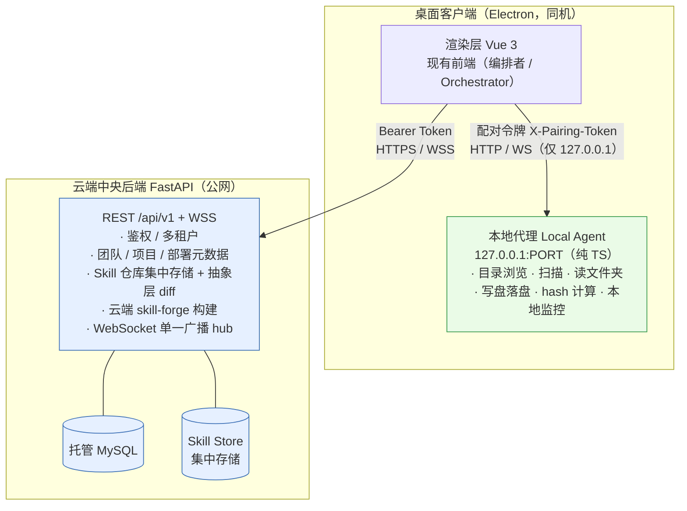
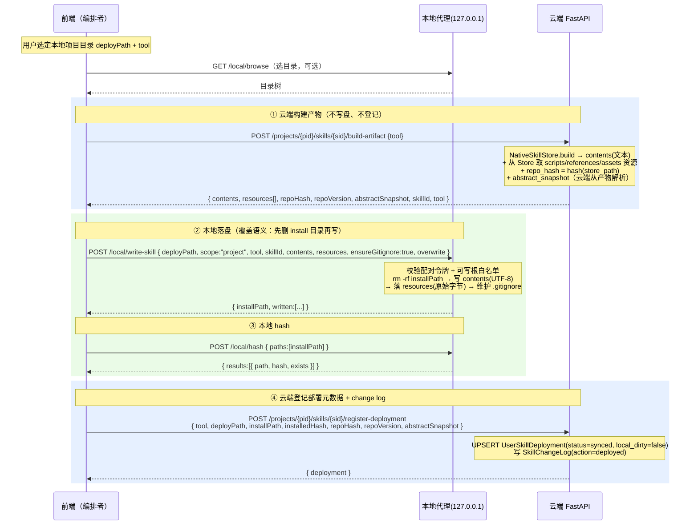
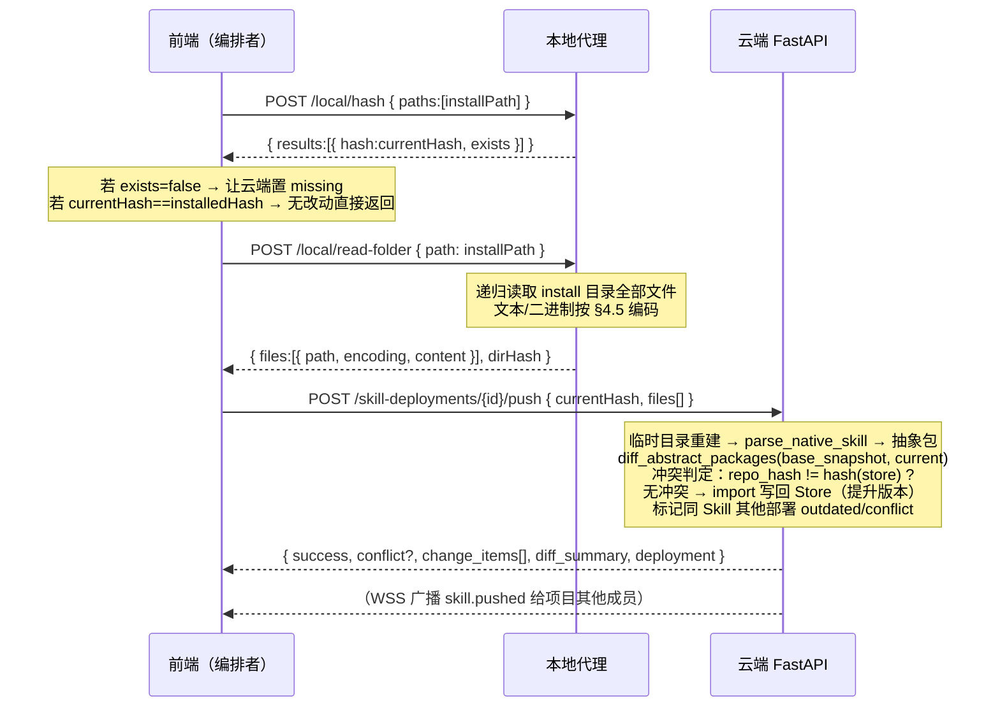
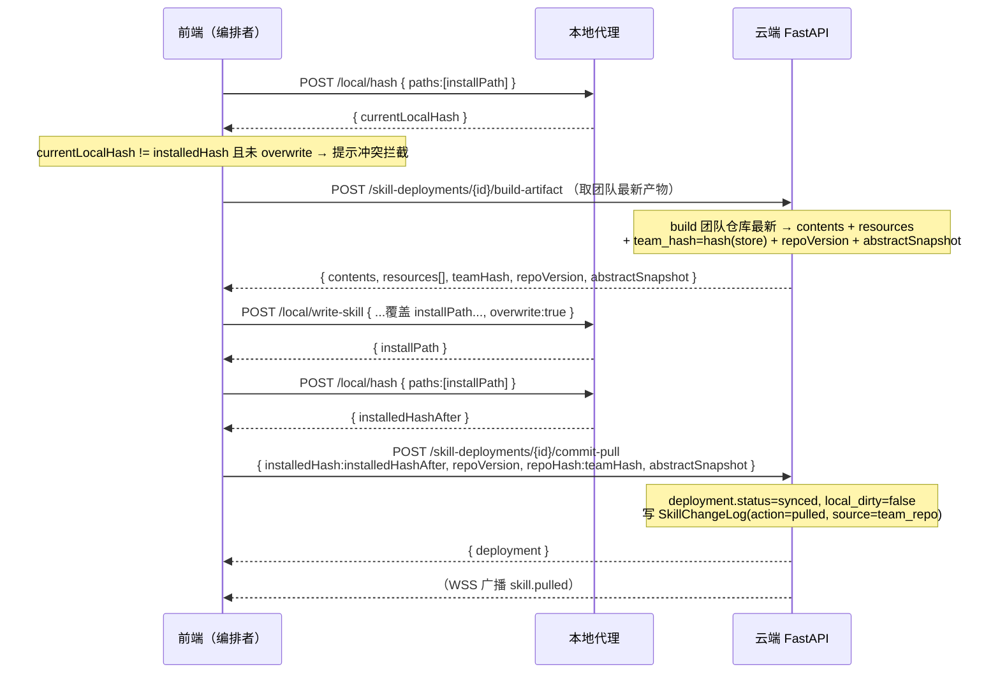
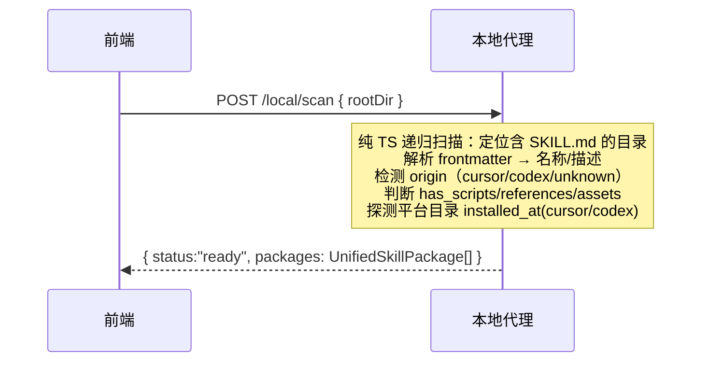
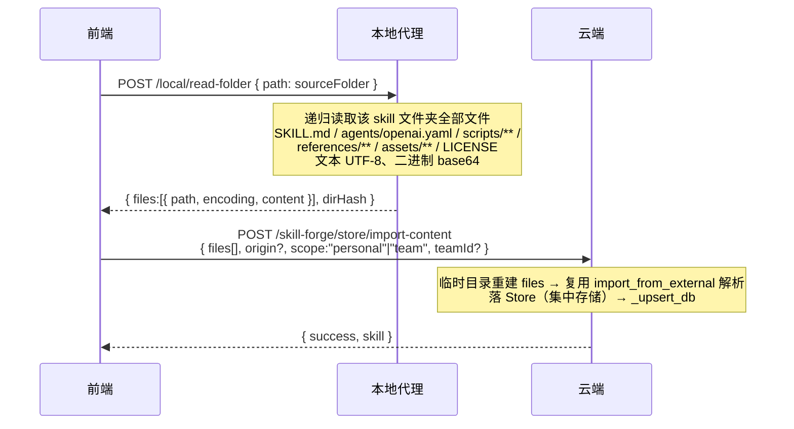
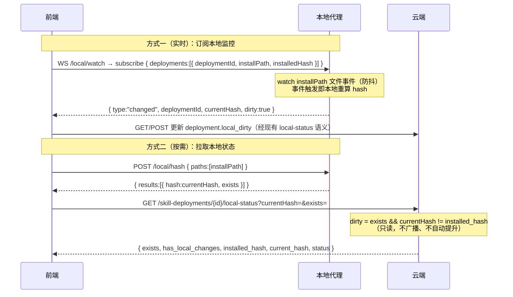
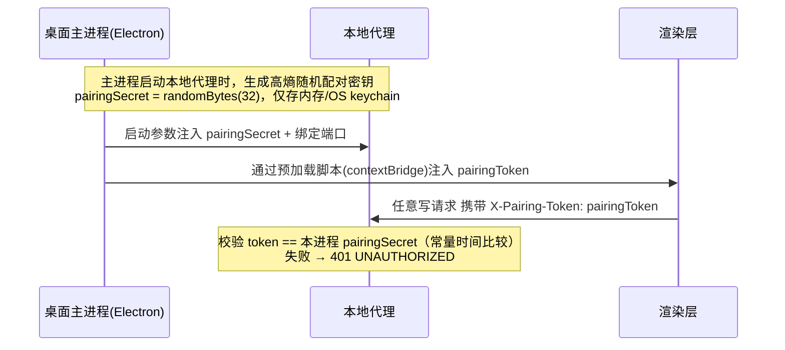

# 方案 B · M0 解耦设计与接口契约（冻结版）

> 本文是方案 B（桌面客户端）迁移里程碑 **M0「解耦设计」** 的交付物，目标是**定义并冻结**「云端中央后端 ↔ 本地代理 Local Agent」之间的接口协议与职责边界。
>
> 退出标准：接口契约评审通过——即本文足够精确，使后续 **M3（本地代理实现）** 与 **M4（前端分流）** 可直接照此编码，无需再次推敲数据流。
>
> 上游依据：根目录 `方案B-桌面客户端迁移技术路径.md`（§4 改造埋点、§5 接口边界、附录 A 端点速查）。
>
> 机器可读契约：见同目录 [`contracts/local-agent-api.md`](./contracts/local-agent-api.md)（TypeScript interface 形式，M3/M4 直接复用）。

---

## 0. 文档元信息

| 项 | 值 |
| --- | --- |
| 里程碑 | M0 解耦设计 |
| 状态 | **冻结候选（待评审）** |
| 本地代理 API 版本 | `local-agent/v1` |
| 云端 API 版本 | `/api/v1`（沿用现状前缀） |
| 适用形态 | B-1 协作版 + 薄代理（云端构建，本地仅落盘/浏览/扫描/hash/监控） |
| 约束 | 本阶段不改任何 `.py / .vue / .ts` 业务代码，仅产出本目录设计与契约文档 |

> 行号约定：文中 `文件:行` 为当前代码行号（以仓库现状为准；与上游方案 B 文档的行号可能有偏移，以本文为准）。

---

## 1. 边界总览与设计原则

### 1.1 三层架构



**关键拓扑事实（决定全部数据流编排方式）：**

> 云端在公网、本地代理只监听 `127.0.0.1`，**云端无法主动连接本地代理**。因此一切「云端构建产物 → 本地落盘」「本地内容 → 云端」的流程，都由**渲染层（前端）充当编排者**串联：前端既持有云端 Bearer Token，又持有本地配对令牌，由它在两侧之间搬运数据。**本契约不存在「云端回调本地代理」的路径。**

### 1.2 设计原则（来自方案 B §1.2 / §3.2，必须遵循）

1. **薄代理**：`skill-forge` / Node 构建留**云端**；本地代理用纯 TS 实现，**不内嵌 Node 构建**，体积极小。
2. **最小下沉**：只有「触达本地文件系统 / 本地进程」的能力下沉到本地代理；鉴权、团队/项目/部署元数据、Skill 集中存储、抽象层 diff、WebSocket 广播、（云端）构建一律留云端。
3. **集中协作**：数据库与 WebSocket 广播必须留云端，保证多客户端协作与实时同步。
4. **安全收敛**：本地代理仅监听 `127.0.0.1`；所有写操作受「配对令牌 + 可写根白名单」双重约束，杜绝任意路径写入。
5. **单一事实源**：抽象包 / 版本 / diff / 部署元数据的权威在云端；本地只持有「落地的文件」与「对本地文件的 hash」。

### 1.3 三方职责矩阵

| 能力 | 渲染层（Vue） | 本地代理（TS） | 云端（FastAPI） |
| --- | --- | --- | --- |
| 登录态 / Bearer Token | 持有并附带 | 不持有云端 token | 签发 / 校验 |
| 配对令牌 | 持有并附带 | 签发候选校验 / 强制校验 | 参与配对签发（见 §5） |
| 目录浏览 / 盘符 | 调用 | **执行** | — |
| 外部 Skill 扫描 | 调用 | **执行（纯 TS 扫描）** | — |
| 读取本地文件夹（导入用） | 调用 | **执行（读字节）** | 接收并解析 / 入库 |
| Skill 构建（skill-forge） | 触发 | — | **执行** |
| 写盘 / 覆盖部署 | 编排 | **执行（落字节）** | 产出 contents + 资源 |
| 本地 hash 计算 | 触发 | **执行** | 仅算 Store 侧 hash |
| 本地改动监控 | 订阅 | **执行（watch）** | — |
| 抽象层 diff / 版本推进 | 展示 | — | **执行** |
| 部署元数据 / change log | 展示 | — | **执行** |
| 实时广播 | 订阅 WSS | — | **执行** |

---

## 2. 端点三分类清单

> 分类口径：
> **A 类** = 留在云端、数据流完全不变的纯数据端点；
> **B 类** = 需要本地代理承接（触达本地 FS / 进程）的端点；
> **C 类** = 云端需改造但仍在云端（典型：构建从「读后端盘 + 写后端盘」改为「接收/返回 contents」）。

### 2.1 A 类：留在云端、数据流不变（纯数据端点）

均已带鉴权（`Depends(get_current_user_id)` + team 成员校验），**保持不变**。客户端只需把 base URL 从 Vite 代理改为云端域名（M4）。

| 方法 + 路径 | 对应 service 函数 | 鉴权 |
| --- | --- | --- |
| `POST /api/v1/auth/register` | `auth_service.register` | 公开 |
| `POST /api/v1/auth/login` | `auth_service.login` | 公开 |
| `GET /api/v1/auth/me` | `auth_service.get_user_by_id` | Bearer |
| `POST /api/v1/auth/api-key` | `auth_service.generate_api_key` | Bearer |
| `POST /api/v1/teams` | `team_service.create_team` | Bearer |
| `GET /api/v1/teams` | `team_service.list_user_teams` | Bearer |
| `GET /api/v1/teams/{team_id}` | `team_service.get_team` | 成员 |
| `PUT /api/v1/teams/{team_id}` | `team_service.update_team` | owner/admin |
| `PATCH /api/v1/teams/{team_id}/settings` | `team_service.update_team_settings` | owner/admin |
| `DELETE /api/v1/teams/{team_id}` | `team_service.delete_team` | owner |
| `POST /api/v1/teams/{team_id}/invite` | `team_service.regenerate_invite_code` | owner/admin |
| `POST /api/v1/teams/join` | `team_service.join_by_invite_code` | Bearer |
| `GET /api/v1/teams/{team_id}/members` | `team_service.list_members` | 成员 |
| `PUT /api/v1/teams/{team_id}/members/{uid}` | `team_service.update_member_role` | owner/admin |
| `DELETE /api/v1/teams/{team_id}/members/{uid}` | `team_service.remove_member` | owner/admin |
| `POST /api/v1/teams/{team_id}/projects` | `project_service.create_project` | 成员 |
| `GET /api/v1/teams/{team_id}/projects` | `project_service.list_projects` | 成员 |
| `GET /api/v1/projects/{pid}` | `project_service.get_project` + `list_project_skills` | 成员 |
| `PUT /api/v1/projects/{pid}` | `project_service.update_project` | 成员 |
| `DELETE /api/v1/projects/{pid}` | `project_service.delete_project` | owner/admin |
| `POST /api/v1/projects/{pid}/skills/{sid}` | `project_service.add_skill_to_project` | 成员 |
| `GET /api/v1/projects/{pid}/skills` | `project_service.list_project_skills` | 成员 |
| `DELETE /api/v1/projects/{pid}/skills/{sid}` | `project_service.remove_skill_from_project` | 成员 |
| `POST /api/v1/teams/{team_id}/skills/from-personal/{sid}` | `NativeSkillStore.copy_to_team` | 成员 |
| `GET /api/v1/skill-forge/store/list` | `NativeSkillStore.list_all` | Bearer |
| `GET /api/v1/skill-forge/store/{sid}` | `NativeSkillStore.get_by_id` | Bearer |
| `POST /api/v1/skill-forge/store/create` | `NativeSkillStore.create` | Bearer |
| `PUT /api/v1/skill-forge/store/{sid}` | `NativeSkillStore.update` | Bearer/成员 |
| `DELETE /api/v1/skill-forge/store/{sid}` | `NativeSkillStore.delete` | Bearer |
| `POST /api/v1/skill-forge/store/{sid}/complete` | `NativeSkillStore.complete_fields` | Bearer |
| `GET /api/v1/skill-forge/store/llm/test` | `llm_service.test_connection` | Bearer |
| `GET /api/v1/projects/{pid}/sync/status` | `project_service.get_sync_status` | 成员 |
| `GET /api/v1/projects/{pid}/sync/changes` | `project_service.get_changes_since` | 成员 |
| `POST /api/v1/projects/{pid}/sync/pull` | `NativeSkillStore.get_by_id`（批量抽象层拉取，**非落盘**） | 成员 |
| `WS /ws/project/{project_id}` | `project_ws_manager` + `SkillSyncService` | token（M2 改强制） |
| `WS /ws/{session_id}` | `ws_manager` | query user_id |

> 注意：`POST /projects/{pid}/sync/pull`（`backend/app/api/projects.py:333-355`）名字里有 "pull"，但它只从云端抽象层取 config/vibeh_content 返回给前端，**不触达本地磁盘**，属 A 类。与触达本地盘的 `skill-deployments/{id}/pull-update`（B 类）不要混淆。

### 2.2 B 类：需要本地代理承接的端点

> 「触达本地文件系统/进程」的能力。下表给出**当前实现 → 迁移后调用链**。迁移后这些云端端点要么被本地代理对等端点替代，要么被拆分为「云端产物端点 + 本地代理落盘 + 云端登记端点」的组合（详见 §3 时序）。

| 当前端点 + service | 当前本地依赖 | 迁移后调用链（编排者=前端） |
| --- | --- | --- |
| `POST /skill-forge/browse`<br/>`skill_forge_service.browse_directory`（`:77-123`） | 列后端磁盘盘符/目录 | 前端 → 本地代理 `GET /local/browse?path=` |
| `GET /skill-forge/packages` / `POST /skill-forge/rescan`<br/>`SkillRegistry`（`:130-200`） | Node 扫描后端目录 + 内存缓存 | 前端 → 本地代理 `POST /local/scan {rootDir}`（扫描逻辑下沉为纯 TS，见风险点 R1） |
| `POST /teams/{tid}/skills/scan-local`<br/>`scan_external_packages`（`:203-215`） | Node 扫描后端目录 | 前端 → 本地代理 `POST /local/scan {rootDir}` |
| `POST /skill-forge/migrate`<br/>`migrate_skill_via_bridge`（`:222-241`） | Node 迁移后端本地文件 | 前端 → 云端构建迁移产物 → 本地代理 `POST /local/write-skill`（见 §3.1 变体） |
| `POST /skill-forge/store/import`<br/>`NativeSkillStore.import_from_external`（`:601-732`） | 读后端文件夹落盘 | 前端 → 本地代理 `POST /local/read-folder` → 云端「按 contents 导入」端点（C 类改造） |
| `POST /teams/{tid}/skills/import-local`<br/>`NativeSkillStore.import_external_to_team`（`:794-843`） | 读后端文件夹落盘 | 前端 → 本地代理 `POST /local/read-folder` → 云端「按 contents 导入到团队」端点 |
| `POST /skill-forge/store/{sid}/deploy`<br/>`NativeSkillStore.deploy`（`:916-1006`） | Node 构建 + 写后端盘 | 前端 → 云端构建产物 → 本地代理 `POST /local/write-skill` |
| `POST /projects/{pid}/skills/{sid}/deploy`<br/>`project_service.deploy_project_skill`（`:352-470`） | 校验本地目录 + 构建 + 写盘 + 算 hash + 登记 | 见 §3.1（拆 build-artifact / write-skill / hash / register-deployment 三段） |
| `POST /skill-deployments/{id}/push`<br/>`project_service.push_deployment`（`:759-983`） | 读本地内容解析上推 | 见 §3.2（本地 read-folder 上传 + 云端 diff/提升） |
| `POST /skill-deployments/{id}/pull-update`<br/>`project_service.pull_update_deployment`（`:986-1101`） | `deploy()` 覆盖写本地 | 见 §3.3（云端产物 + 本地覆盖写 + 回报 hash） |
| `GET /skill-deployments/{id}/local-status`<br/>`project_service.get_deployment_local_status`（`:625-648`） | 读本地 hash | 见 §3.6（本地代理 `POST /local/hash` 上报，云端比对） |
| `POST /skill-deployments/{id}/promote`<br/>`project_service.promote_deployment`（`:495-588`） | 读本地内容回写仓库 | 同 push：本地 read-folder 上传 + 云端导入/提升 |
| 部署 dirty 轮询<br/>`file_watcher_service._deployment_poll_loop`（`:188-213`） | 后端轮询本地 hash | 改为本地代理 `WS /local/watch` 推送 dirty（见 §3.6） |

### 2.3 C 类：云端需改造但仍在云端

> 这些能力**留云端**，但因不能再读/写「后端机器磁盘」，数据流要从「读后端盘 + 写后端盘」改成「接收/返回 contents」。**M0 只定义契约，不改代码**；下列「改造方向」是 M1/M3 落地指引。

| 云端能力 + service | 现状（耦合本地盘） | 改造方向（仍在云端） |
| --- | --- | --- |
| 构建 `NativeSkillStore.build`（`:905-914`）/ bridge `handleBuild` | 临时目录跑 Node，`collectFiles` 收 **utf-8 文本** contents | **不变**（构建留云端），但新增「部署产物」端点把 `contents` + **资源清单** 一并返回前端（资源不在 build 产物里，见 §2.4） |
| 部署 `NativeSkillStore.deploy`（`:916-1006`） | build 后**直接写后端盘** + 从 Store `copytree` 资源 | 拆为：① 云端 `build-artifact`（返回 contents+resources，不写盘）；② 本地代理 `write-skill` 落盘 |
| 预览 `NativeSkillStore.preview`（`:1008-1016`） | Node 构建预览（不写盘） | **基本不变**，纯云端返回 contents，前端展示即可（不落盘，仍是 A 类边缘；列此处仅因复用 build） |
| 导入 `import_from_external`（`:601-732`） | 读后端文件夹路径 | 新增「按 contents 导入」入口：接收本地代理 `read-folder` 上传的文件集合，写临时目录后复用现有解析/落 Store 逻辑 |
| 推送/提升解析 `parse_native_skill`（`skill_diff_service`） | 解析后端本地 install 路径 | 改为解析「前端回传的 install 内容」（临时目录重建后解析），或由云端从构建产物直接生成抽象快照（见 §3.1 说明） |
| 部署状态探测 `_upsert_db`（`:288-295`） | `Path(~/.cursor/skills/{id}/SKILL.md).exists()` 探测后端盘 | 平台目录部署状态由本地代理 `scan` 的 `installed_at` 上报；云端不再探测自身磁盘 |
| Store 路径常量 `core/config.py:21` `SKILL_STORE_DIR=~/.cowork/skills` | 取后端 home | 云端集中存储（卷/对象存储），去 `Path.home()`（M1） |
| 启动编排 `main.py:65-105` lifespan | 含 `FileWatcherService.start` 监控后端盘 | 云端只保留 DB/seed/Store 同步/广播；本地监控随本地代理（M1） |

### 2.4 薄代理的关键缺口：资源文件不在构建产物里（必须补齐）

精读 `bridge.mjs:65-83` 与 `native_skill_store.deploy`（`:979-989`）发现：

- **构建产物 `contents` 仅包含文本文件**：bridge 的 `collectFiles` 用 `readFileSync(fullPath, "utf-8")` 把输出目录所有文件读成 **UTF-8 字符串**，组成 `{ 相对路径: 文本内容 }`。它产出的是 `SKILL.md` / `AGENTS.md` / `agents/openai.yaml` 等**文本**。
- **资源文件（scripts / references / assets）不经过构建产物**：`deploy()` 落盘时，先写 `contents` 文本，再**单独**从云端 Store 目录 `shutil.copytree` 复制 `scripts/`、`references/`、`assets/` 子目录。这些资源可能是**二进制**（如 `assets/*.png` 图标）。

> ⚠️ 结论：薄代理下，云端把「写盘」交给本地代理后，**必须把资源文件随构建产物一起下发给 `write-skill`**，否则本地落盘会缺少 scripts/references/assets。这正是 §4.6 `write-skill` 契约里 `contents`（文本）与 `resources`（含二进制）分列、并定义 `transfer: inline | url` 的原因。**详见待拍板分歧 D1（base64 内联 vs 签名 URL）。**

---

## 3. 云端 ↔ 本地代理完整数据流时序

> 通用约定：
> - **编排者 = 前端（渲染层）**；云端不直连本地代理。
> - 前端对云端用 `Authorization: Bearer <token>`；对本地代理用 `X-Pairing-Token: <pairingToken>`。
> - **install 目录的 hash 一律由本地代理计算并上报**；云端绝不“猜测/代算”本地 install 目录的 hash（除非启用 §7.4 的预测优化且两端算法位级一致）。
> - 路径推导：`cursor → {deployPath}/.cursor/skills/{skillId}`，`codex → {deployPath}/.codex/skills/{skillId}`（对应 `project_service._install_root` `:64-70`）。

### 3.1 部署（deploy：项目 Skill → 本地项目目录）

对应当前 `POST /projects/{pid}/skills/{sid}/deploy`（`project_service.deploy_project_skill`）。拆为「①云端产物 → ②本地落盘 → ③本地 hash → ④云端登记」四步：



字段流转要点：
- `repo_hash` = 云端 `hash(pkg.store_path)`（云端算，权威）。
- `installed_hash` = 本地代理对 `installPath` 算（本地算，权威）；二者内容不同（Store 含 `skill.config.yaml`+`VibeH.md`+资源，install 含构建出的 `SKILL.md`+资源），**本就不相等**，仅作各自基线。
- `abstract_snapshot`：当前实现是部署后 `parse_native_skill(install_path)`（`project_service.py:407`）。迁移后**优先由云端从构建产物直接生成**（云端手握 contents+资源，无需本地回传），写入 `register-deployment`。这样 deploy 路径**无需把 install 内容回传云端**。
- `migrate`（跨平台迁移）是 deploy 的变体：云端按目标平台构建产物，本地代理 `write-skill` 落到迁移目标目录；不一定登记 deployment。

### 3.2 推送（push：本地改动 → 团队仓库）

对应当前 `POST /skill-deployments/{id}/push`（`project_service.push_deployment`）。本地内容**云端不可知**，必须把 install 目录内容回传云端解析。



要点：
- 冲突检测 `repo_hash != hash(store)`（`push_deployment` `:846-847`）两侧都是**云端 Store** 的 hash，云端内部自洽，与本地 hash 无关。
- `currentHash`（本地代理算）回传仅用于：① 与 `installed_hash` 比对判定「是否真有本地改动」；② 登记新的 `installed_hash`。
- 提升成功后，新的 `installed_hash` 仍应是「写回 Store 后该 install 目录的实际 hash」。由于 push 不重写本地（本地已是最新），云端可直接采用 `currentHash` 作为新的 `installed_hash`（对应 `push_deployment:932` 的 `installed_hash_after or current_hash`）。

### 3.3 拉取更新（pull-update：团队仓库 → 覆盖本地）

对应当前 `POST /skill-deployments/{id}/pull-update`（`project_service.pull_update_deployment`，内部调 `deploy()` 覆盖写本地）。



> 实现备注：当前 `pull-update` 是单一云端端点内部完成构建+写盘+登记。迁移后**可保留同一端点名**，但其行为由「云端写后端盘」改为「返回产物（C 类）」，再由前端走 `write-skill`，最后调 `commit-pull` 登记。端点是否拆名由 M3/M4 定，本契约只要求**数据流按上图三段**。

### 3.4 外部扫描（scan：列出某本地目录下已装/可导入的 Skill）

对应当前 `GET /skill-forge/packages` + `POST /skill-forge/rescan` + `POST /teams/{tid}/skills/scan-local`。



要点：
- **扫描结果缓存不再放云端内存**（当前 `SkillRegistry` 是云端类变量缓存）；改为本地代理无状态返回，或本地代理自持缓存。云端不再持有扫描状态。
- `installed_at` 由本地代理探测**用户机器**的 `~/.cursor/skills/{id}/SKILL.md`、`$CODEX_HOME|~/.codex/skills/{id}/SKILL.md`（对应 `native_skill_store.py:31-34, 288-295`）。
- **风险点 R1**：当前 scan 由 Node bridge `scan-and-package` 实现（含 origin 检测、资源归一化）。薄代理不内嵌 Node，需将该扫描/识别逻辑用纯 TS 在本地代理重写（或从 skill-forge 抽出**不依赖构建管线**的扫描模块复用）。详见 §9 风险。

### 3.5 从本地文件夹导入（import：本地 Skill 文件夹 → 云端 Store）

对应当前 `POST /skill-forge/store/import`、`POST /teams/{tid}/skills/import-local`。



要点：
- 当前 `import_from_external` 读 `source_path`（后端盘）解析 SKILL.md frontmatter、`agents/openai.yaml`、复制 scripts/references/assets、LICENSE（`native_skill_store.py:601-732`）。迁移后云端改为接收 `files[]`，写临时目录后复用同一解析逻辑（C 类改造）。
- 导入只需「读取并上传」，不需要本地代理理解 skill 语义；解析与入库的权威仍在云端。

### 3.6 本地改动检测（dirty / watch）

对应当前 `file_watcher_service._deployment_poll_loop`（后端每 3s 轮询所有部署，算 install hash 比对，`:188-213`）与 `GET /skill-deployments/{id}/local-status`。



要点：
- **dirty 判定一律是本地两次 hash 的比较**：`currentHash`（本地实时）vs `installed_hash`（部署/拉取时本地算并存云端 DB）。两者皆由本地代理用**同一算法**产生 → 只要算法在本地稳定，dirty 不会误判。这是 §7 必须冻结 hash 算法的根本原因。
- 当前 `get_deployment_local_status`（`:625-648`）在后端直接读盘算 hash。迁移后改为「本地代理算 → 前端把 `currentHash/exists` 作为入参传云端」或「云端纯比对前端上报值」。后端轮询循环（`_deployment_poll_loop`）下沉为本地代理 `watch` 推送，云端不再轮询本地盘。

---

## 4. 本地代理 API 契约（冻结版）

> Base：`http://127.0.0.1:<PORT>`，前缀 `/local`，版本 `local-agent/v1`（见 §6）。
> 鉴权：除 `GET /local/health` 外，所有端点必须携带请求头 `X-Pairing-Token: <token>`；写类端点额外受可写根白名单约束（§5）。
> 内容类型：请求/响应均为 `application/json; charset=utf-8`。
> 机器可读类型定义见 [`contracts/local-agent-api.md`](./contracts/local-agent-api.md)，与本节字段严格一致。

### 4.0 通用错误模型

所有失败响应统一为：

```json
{ "ok": false, "error": { "code": "WRITE_ROOT_FORBIDDEN", "message": "目标路径不在可写根白名单内", "detail": "..." } }
```

成功响应统一含 `"ok": true`。错误码表：

| code | HTTP | 含义 |
| --- | --- | --- |
| `UNAUTHORIZED` | 401 | 缺失/无效配对令牌 |
| `WRITE_ROOT_FORBIDDEN` | 403 | 目标路径不在可写根白名单 |
| `PATH_NOT_FOUND` | 404 | 路径不存在 |
| `NOT_A_DIRECTORY` | 400 | 期望目录但不是目录 |
| `INSTALL_EXISTS` | 409 | install 目录已存在且未 `overwrite` |
| `IO_ERROR` | 500 | 读写失败 |
| `UNSUPPORTED_TOOL` | 400 | tool 非 cursor/codex |
| `BAD_REQUEST` | 400 | 参数缺失/非法 |

### 4.1 `GET /local/health` — 存活探测

- 鉴权：**无需**配对令牌（用于配对前探测端口）。
- 响应：

```json
{ "ok": true, "agentVersion": "1.0.0", "apiVersion": "local-agent/v1",
  "platform": "win32", "paired": true,
  "platformSkillDirs": { "cursor": "C:\\Users\\me\\.cursor\\skills", "codex": "C:\\Users\\me\\.codex\\skills" } }
```

### 4.2 `GET /local/browse?path=<abs>` — 目录浏览

精确复刻 `skill_forge_service.browse_directory`（`:77-123`）。`path` 为空时：Windows 返回盘符列表，POSIX 返回 `/`。

- 响应：

```json
{ "ok": true, "current": "C:\\Users\\me", "parent": "C:\\Users",
  "dirs": [ { "name": "project-a", "absPath": "C:\\Users\\me\\project-a", "isDrive": false } ] }
```

- 过滤规则（与现状一致）：跳过非目录、`.` 开头、`node_modules/__pycache__/.git/dist/build`。无权限时返回 `dirs:[]` 且附 `note:"权限不足"`。

### 4.3 `POST /local/scan` — 扫描已装/可导入 Skill

替代 `GET /skill-forge/packages` + `rescan` + `scan-local`。请求 `{ "rootDir": "..." }`。响应 `packages` 与现有 `UnifiedSkillPackage`（`schemas/skill_forge.py:36-49`）字段对齐（camelCase）：

```json
{ "ok": true, "status": "ready", "scanDir": "...", "lastScan": "2026-06-01T07:43:00Z",
  "packages": [ {
    "id": "my-skill", "origin": "cursor", "originConfidence": "high", "originSignals": ["disable-model-invocation"],
    "sourcePath": "C:\\...\\my-skill", "name": "my-skill", "displayName": "My Skill",
    "description": "...", "shortDescription": "...",
    "hasScripts": true, "hasReferences": false, "hasAssets": true,
    "installedAt": { "cursor": true, "codex": false }
  } ] }
```

### 4.4 `POST /local/read-folder` — 读取本地文件夹内容（导入/推送/提升用）

请求 `{ "path": "<abs skill folder>", "include": "skill" | "all" }`。递归读取该 skill 文件夹全部文件，文本 UTF-8、二进制 base64（见 §4.5）：

```json
{ "ok": true, "root": "C:\\...\\my-skill", "dirHash": "<sha256>",
  "files": [
    { "path": "SKILL.md", "encoding": "utf8", "content": "---\nname: ...\n---\n..." },
    { "path": "assets/icon.png", "encoding": "base64", "content": "iVBORw0KGgo..." }
  ] }
```

- `path` 是相对 `root` 的 **POSIX** 路径（正斜杠）。
- `dirHash` 用 §7 统一算法对 `root` 计算，便于云端与本地核对一致性。

### 4.5 文件内容编码约定（read-folder / write-skill 公用）

- **文本**：`encoding:"utf8"`，`content` 为原始字符串；**UTF-8 无 BOM、保留原始换行符（不做 CRLF↔LF 归一）**。
- **二进制**：`encoding:"base64"`，`content` 为标准 base64（无换行）。
- 判定：扫描时按扩展名/字节探测；构建产物文本（来自 bridge `contents`）固定 `utf8`，资源按真实类型。
- **落盘忠实性要求**：`write-skill` 必须按上述编码**逐字节忠实落盘**，不得改写换行/编码/权限，以保证 §7.4「云端预测 installed_hash」成立。

### 4.6 `POST /local/write-skill` — 落盘部署产物（核心写端点）

替代 `NativeSkillStore.deploy` 的写盘段（`:963-989`）。请求体：

```json
{
  "deployPath": "C:\\Users\\me\\project-a",
  "scope": "project",
  "tool": "cursor",
  "skillId": "my-skill",
  "contents": { "SKILL.md": "...", "agents/openai.yaml": "..." },
  "resources": [
    { "path": "scripts/run.py", "encoding": "utf8", "content": "...", "transfer": "inline" },
    { "path": "assets/icon.png", "encoding": "base64", "content": "iVBOR...", "transfer": "inline" }
  ],
  "overwrite": true,
  "ensureGitignore": true
}
```

- `scope`：`"project"` → 落到 `{deployPath}/.{tool}/skills/{skillId}`；`"platform"` → 落到本地代理解析的平台目录（`~/.cursor/skills/{skillId}` 等），此时忽略 `deployPath`。
- `contents`：构建产物**文本**（dict：相对路径→UTF-8 文本），对应 bridge `collectFiles` 输出。
- `resources`：scripts/references/assets 等资源文件（**可含二进制**），见 §2.4。`transfer:"inline"` 时内容在 `content`；`transfer:"url"` 时改用 `url`+`sha256`+`size` 由本地代理下载（见 §4.7 / 分歧 D1）。
- 覆盖语义（与现状一致）：先 `rm -rf installPath` 再重建并写入（对应 `deploy:975-977`）。`overwrite=false` 且目录已存在 → `INSTALL_EXISTS`。
- `ensureGitignore=true`：在 `deployPath` 维护 `.gitignore` 块（`.cursor/skills/`、`.codex/skills/`），对应 `project_service._ensure_gitignore`（`:73-86`）。仅 `scope:"project"` 有效。
- 响应：

```json
{ "ok": true, "installPath": "C:\\Users\\me\\project-a\\.cursor\\skills\\my-skill",
  "written": ["SKILL.md", "agents/openai.yaml", "scripts/run.py", "assets/icon.png"],
  "installedHash": "<sha256 §7>" }
```

> `installedHash` 可由 write-skill 顺带返回（落盘后即算），省去单独再调 `/local/hash` 一次往返。

### 4.7 资源传输方式（`transfer`）

| 模式 | 触发 | 字段 | 说明 |
| --- | --- | --- | --- |
| `inline`（M3 默认） | 资源体积小 | `encoding` + `content`（base64/utf8） | 单次请求带齐，最简单；base64 膨胀约 +33% |
| `url`（预留） | 大资源 | `url` + `sha256` + `size` | 本地代理向云端带 Bearer 拉取后校验 `sha256` 落盘 |

> **分歧 D1**：M3 先用 `inline`，契约预留 `url` 字段以便无痛切换。需协调者拍板（见 §9）。

### 4.8 `POST /local/hash` — 计算内容 hash（dirty 检测）

请求 `{ "paths": ["<abs>", ...] }`。对每个路径用 §7 统一算法计算目录/文件 hash：

```json
{ "ok": true, "results": [ { "path": "C:\\...\\my-skill", "hash": "<sha256>", "exists": true } ] }
```

- 路径不存在 → `exists:false, hash:""`（与 `_compute_content_hash` 对不存在/空目录返回 `""` 一致）。

### 4.9 `WS /local/watch` — 本地变更事件流

替代 `file_watcher_service` 的部署轮询。握手需 `X-Pairing-Token`（或 query `pairingToken`）。

- 客户端 → 代理（订阅）：

```json
{ "op": "subscribe", "deployments": [ { "deploymentId": "d1", "installPath": "C:\\...\\skills\\my-skill", "installedHash": "<sha256>" } ] }
```

- 代理 → 客户端（事件，防抖后推送）：

```json
{ "type": "changed", "deploymentId": "d1", "installPath": "...", "currentHash": "<sha256>", "dirty": true, "exists": true, "ts": "2026-06-01T07:43:10Z" }
```

- `type ∈ { changed, missing, unchanged, error }`；`dirty = exists && currentHash != installedHash`。
- 防抖参考现状 `DEBOUNCE_SECONDS=2.0` / `debounce=1000`（`file_watcher_service.py:20,72`）。

---

## 5. 安全 / 配对模型

### 5.1 现状与差距

- 云端鉴权：HMAC token，格式 `user_id.expire_ts.signature`（`auth_service._create_token` `:38-45`），secret = `settings.LLM_API_KEY or "vibehub-default-secret"`（`:20`），有效期 7 天。`get_current_user_id` 从 `Authorization: Bearer` 解析（`api/auth.py:21-35`）。
- WS 鉴权可选：`websocket/routes.py:38` `if token and not verify_token(token)` —— **token 为空直接放行**（M2 改强制）。
- 前端 token 存 `localStorage`（`client.ts:11`、`useSkillSync.ts:66`）。
- **本地代理无任何鉴权概念**（当前不存在本地代理）。

### 5.2 设备配对令牌（Pairing Token）模型

**目标**：保证「只有本机、已配对的渲染层」能调用本地代理写盘，杜绝其他本机进程/网页越权写用户磁盘。

**双令牌分离**（关键设计）：
- **Bearer Token（云端身份）**：证明「我是用户 X」，只发给云端，**绝不发给本地代理**。
- **Pairing Token（本地设备配对）**：证明「我是与本代理配对的合法渲染层」，只发给本地代理，**绝不发给云端**。

**签发与校验流程（建议，M2/M3 落地）：**



- **配对令牌不是云端 HMAC token**，二者独立。理由：本地代理不应理解云端身份，云端也不应能调用本地代理。
- 桌面壳负责把同一 `pairingSecret` 注入「本代理进程」与「本渲染层」，从而天然只在本机本会话内有效。
- 进阶（可选）：`pairingToken` 可带 `exp` 并由主进程定期轮换；或采用「挑战-响应」（代理出 nonce，渲染层用 pairingSecret 签名）。M0 冻结**最简形态：固定高熵 bearer 风格令牌 + 常量时间比较**，进阶留 M2。

### 5.3 可写根白名单（Writable Roots）

- 本地代理维护一组**允许写入的根目录**白名单：仅包含「用户在 browse 流程中显式选定的项目目录」与「平台 skill 目录（`~/.cursor/skills`、`~/.codex/skills`）」。
- 每个 `write-skill` 的目标 `installPath` 必须经 `realpath` 规整后，落在某个白名单根之内（防 `..`/符号链接逃逸），否则 `403 WRITE_ROOT_FORBIDDEN`。
- 白名单来源：用户每次通过 `GET /local/browse` 选定目录并确认部署时，前端把该 `deployPath` 注册进白名单（或本地代理在 write-skill 时按「用户最近确认过的目录」校验）。M3 定具体注册端点；M0 冻结**约束语义**：写操作只能落在用户显式授权的根内。

### 5.4 仅监听 127.0.0.1

- 本地代理 socket **只绑定 `127.0.0.1`**（非 `0.0.0.0`），杜绝局域网访问。
- CORS：本地代理只接受来自桌面渲染层 origin（`app://` / `file://` / 固定本地端口）的请求；拒绝任意网页跨站调用。

### 5.5 与现有 HMAC token 的关系小结

| 令牌 | 签发方 | 持有方 | 校验方 | 用途 |
| --- | --- | --- | --- | --- |
| Bearer（HMAC） | 云端 `auth_service` | 渲染层（OS 安全存储，M2 不再用 localStorage） | 云端 | 云端身份/多租户 |
| Pairing Token | 桌面主进程 | 渲染层 | 本地代理 | 本机设备配对/写盘授权 |

---

## 6. 数据契约版本化策略

### 6.1 版本标识

- **本地代理 API 版本**：`local-agent/v1`，体现在：① `GET /local/health` 的 `apiVersion` 字段；② 路径前缀 `/local`（破坏性升级时升 `/local/v2`）；③ 每个响应可选 `apiVersion`。
- **云端 API 版本**：沿用 `/api/v1`（破坏性升级 `/api/v2`）。
- **客户端版本**：桌面壳 `agentVersion`（语义化版本），随包发布。

### 6.2 兼容矩阵（占位约定）

| 客户端 agentVersion | 本地代理 apiVersion | 云端 /api 版本 | 结果 |
| --- | --- | --- | --- |
| 1.x | local-agent/v1 | v1 | ✅ 完全兼容 |
| 1.x | local-agent/v1 | v2（向后兼容 v1） | ✅ 客户端按 v1 调用 |
| 1.x | local-agent/v1 | v2（不兼容） | ⚠️ 提示「需升级客户端」并阻断写操作 |
| 2.x | local-agent/v2 | v1 | ⚠️ 客户端降级按 v1 语义或阻断 |

### 6.3 协商机制（约定）

1. 客户端启动时：先 `GET /local/health` 取本地代理 `apiVersion`，再 `GET /api/v1/version`（M1 新增轻量端点）取云端最低兼容客户端版本 `minClientVersion`。
2. 若 `clientVersion < minClientVersion` → 走自动更新（electron-updater）或强制提示，**禁用写类流程**（deploy/push/pull/write-skill），只读浏览仍可用。
3. 字段演进规则：**只增不改**——新增字段必须可选并有默认值；删除/改名字段须升主版本。本地代理与云端均遵循。

---

## 7. hash 算法统一约定（可被 TS 精确复刻）

> 这是 dirty 检测正确性的命门：云端 `_compute_content_hash`（`project_service.py:47-61`）与 `_compute_dir_hash`（`native_skill_store.py:84-96`）**当前实现完全一致**；本地代理 TS 实现必须**位级一致**，否则 §3.6 的 dirty/冲突判定会误判。

### 7.1 当前 Python 算法（逐行还原）

```python
def _compute_content_hash(store_path: str) -> str:
    root = Path(store_path)
    if not root.exists():
        return ""
    digest = hashlib.sha256()
    has_files = False
    for file_path in sorted(p for p in root.rglob("*") if p.is_file()):
        rel = file_path.relative_to(root).as_posix()
        digest.update(rel.encode("utf-8"))
        digest.update(b"\0")
        digest.update(file_path.read_bytes())
        digest.update(b"\0")
        has_files = True
    return digest.hexdigest() if has_files else ""
```

要素拆解：
1. **算法**：SHA-256，输出小写 hex。
2. **遍历范围**：`root.rglob("*")` 递归所有后代，**仅保留 `is_file()` 为真者**（排除目录；符号链接指向文件按文件计）。**包含**以 `.` 开头的隐藏文件。
3. **相对路径**：`file_path.relative_to(root).as_posix()` —— 相对 root、**正斜杠** `/` 分隔。
4. **累积顺序**：对每个文件依次 `update(rel 的 UTF-8 字节)` → `update(b"\0")` → `update(文件原始字节)` → `update(b"\0")`。
5. **空集**：root 不存在或无任何文件 → 返回空串 `""`。
6. **二进制读取**：`read_bytes()` 原始字节，不做编码转换。

### 7.2 排序键陷阱（必须冻结收敛）

⚠️ 当前 `sorted(... p ...)` 排序的是 **`Path` 对象**，其比较用平台相关的 `normcase` 与**操作系统原生分隔符**：
- POSIX：按完整路径字符串、`/` 分隔、**大小写敏感**；
- Windows：按完整路径字符串**小写化**、`\` 分隔。

当文件/目录名在「分隔符字符」附近（`/` = `0x2F`，`\` = `0x5C`）产生分歧时，**同一份内容在 Linux 云端与 Windows 本地排序可能不同**（例：目录 `ref/` 下的 `ref/z` 与同级文件 `refA.md`，POSIX 下 `/`(0x2F)<`A`(0x41) 而 Windows 下 `\`(0x5C)>`A`(0x41)，文件顺序相反 → hash 不同）。中文/大小写文件名亦有 normcase 风险。

**冻结规范（M0 决定，M1 落地）：排序键统一为「相对路径 `as_posix()` 的 UTF-8 字节序升序」，大小写敏感、不做 normcase、分隔符恒为 `/`。**
- 云端需在 M1 把两处 `sorted(...)` 显式改为按相对 posix 路径的 UTF-8 字节排序（**一行改动**，见 §9 风险 R2）：

```python
files = sorted(
    (p for p in root.rglob("*") if p.is_file()),
    key=lambda p: p.relative_to(root).as_posix().encode("utf-8"),
)
```

> 说明：因 install 目录通常无诡异文件名，此收敛对既有数据基本无影响；但作为冻结契约必须显式化，杜绝跨平台/中文名误判。

### 7.3 可被 TS 精确复刻的伪代码（冻结）

```text
function computeDirHash(rootAbsPath) -> hexString:
    if not exists(rootAbsPath): return ""
    # 1) 递归收集所有"常规文件"的绝对路径（含隐藏文件；排除目录）
    absFiles = walkRecursive(rootAbsPath).filter(isRegularFile)
    if absFiles is empty: return ""
    # 2) 转为相对 root 的 POSIX 路径
    relFiles = absFiles.map(a => toPosix(relative(rootAbsPath, a)))   # 用 '/' 分隔
    # 3) 按相对路径的 UTF-8 字节序升序排序（大小写敏感；NFC 不归一）
    relFiles.sort((x, y) => compareBytes(utf8(x), utf8(y)))
    # 4) 流式喂入 sha256
    h = sha256()
    for rel in relFiles:
        h.update(utf8(rel))
        h.update(byte(0x00))
        h.update(readFileBytes(join(rootAbsPath, rel)))   # 原始字节
        h.update(byte(0x00))
    return h.hexLowerCase()
```

TS 实现注意：
- `compareBytes`：用 `Buffer.compare(Buffer.from(x,'utf8'), Buffer.from(y,'utf8'))`，**不要**用 `String.localeCompare`/默认 `<`（JS 默认按 UTF-16 码元，对非 BMP/中文与 UTF-8 字节序可能不同）。
- 读文件用 `fs.readFileSync(path)`（Buffer，原始字节），喂 `crypto.createHash('sha256')`。
- 相对路径用 `path.relative` 后 `.split(path.sep).join('/')` 强制 POSIX。
- 不读取目录项、不含目录名单独入 hash（仅文件 rel + 内容）。
- 文件名 Unicode：保持 OS 返回的原始码点，**不做 NFC/NFD 归一**（与 Python `as_posix()` 一致）。macOS 文件系统可能返回 NFD，需注意（列为 §9 风险 R3）。

### 7.4 可选优化：云端预测 installed_hash（需两端位级一致）

若 §7 算法两端严格一致，且 §4.5「落盘忠实性」成立，则云端在 build 阶段即可**预测** install 目录落盘后的 hash（contents 文本字节 + 资源原始字节都在云端手里），从而 deploy/pull 流程可省去「本地 `/local/hash` 回报」一次往返。**M0 仅记录此优化可行性，是否启用由 M3 决定**（默认仍以本地实算为权威，最稳妥）。

---

## 8. M0 退出检查表

- [ ] **边界图与原则**：三层架构、薄代理、"云端不直连本地代理、前端编排"已明确（§1）。
- [ ] **端点三分类**：A/B/C 三类清单精确到 `方法 + 路径 + service 函数`，覆盖 auth/teams/projects/skill 关联/仓库 CRUD/项目动态/WS（§2）。
- [ ] **资源缺口**：已识别「构建产物 contents 仅文本、资源需单独下发」并在 write-skill 契约中解决（§2.4 / §4.6）。
- [ ] **六条数据流时序**：deploy / push / pull-update / scan / import / dirty-watch 均给出「谁构建、谁落盘、谁算 hash、字段如何传输」（§3）。
- [ ] **本地代理 API 冻结**：health / browse / scan / read-folder / write-skill / hash / watch(WS) 七端点的路径、方法、请求/响应 schema、错误码、鉴权头齐备（§4）。
- [ ] **资源下发方式**：inline / url 两模式 + `transfer` 字段已定义，默认 inline（§4.7）。
- [ ] **安全/配对模型**：双令牌分离、可写根白名单、仅 127.0.0.1、与现有 HMAC 关系已写明（§5）。
- [ ] **版本化策略**：local-agent/v1 与 /api/v1、兼容矩阵与协商机制占位（§6）。
- [ ] **hash 统一约定**：当前算法逐行还原 + 排序陷阱 + TS 可复刻伪代码 + 收敛规范（§7）。
- [ ] **机器可读契约**：`contracts/local-agent-api.md` TS interface 与本文字段一致（§4 / 附）。
- [ ] **风险与分歧**：D1（资源传输）、R1（scan 下沉）、R2（排序收敛）、R3（Unicode 归一）等已列出待拍板（§9）。
- [ ] 评审会签：架构 / 后端 / 前端 / 客户端 四方确认接口冻结。

---

## 9. 对 M1–M5 的影响提示

### M1 云端化（去 Path.home / Store 集中 / DB / CORS）
- **必须**：把 `_compute_content_hash`、`_compute_dir_hash` 的排序键显式改为「相对 posix 路径 UTF-8 字节序」（§7.2 风险 **R2**），与本地代理一致。
- 新增 C 类端点：`build-artifact`（返回 contents+resources+repoHash+abstractSnapshot）、`register-deployment` / `commit-pull`、`store/import-content`、`push`（接收 files[]）。这些是「数据流拆段」的云端侧落点。
- `_upsert_db` 的平台部署状态探测（`:288-295`）改为接收本地代理 `scan.installedAt`，去掉对后端 `~/.cursor/skills` 的 `exists()`。
- 新增 `GET /api/v1/version` 返回 `minClientVersion`（§6.3）。
- Store 去 `Path.home()`（`config.py:21`），抽象层 diff/`parse_native_skill` 改为可对「临时目录重建的内容」工作。

### M2 鉴权强化
- JWT secret 独立化（停用 `LLM_API_KEY` 复用，`auth_service.py:20`）。
- WS 强制鉴权（`websocket/routes.py:38` 去掉「空 token 放行」）。
- 落地 §5 配对令牌：桌面主进程注入 pairingSecret、常量时间比较、可写根白名单、仅 127.0.0.1。
- token 存储从 `localStorage` 迁 OS 安全存储（`client.ts:11`、`useSkillSync.ts:66`）。

### M3 本地代理实现
- 按 §4 七端点 + §7 hash 算法 + §4.5 编码约定实现纯 TS 代理。
- **风险 R1**：scan 的 origin 检测/资源归一化逻辑需从 Node bridge `scan-and-package` 移植为纯 TS（不内嵌构建管线）。评估「抽出 skill-forge 扫描模块复用」vs「重写」。
- 实现可写根白名单 `realpath` 逃逸防护、watch 防抖（参考 `DEBOUNCE_SECONDS=2.0`）。
- 决策：是否启用 §7.4「云端预测 installed_hash」优化（默认否，本地实算为准）。

### M4 前端分流
- 拆两个 client：云端 client（Bearer、云端域名）与本地代理 client（`http://127.0.0.1:PORT`、`X-Pairing-Token`）。对应 `client.ts:3-4` 的 baseURL 注入化。
- **前端成为编排者**：deploy/push/pull 不再是「一次云端调用」，而是按 §3 时序串联「云端产物 → 本地落盘 → 本地 hash → 云端登记」。原 `projects.ts` 里 `deployProjectSkill/pushDeployment/pullUpdateDeployment` 等需重写为多步编排。
- WS URL 从 `window.location.host`（`useSkillSync.ts:66-72`）改指向云端 WSS 域名；本地 watch 走本地代理 WS。
- Vite 代理（`vite.config.ts:12-24`）仅 dev 用；打包后由运行时配置注入云端地址与本地端口。

### M5 桌面封装（B 独有）
- 主进程负责：拉起/守护本地代理进程、端口分配（写入 health 可发现）、注入 pairingSecret 到代理与渲染层。
- 自动更新 + §6 兼容矩阵：客户端启动校验 `minClientVersion`，不兼容则强制更新并禁用写流程。
- 资源传输若从 inline 切到 url（分歧 D1），主进程/代理需支持带 Bearer 向云端下载资源。

### 待协调者拍板的设计分歧 / 风险

| 编号 | 议题 | 选项 | 倾向 |
| --- | --- | --- | --- |
| **D1** | 资源文件下发方式 | A. base64 内联（简单、+33% 体积）；B. 签名/Bearer URL（适合大资源、需对象存储） | M3 先 **A 内联**，契约预留 `transfer:"url"` 平滑切换 |
| **D2** | 配对令牌形态与存储 | A. 主进程注入固定高熵 bearer（最简）；B. 挑战-响应 + 轮换 exp | M0 冻结 **A**，B 留 M2 |
| **D3** | scan 解析归属 | A. 本地代理纯 TS 扫描（方案 B §5.3 倾向）；B. 本地只读原始文件、云端解析 | 倾向 **A**（避免大目录全量上传），代价是移植扫描逻辑（R1） |
| **D4** | abstract_snapshot 生成 | A. 云端从构建产物直接生成（deploy/pull 免回传）；B. 本地 read-folder 回传云端解析 | deploy/pull 用 **A**；push/promote 必须 **B**（本地被改过） |
| **R1** | scan 逻辑下沉 | Node bridge → 纯 TS 重写/抽模块 | M3 评估工作量 |
| **R2** | hash 排序键收敛 | 云端两处 `sorted` 改 UTF-8 字节序 | M1 必做（否则跨平台误判） |
| **R3** | 文件名 Unicode 归一 | macOS NFD vs Linux/Win NFC | M3 统一不归一；如遇 macOS NFD 文件名需专项验证 |
| **R4** | installed_hash 权威 | 一律本地实算 vs 云端预测优化 | 默认本地实算；优化留 M3 评估 |
```